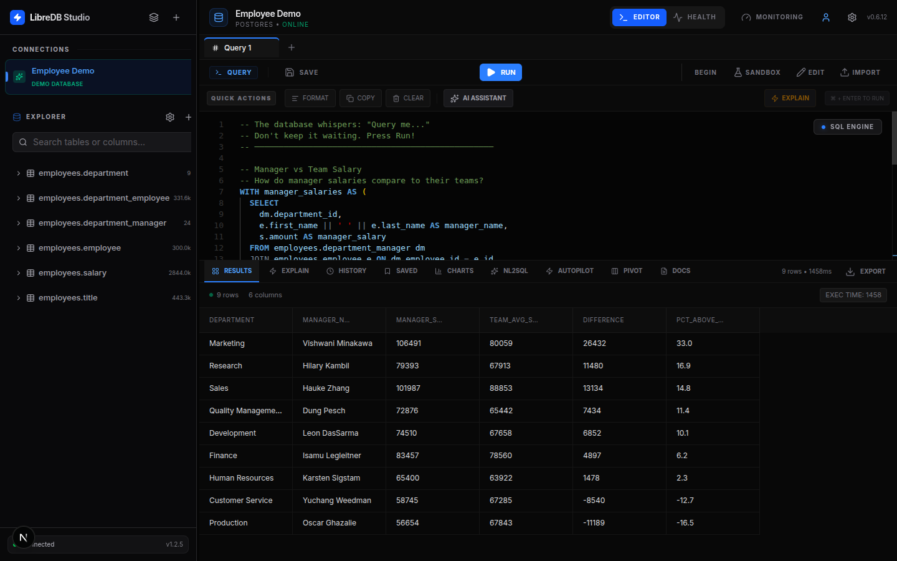
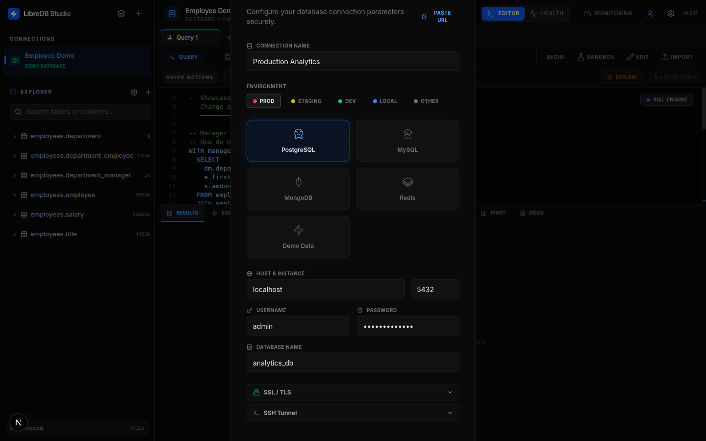
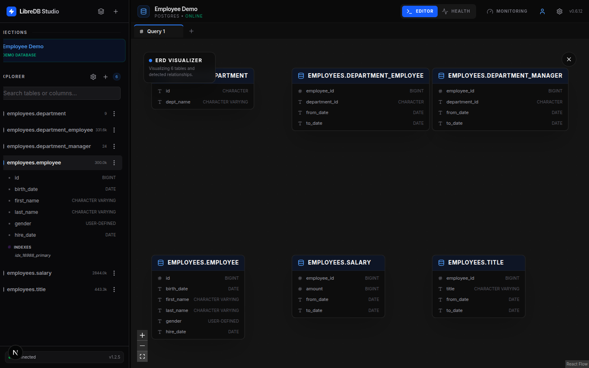
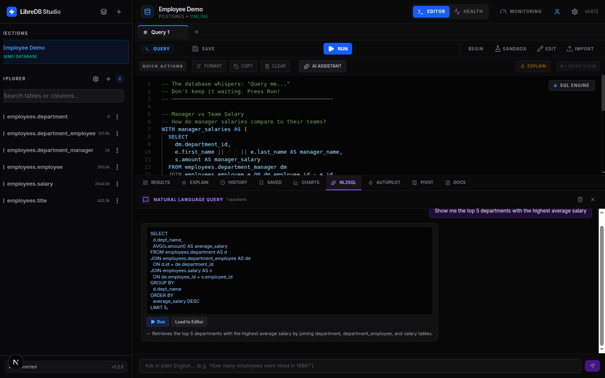
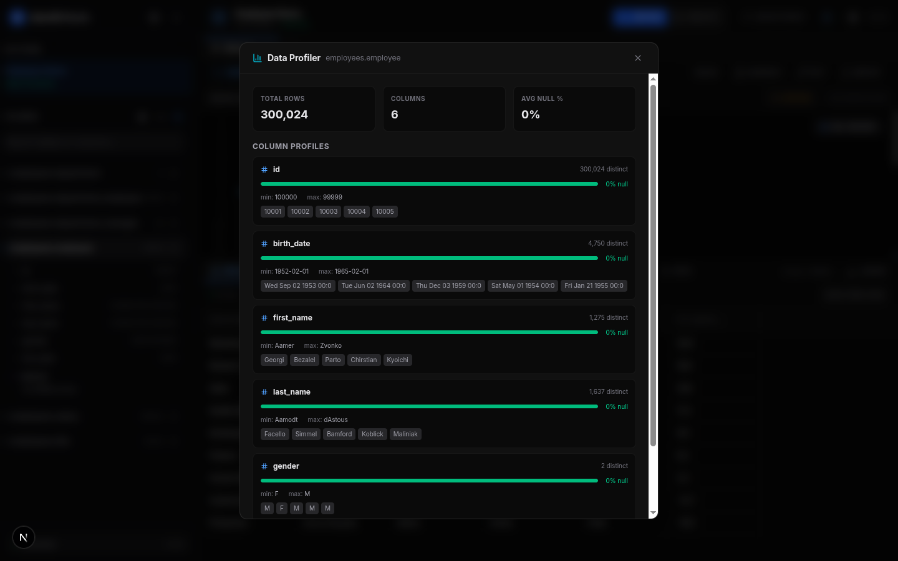
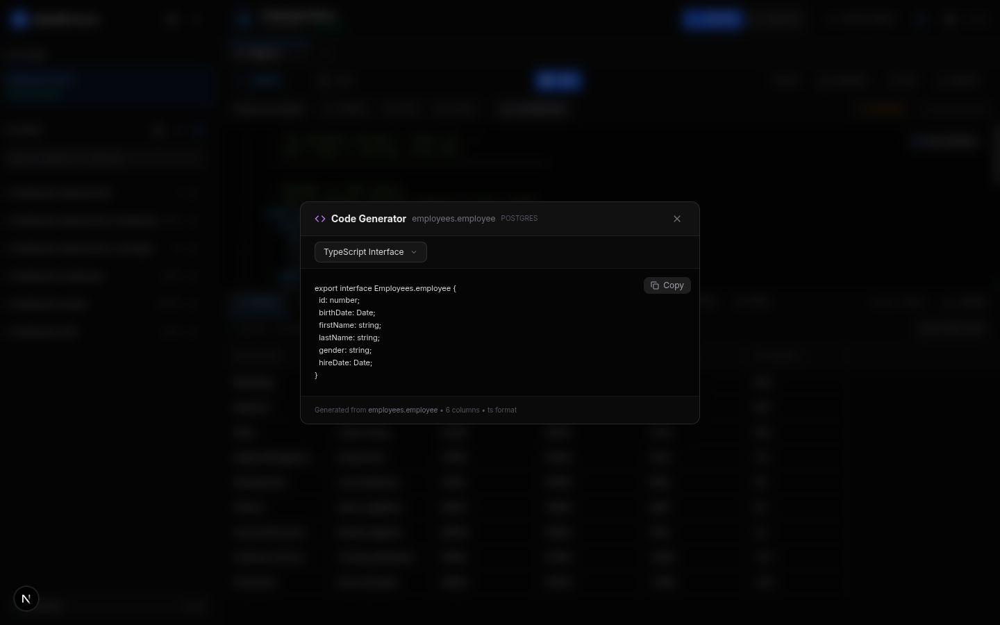

<p align="center">
  
</p>

<h1 align="center">LibreDB Studio</h1>

<p align="center">
  <strong>The Modern, AI-Powered Open-Source SQL IDE for Cloud-Native Teams.</strong>
</p>

<p align="center">
  <a href="https://opensource.org/licenses/MIT"></a>
  <a href="https://sonarcloud.io/project/overview?id=libredb_libredb-studio"></a>
  <a href="https://deepwiki.com/libredb/libredb-studio"></a>
</p>

<p align="center">
  <a href="https://nextjs.org/"></a>
  <a href="https://react.dev/"></a>
  <a href="https://www.docker.com/"></a>
  <a href="https://kubernetes.io/"></a>
</p>

<p align="center">
  <a href="#-live-demo"><strong>🚀 Try Live Demo</strong></a> •
  <a href="#getting-started"><strong>📖 Documentation</strong></a> •
  <a href="#-one-click-deploy"><strong>⚡ Deploy Your Own</strong></a>
</p>

<p align="center">
  
</p>

---

## 🚀 Live Demo

> **Try LibreDB Studio instantly without installation!**

| Demo | URL | Credentials |
|------|-----|-------------|
| **Public Demo** | [app.libredb.org](https://app.libredb.org) | `demo` / `demo` |

The demo runs in **Demo Mode** with simulated data. No real database required!

---

## Overview

**LibreDB Studio** is a lightweight, high-performance, and secure web-based SQL editor designed to bridge the gap between heavy desktop applications (like DataGrip/DBeaver) and minimal CLI tools. Built with a "Mobile-First, Professional-Always" philosophy, it empowers engineering teams to manage databases anywhere—from a 4K monitor to a mobile screen.

### Why LibreDB Studio?
- **Zero Install**: Run a professional SQL IDE in your browser or private network.
- **Multi-Platform**: Native-like experience on both **Web** and **Mobile** browsers.
  - **AI-Native**: Multi-model support (Gemini, OpenAI, or Local LLMs) for NL2SQL.
- **DevOps Ready**: Optimized for Kubernetes orchestration and Docker environments.
- **Enterprise Grade**: Built-in RBAC, query auditing, and live health monitoring.

<p align="center">
  
  <br/><em>Connect to PostgreSQL, MySQL, MongoDB, Redis, or SQLite with SSL/TLS and SSH Tunnel support.</em>
</p>

---

## Key Features

### Professional SQL IDE
- **Monaco Engine**: Powered by the same core as VS Code.
- **Smart Autocomplete**: Schema-aware suggestions for tables, columns, and SQL keywords.
- **Multi-Tab Workspace**: Handle parallel tasks with independent execution states.
- **Visual EXPLAIN**: Graphical execution plans to identify performance bottlenecks.
- **Interactive ER Diagrams**: Visual schema graph with table relationships and column details.

<p align="center">
  
  <br/><em>Visual schema explorer with interactive ER diagrams powered by ReactFlow.</em>
</p>

### Multi-Model AI Copilot
- **Universal LLM Support**: Defaults to Gemini 2.5 Flash, but ready for OpenAI, Claude, or **Local LLMs** (Ollama/LM Studio).
- **NL2SQL**: Generate complex queries from natural language with schema-aware context.
- **Query Safety Analysis**: AI-powered pre-execution risk assessment for destructive queries (DELETE, DROP, TRUNCATE).
- **AI Query Explainer**: EXPLAIN plans translated into plain language with optimization suggestions.
- **AI Query Autopilot**: Automated slow query analysis with actionable index and rewrite recommendations.
- **Schema Awareness**: AI understands your specific database structure for pinpoint accuracy.
- **Plug & Play**: Works out of the box with zero complex configuration.

<p align="center">
  
  <br/><em>Ask questions in plain English and get executable SQL queries instantly.</em>
</p>

### Pro Data Management
- **Universal Data Grid**: Virtualized rendering (TanStack) for millions of rows.
- **Inline Editing**: Double-click to update values directly in the grid.
- **Column Filtering**: Per-column text filters on query results for instant data exploration.
- **Interactive Pivot Table**: Client-side pivoting with 5 aggregation functions (COUNT, SUM, AVG, MIN, MAX) and SQL generation.
- **Expert Exporter**: Instant CSV and JSON exports for reporting.

### Analyst & Developer Tools
- **AI Data Profiler**: One-click table profiling with column statistics (null %, cardinality, min/max, sample values) and AI-powered narrative summaries.
- **ORM Code Generator**: Generate TypeScript interfaces, Zod schemas, Prisma models, Go structs, Python dataclasses, and Java POJOs from live table schemas.
- **Test Data Generator**: Schema-aware fake data generation with 30+ semantic column inferences (email, phone, name, address, etc.). Produces INSERT statements or MongoDB insertMany JSON.
- **Database Documentation**: Auto-generated searchable data dictionary from live schema with AI-powered documentation and Markdown export.

<p align="center">
  
  <br/><em>One-click column profiling: null %, cardinality, min/max, and sample values for 300K+ rows.</em>
</p>

<p align="center">
  
  <br/><em>Generate TypeScript interfaces, Prisma models, Go structs, and more from live schemas.</em>
</p>

### DBA Maintenance Toolkit (Admin Only)
- **Live Monitoring**: Track active connections, long-running queries, and session PIDs.
- **One-Click Maintenance**: Trigger `VACUUM`, `ANALYZE`, and `REINDEX` globally.
- **Audit Trail**: Full history of every query executed across the organization.

---

## Tech Stack

| Component | Technology | Target |
| :--- | :--- | :--- |
| **Framework** | Next.js 15 (App Router), React 19 | Web, Mobile |
| **UI Engine** | Tailwind CSS 4, Radix UI, [shadcn/ui](https://ui.shadcn.com/) | Web, Mobile |
| **Theming** | CSS Variables + `@theme inline` ([Guide](docs/THEMING.md)) | Web, Mobile |
| **Editor** | Monaco Editor (VS Code Engine) | Web |
| **AI** | Multi-Model (Gemini, OpenAI, Ollama, Custom) | Web, Mobile |
| **Database** | PostgreSQL, MySQL, SQLite, MongoDB | Web, Mobile |
| **State/Grid** | TanStack Table & Virtual | Web, Mobile |
| **Deployment** | Docker, Kubernetes | Web |

---

## Getting Started

  ### Prerequisites
  - [Bun](https://bun.sh/) (Recommended) or Node.js 20+
  - A target database to query (PostgreSQL, MySQL, SQLite, or MongoDB)

  ### Quick Start (Local)
  1. **Clone & Install**
     ```bash
     git clone https://github.com/libredb/libredb-studio.git
     cd libredb-studio
     bun install
     ```

    2. **Configure Environment**
       Create a `.env.local` file:
       ```env
       ADMIN_PASSWORD=admin123
       USER_PASSWORD=user123
       JWT_SECRET=your_32_character_random_string

       # LLM Configuration
       LLM_PROVIDER=gemini # options: gemini, openai, ollama, custom
       LLM_API_KEY=your_api_key
       LLM_MODEL=gemini-2.5-flash
       LLM_API_URL=http://localhost:11434/v1 # optional for local LLMs (Ollama)
       ```

3. **Launch**
   ```bash
   bun dev
   ```
   Open [http://localhost:3000](http://localhost:3000)

---

## 🗄️ Development Database

Need a database to test with? We provide a ready-to-use PostgreSQL setup with sample data:

```bash
# Start PostgreSQL with sample e-commerce data
docker compose -f docker/postgres.yml up -d

# Stop (keeps data)
docker compose -f docker/postgres.yml down

# Stop and remove all data
docker compose -f docker/postgres.yml down -v
```

### What's Included

| Feature | Description |
|---------|-------------|
| **PostgreSQL 17** | Latest Alpine image |
| **pg_stat_statements** | Pre-enabled for query monitoring |
| **Sample Schema** | E-commerce database (app schema) |
| **Sample Data** | 25 customers, 30 products, 100 orders |
| **Views** | Order summary, product sales, customer LTV |

### Connection Details

```
Host: localhost
Port: 5432
Database: libredb_dev (or postgres)
User: postgres
Password: postgres
```

### Sample Tables

- `app.customers` - Customer profiles with loyalty tiers
- `app.products` - Product catalog with pricing
- `app.orders` / `app.order_items` - Order history
- `app.product_reviews` - Customer reviews
- `app.categories` - Product categories (hierarchical)
- `app.coupons` - Discount codes
- `app.audit_log` - Change tracking

> 💡 This setup is ideal for testing the **Monitoring Dashboard** features with real `pg_stat_statements` data.

---

## ⚡ One-Click Deploy

Deploy your own instance of LibreDB Studio with a single click:

[](https://render.com/deploy?repo=https://github.com/libredb/libredb-studio)

### Environment Variables

| Variable | Required | Description |
|----------|----------|-------------|
| `ADMIN_PASSWORD` | ✅ | Password for admin access |
| `USER_PASSWORD` | ✅ | Password for user access |
| `JWT_SECRET` | ✅ | Secret for JWT tokens (min 32 chars) |
| `LLM_PROVIDER` | ❌ | AI provider: `gemini`, `openai`, `ollama` |
| `LLM_API_KEY` | ❌ | API key for AI features |
| `LLM_MODEL` | ❌ | Model name (e.g., `gemini-2.0-flash`) |

> 💡 **Tip**: Copy `.env.example` to `.env.local` for local development.

---

## Deployment (DevOps)

### Render (Recommended) 🚀

LibreDB Studio includes a `render.yaml` Blueprint for one-click deployment:

1. **Fork this repository**
2. **Connect to Render**: [dashboard.render.com](https://dashboard.render.com) → New → Blueprint
3. **Select your forked repo** and Render will auto-detect `render.yaml`
4. **Set Environment Variables** in Render Dashboard:
   - `ADMIN_PASSWORD`: Your admin password
   - `USER_PASSWORD`: User access password  
   - `JWT_SECRET`: Generate with `openssl rand -base64 32`
   - `LLM_API_KEY`: (Optional) For AI features
5. **Deploy!** 🎉

### Docker Compose (Self-Hosted)

```bash
docker-compose up -d
```

### Kubernetes Compatibility

LibreDB Studio is optimized for K8s with:
- **Standalone Mode**: Reduced image size via Next.js output tracing.
- **Horizontal Scaling**: Stateless architecture (JWT-based) for effortless scaling.
- **Health Checks**: Integrated `/api/db/health` endpoint for readiness/liveness probes.

---

## Roadmap

- [x] **Phase 1**: Monaco SQL IDE & Multi-Tab Support.
- [x] **Phase 2**: Multi-Model AI (Gemini, OpenAI, Ollama, Custom) Integration.
- [x] **Phase 3**: Pro Data Grid & Virtualization.
- [x] **Phase 4**: Multi-Database Support (PostgreSQL, MySQL, SQLite, MongoDB).
- [x] **Phase 5**: Interactive ER Diagrams (Visual Schema Graph).
- [x] **Phase 6**: Enterprise Foundation (Connection Testing, SSL/TLS, SSH Tunnel, Transaction Control, Query Cancellation).
- [x] **Phase 7**: AI Intelligence (NL2SQL, Query Safety Analysis, AI Index Advisor, Multi-Turn Chat, Query Autopilot).
- [x] **Phase 8**: Analyst & Developer Tools (Data Profiler, Code Generator, Test Data Generator, Pivot Table, Column Filtering, Database Docs).
- [ ] **Phase 9**: DBA & Monitoring (Lock Dependency Graph, Vacuum Scheduler, Alerting, Prometheus Export).
- [ ] **Phase 10**: Enterprise Collaboration (User Identity, RBAC, Audit Log, Shared Workspaces).
- [ ] **Phase 11**: SSO Integration (OIDC/SAML).

---

## Community & Quality

| Resource | Description |
|----------|-------------|
| [DeepWiki](https://deepwiki.com/libredb/libredb-studio) | AI-powered documentation — always up-to-date with the codebase |
| [SonarCloud](https://sonarcloud.io/project/overview?id=libredb_libredb-studio) | Code quality, security analysis, and technical debt tracking |
| [API Docs](docs/API_DOCS.md) | Complete REST API reference |
| [Theming Guide](docs/THEMING.md) | CSS theming, dark mode, and styling customization |
| [Architecture](docs/ARCHITECTURE.md) | System architecture and design patterns |

---

## Contributing

We welcome contributions from the community! Whether it's a bug fix, a new feature, or documentation improvements:
1. Fork the Project.
2. Create your Feature Branch (`git checkout -b feature/AmazingFeature`).
3. Commit your Changes (`git commit -m 'Add some AmazingFeature'`).
4. Push to the Branch (`git push origin feature/AmazingFeature`).
5. Open a Pull Request.

---

## License

Distributed under the MIT License. See `LICENSE` for more information.

---

<p align="center">
  Built for DBAs and Developers.
</p>
