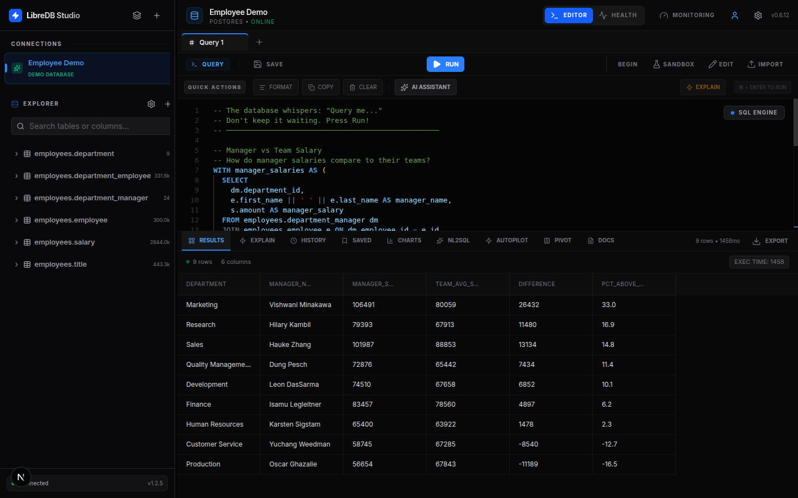
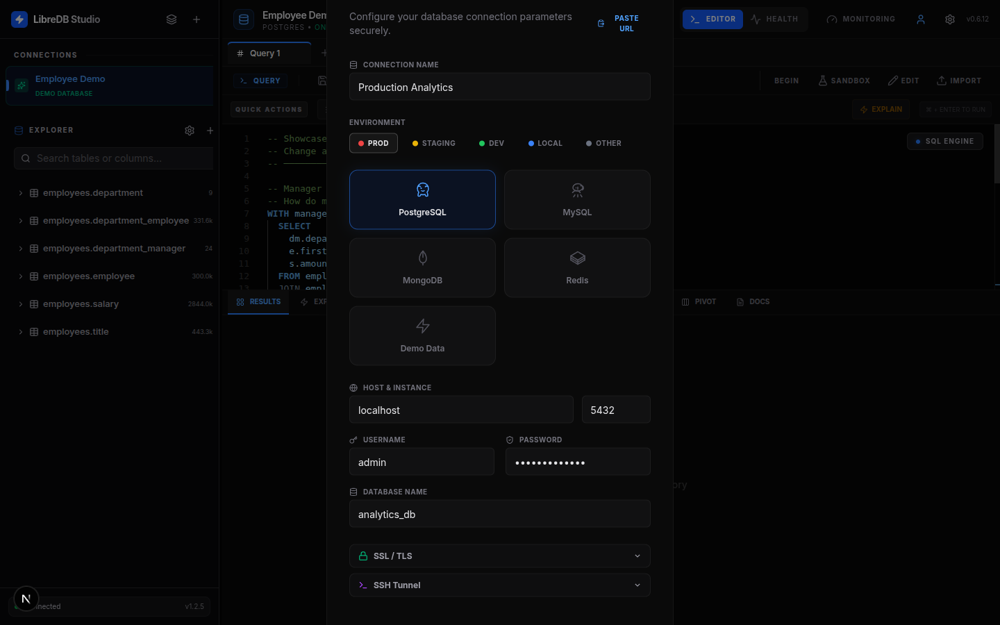
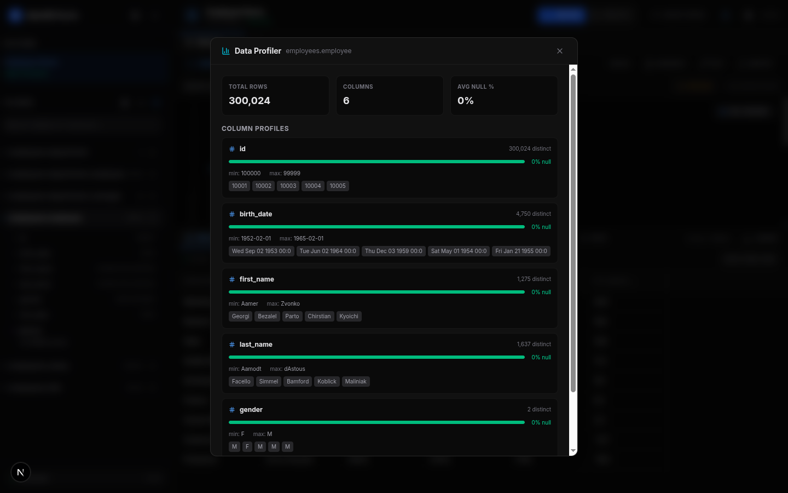
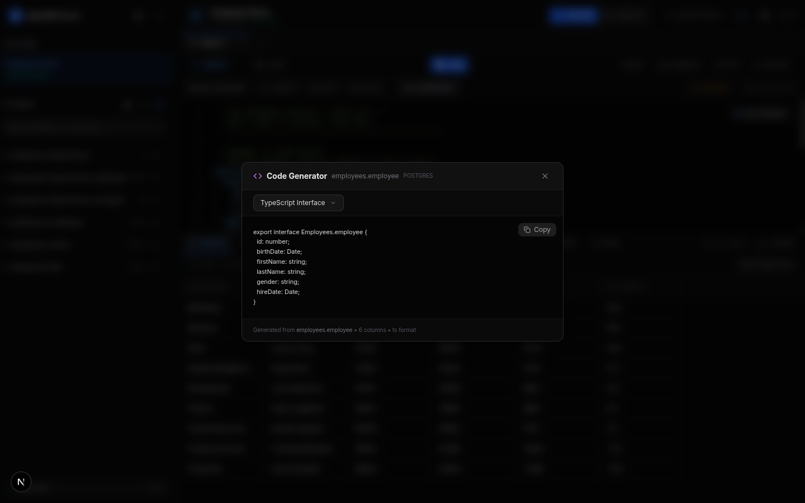

<p align="center">
  
</p>

<h1 align="center">LibreDB Studio</h1>

<p align="center">
  <strong>The database editor that deploys next to your data, not onto your laptop.</strong>
</p>

<p align="center">
  <b>English</b> ·
  <a href="README_zh.md">简体中文</a> ·
  <a href="README_ja.md">日本語</a>
</p>

<p align="center">
  <a href="https://opensource.org/licenses/MIT"></a>
  <a href="https://sonarcloud.io/project/overview?id=libredb_libredb-studio"></a>
  <a href="#testing"></a>
  <a href="https://deepwiki.com/libredb/libredb-studio"></a>
  <a href="https://artifacthub.io/packages/helm/libredb-studio/libredb-studio"></a>
</p>

<p align="center">
  <a href="https://nextjs.org/"></a>
  <a href="https://react.dev/"></a>
  <a href="https://hub.docker.com/r/libredb/libredb-studio?tag=latest"></a>
  <a href="https://artifacthub.io/packages/helm/libredb-studio/libredb-studio"></a>
</p>

<p align="center">
  <a href="#quick-start"><strong>Quick Start</strong></a> •
  <a href="#live-test"><strong>Live Demo</strong></a> •
  <a href="#getting-started"><strong>Install Options</strong></a> •
  <a href="#one-click-deploy"><strong>Deploy Your Own</strong></a>
</p>

<p align="center">
  
</p>

---

## Quick Start

Run a full SQL IDE in one command — no clone, no build:

```bash
# Docker (recommended)
docker run -d -p 3000:3000 ghcr.io/libredb/libredb-studio:latest

# or with Node.js 20.9+ (no Docker)
npx @libredb/studio
```

Then open **http://localhost:3000** — on first run the admin password is printed to the log (zero-config).

> Need Helm, Homebrew, Snap, winget, or deb/rpm? See [all install options](#getting-started).

---

## Live Test

> **Try LibreDB Studio instantly without installation!**

| Test | URL | Credentials |
|------|-----|-------------|
| **Public Test** | [app.libredb.org](https://app.libredb.org) | SSO |

The test instance comes with a pre-configured PostgreSQL database via [Seed Connections](#seed-connections-pre-configured-databases). No setup required!

---

## Overview

You create a Postgres on a managed platform. It is ready in forty seconds. Then you want to look inside it — so you open a port to the internet, dig an SSH tunnel, or install a desktop client on every machine that needs one.

LibreDB Studio goes the other way. It deploys next to the data: a container, a Helm chart, an operator, a one-click template on your PaaS, or `npm i @libredb/studio` inside your own product. Nothing has to face outward.

Ten engines share one interface — PostgreSQL, MySQL, Oracle, SQL Server, SQLite, MongoDB, Redis, Couchbase, ClickHouse and Druid — with the same explorer, ER diagrams, schema diff and monitoring across all of them.

And nothing is held back. Single sign-on, ER diagrams, the AI assistant and the NoSQL engines all ship in the MIT build. MIT is not generosity here, it is a requirement of the architecture: you cannot place a per-seat licensed, feature-gated tool into every environment you own.

### Why LibreDB Studio?
- **Deploys next to the data**: container, Helm chart, OpenShift operator, one-click PaaS template, or embedded via npm.
- **Ten engines, one interface**: PostgreSQL, MySQL, Oracle, SQL Server, SQLite, MongoDB, Redis, Couchbase, ClickHouse, Druid.
- **Runs where you are**: browser, phone, Windows, Linux desktop.
- **AI with your own model**: NL2SQL against Gemini, OpenAI, or a local LLM.
- **Nothing behind a wall**: RBAC, OIDC single sign-on, query audit trail and ER diagrams all ship under MIT.

<p align="center">
  
  <br/><em>Connect to PostgreSQL, MySQL, Oracle, SQL Server, MongoDB, Couchbase, ClickHouse, Apache Druid, Redis, or SQLite with SSL/TLS and SSH Tunnel support.</em>
</p>

---

[](https://deepwiki.com/libredb/libredb-studio)

---

## Key Features

### Professional SQL IDE
- **Monaco Engine**: Powered by the same core as VS Code.
- **Smart Autocomplete**: Schema-aware suggestions for tables, columns, and SQL keywords.
- **Multi-Tab Workspace**: Handle parallel tasks with independent execution states.
- **Visual EXPLAIN**: Graphical execution plans to identify performance bottlenecks.
- **Interactive ER Diagrams**: Visual schema graph with real foreign key edges, cardinality labels, MiniMap navigation, table search/filter, compact mode, and PNG/SVG export. Automatic hierarchical layout powered by ELK.js.
- **Schema Diff & Migration**: Compare schema snapshots or cross-connection schemas side-by-side. Color-coded diff view (added/removed/modified) with automatic migration SQL generation for PostgreSQL, MySQL, SQLite, Oracle, and SQL Server, plus ClickHouse column modifications.
- **Snapshot Timeline**: Visual horizontal timeline of schema snapshots. Click any two points to instantly compare and track schema evolution over time.

<p align="center">
  
  <br/><em>Visual schema explorer with interactive ER diagrams powered by ReactFlow.</em>
</p>

### Multi-Model AI Copilot
- **Universal LLM Support**: Defaults to Gemini 2.5 Flash, but ready for OpenAI, Claude, or **Local LLMs** (Ollama/LM Studio).
- **NL2SQL**: Generate complex queries from natural language with schema-aware context.
- **Query Safety Analysis**: AI-powered pre-execution risk assessment for destructive queries (DELETE, DROP, TRUNCATE).
- **AI Query Explainer**: EXPLAIN plans translated into plain language with optimization suggestions.
- **AI Query Autopilot**: Automated slow query analysis with actionable index and rewrite recommendations.
- **Schema Awareness**: AI understands your specific database structure for pinpoint accuracy.
- **Plug & Play**: Works out of the box with zero complex configuration.

<p align="center">
  
  <br/><em>Ask questions in plain English and get executable SQL queries instantly.</em>
</p>

### Pro Data Management
- **Universal Data Grid**: Virtualized rendering (TanStack) for millions of rows.
- **Inline Editing**: Double-click to update values directly in the grid, on engines whose SQL has a single-table row update (the control is hidden elsewhere).
- **Column Filtering**: Per-column text filters on query results for instant data exploration.
- **Interactive Pivot Table**: Client-side pivoting with 5 aggregation functions (COUNT, SUM, AVG, MIN, MAX) and SQL generation.
- **Expert Exporter**: Instant CSV and JSON exports for reporting.

### Advanced Data Visualization
- **8 Chart Types**: Bar, Line, Pie, Area, Scatter, Histogram, Stacked Bar, and Stacked Area charts powered by Recharts.
- **Data Aggregation**: Group-by with SUM, AVG, COUNT, MIN, MAX aggregation functions. Date grouping by hour, day, week, month, or year.
- **Chart Persistence**: Save chart configurations and reload them instantly. Manage a library of saved charts.
- **Chart Dashboard**: Grid view of all saved charts for at-a-glance data overview directly in the bottom panel.

### Display Masking (Preview)
- **Client-Side Display Layer**: Masks sensitive values in the browser UI — useful for screen sharing, demos, and reducing accidental on-screen exposure. **Not server-enforced**; query API responses still contain full values for authenticated users.
- **Column-Name Pattern Matching**: 10 built-in patterns (email, phone, credit card, SSN, password, IP, date, financial, and more) match **result column headers** by regex. Works when the output name matches (e.g. `SELECT salary`). Aliases (`salary AS x`) and aggregates (`SUM(salary)`) are not masked today.
- **Configurable Rules**: Admin panel to add, edit, enable/disable masking patterns. Custom patterns with regex support. Settings stored per-browser in localStorage.
- **RBAC UI Controls**: User role cannot toggle or reveal masked cells in the UI. Admin role can toggle masking and temporarily reveal individual cells (10s auto-hide).
- **Export & Clipboard**: CSV, JSON, and SQL INSERT exports use masked display values when masking is active in the UI. This does not prevent access to raw data via the API, browser DevTools, or admin reveal.
- **UI Coverage**: Grid, mobile card/table views, row detail sheet, and clipboard copy respect the active display mask.

### Analyst & Developer Tools
- **AI Data Profiler**: One-click table profiling with column statistics (null %, cardinality, min/max, sample values) and AI-powered narrative summaries.
- **ORM Code Generator**: Generate TypeScript interfaces, Zod schemas, Prisma models, Go structs, Python dataclasses, and Java POJOs from live table schemas.
- **Test Data Generator**: Schema-aware fake data generation with 30+ semantic column inferences (email, phone, name, address, etc.). Produces INSERT statements or MongoDB insertMany JSON.
- **Database Documentation**: Auto-generated searchable data dictionary from live schema with AI-powered documentation and Markdown export.

<p align="center">
  
  <br/><em>One-click column profiling: null %, cardinality, min/max, and sample values for 300K+ rows.</em>
</p>

<p align="center">
  
  <br/><em>Generate TypeScript interfaces, Prisma models, Go structs, and more from live schemas.</em>
</p>

### Authentication & SSO
- **Dual Auth Modes**: Local email/password login or OpenID Connect (OIDC) Single Sign-On — switchable via environment variable.
- **Vendor-Agnostic OIDC**: Works with any OIDC-compliant provider — Auth0, Keycloak, Okta, Azure AD, Zitadel, Google, and more.
- **PKCE Security**: Authorization Code Flow with Proof Key for Code Exchange (S256) for secure authentication.
- **Auto Role Mapping**: Configurable claim-based role mapping with dot-notation for nested claims (e.g., `realm_access.roles`).
- **Provider Logout**: Logout clears both local JWT session and identity provider session.

### DBA Maintenance Toolkit (Admin Only)
- **Live Monitoring Dashboard**: 7-tab monitoring with Overview, Performance, Queries, Sessions, Tables, Storage, and Connection Pool views.
- **Time-Series Trend Charts**: Real-time metric trends (connections, cache hit ratio, buffer pool, deadlocks) with auto-refreshing ring buffer history.
- **Configurable Auto-Refresh**: Polling intervals from 5s to 60s with play/pause control.
- **Threshold Alerting**: Color-coded health indicators (healthy/warning/critical) for cache hit ratio, connection usage, deadlocks, and buffer pool utilization.
- **Connection Pool Stats**: Live total/active/idle/waiting pool metrics with utilization progress bars.
- **One-Click Maintenance**: Trigger `VACUUM`, `ANALYZE`, `REINDEX`, `UPDATE STATISTICS`, `DBCC CHECKDB`, and `ALTER INDEX REBUILD` per database engine.
- **Audit Trail**: Full history of every query executed across the organization.

---

## Supported Databases

| Database | Driver | Features |
| :--- | :--- | :--- |
| **PostgreSQL** | `pg` | Full SQL IDE, EXPLAIN plans, transactions, query cancellation (`pg_cancel_backend`), SSL/TLS, SSH tunnel |
| **MySQL** | `mysql2` | Full SQL IDE, EXPLAIN plans, transactions, query cancellation (`KILL QUERY`), SSL/TLS, SSH tunnel |
| **Oracle** | `oracledb` (Thin mode) | Full SQL IDE, `FETCH FIRST N ROWS` pagination, `V$` monitoring views, `ANALYZE TABLE`, `ALTER INDEX REBUILD`, transactions |
| **SQL Server** | `mssql` (tedious) | Full SQL IDE, `TOP N` / `OFFSET FETCH` pagination, `sys.dm_*` DMVs, `UPDATE STATISTICS`, `DBCC CHECKDB`, transactions, Azure SQL auto-detect |
| **SQLite** | `bun:sqlite` / `node:sqlite` (runtime-selected) | Full SQL IDE, file-based or in-memory databases (server-local file) |
| **MongoDB** | `mongodb` | JSON query editor, collection operations (find, aggregate, insert, update, delete) |
| **Couchbase** | none — HTTP (Query + management REST) | Full SQL++ IDE, EXPLAIN plans, bucket/scope/collection explorer, `INFER` column inference, read-your-writes consistency, `UPDATE STATISTICS` / `BUILD INDEX` / request kill |
| **ClickHouse** | none — HTTP (SQL interface, port 8123) | Full SQL IDE, JSON EXPLAIN plan trees, system-table schema introspection, `OPTIMIZE TABLE` / table statistics / query kill maintenance |
| **Apache Druid** | none — HTTP (`POST /druid/v2/sql`, Router port 8888 or Broker 8082) | Read-only SQL IDE, native-query EXPLAIN plan trees, `INFORMATION_SCHEMA` datasource introspection, `sys.*` monitoring (segments, servers, ingestion tasks). Druid SQL has no `UPDATE`, no `DELETE` and no `CREATE TABLE`, and nothing it can do counts as a maintenance operation — a datasource changes through ingestion, not from the editor |
| **Redis** | `ioredis` | Command editor, key browser, INFO-based monitoring |

> All SQL databases share: schema explorer, ER diagrams, schema diff & migration, display masking (preview), monitoring dashboard, and connection string import. Druid is the exception twice over: its HTTP SQL API has no URI convention to paste, so it is configured by host and port only, and a generated migration names the limitation instead of emitting column-modification DDL against an engine whose SQL contains none — as it also does for Couchbase's schemaless collections.

> **Provider reference docs:** each database has an in-depth reference (design, connection, query format, monitoring, limitations) under [`docs/providers/`](docs/providers/README.md). For the provider architecture see [`docs/DATABASE_PROVIDERS.md`](docs/DATABASE_PROVIDERS.md), and to add a new database see [`docs/ADDING_A_PROVIDER.md`](docs/ADDING_A_PROVIDER.md).

---

## Tech Stack

| Component | Technology | Target |
| :--- | :--- | :--- |
| **Framework** | Next.js 16 (App Router), React 19 | Web, Mobile |
| **UI Engine** | Tailwind CSS 4, Radix UI, [shadcn/ui](https://ui.shadcn.com/) | Web, Mobile |
| **Theming** | CSS Variables + `@theme inline` ([Guide](docs/ui/theming.md)) | Web, Mobile |
| **Editor** | Monaco Editor (VS Code Engine) | Web |
| **AI** | Multi-Model (Gemini, OpenAI, Ollama, Custom) | Web, Mobile |
| **Auth** | JWT (`jose`) + OIDC (`openid-client`), PKCE, Role Mapping | Web, Mobile |
| **Database** | PostgreSQL, MySQL, Oracle, SQL Server, SQLite, MongoDB, Couchbase, ClickHouse, Apache Druid, Redis | Web, Mobile |
| **Charts** | Recharts (Bar, Line, Pie, Area, Scatter, Histogram, Stacked) | Web, Mobile |
| **ERD** | React Flow, ELK.js (auto-layout) | Web |
| **State/Grid** | TanStack Table & Virtual | Web, Mobile |
| **Deployment** | Docker, Kubernetes | Web |

---

## Getting Started

  ### Install

  | Channel | Command | Notes |
  | :--- | :--- | :--- |
  | **Docker** | `docker run -d -p 3000:3000 ghcr.io/libredb/libredb-studio:latest` | Zero-config: the admin password is printed to the log on first run |
  | **Helm (Kubernetes)** | `helm install libredb oci://ghcr.io/libredb/charts/libredb-studio` | Zero-config: first-run admin credentials are printed to the pod log |
  | **npx** | `npx @libredb/studio` | Linux/macOS/Windows, Node 20.9+ (Node 24 LTS recommended); downloads the release server archive |
  | **Homebrew** | `brew trust libredb/tap && brew install libredb/tap/libredb-studio` | `brew trust` is required once (Homebrew 6+; run `brew update` if unknown) |
  | **deb / rpm** | `sudo dpkg -i libredb-studio_<version>_amd64.deb` | Attached to each GitHub release; systemd service included |
  | **Snap** | `sudo snap install libredb-studio` | Zero-config: the admin password is printed to `sudo snap logs libredb-studio` on first run — [Snap Store listing](https://snapcraft.io/libredb-studio) |
  | **winget (Windows)** | `winget install LibreDB.Studio` | Portable zip with a bundled Node.js runtime; run `libredb-studio` — [listed in the winget community repository](https://github.com/microsoft/winget-pkgs/tree/master/manifests/l/LibreDB/Studio) |
  | **Chocolatey (Windows)** | `choco install libredb-studio` | Same standalone zip — CI push ready; first push awaits community moderation ([#114](https://github.com/libredb/libredb-studio/issues/114)) |
  | **Portable zip (Windows)** | `.\libredb-studio.exe` | Download from [GitHub Releases](https://github.com/libredb/libredb-studio/releases); bundled Node runtime, no package manager needed |
  | **Desktop app (Linux, AppImage)** | `chmod +x libredb-studio-desktop-<version>-linux-x64.AppImage && ./libredb-studio-desktop-<version>-linux-x64.AppImage` | Native window, no browser tab and no login prompt; the server runs as a local sidecar. For a sandboxed build, use the Flatpak row below ([#232](https://github.com/libredb/libredb-studio/issues/232)) |
  | **Desktop app (Debian/Ubuntu)** | `sudo apt install ./libredb-studio-desktop-<version>_amd64.deb` | Same desktop app, installed into the menu; needs no FUSE and takes WebKitGTK from the distribution. Not the server package — that one is `libredb-studio_<version>_<arch>.deb` |
  | **Desktop app (Flatpak)** | `flatpak --user remote-add --if-not-exists flatpark https://dl.flatpark.org/flatpark.flatpakrepo`<br>`flatpak --user install flatpark org.libredb.Studio` | Sandboxed desktop app from the [FlatPark](https://flatpark.org/) remote — no filesystem access at all; databases are reached over TCP. Developer-approved listing ([#241](https://github.com/libredb/libredb-studio/issues/241)) |

  > Homebrew, deb/rpm, Snap, the Windows portable zip, winget/Chocolatey, the desktop AppImage and Debian package, and the npx launcher consume standalone artifacts attached to each GitHub release. Full per-channel guide — commands, configuration, systemd usage, and the Docker image tag model — in [`docs/DISTRIBUTION.md`](docs/DISTRIBUTION.md). Channel coverage scorecard (live / pending, by platform and category) — [`docs/CHANNELS.md`](docs/CHANNELS.md).

  ### Quick Start (Docker)

  Run LibreDB Studio with a single command — no clone, no install, no build:

```bash
docker run -d \
  --name libredb-studio \
  -p 3000:3000 \
  -e ADMIN_EMAIL=admin@libredb.org \
  -e ADMIN_PASSWORD=LibreDB.2026 \
  -e USER_EMAIL=user@libredb.org \
  -e USER_PASSWORD=LibreDB.2026 \
  -e JWT_SECRET=change-me-to-a-random-32-char-string \
  ghcr.io/libredb/libredb-studio:latest
```

  > **Registry**: `ghcr.io/libredb/libredb-studio` is the primary image (no pull rate limits — preferred for Kubernetes/CI). The same image is also mirrored to Docker Hub as [`libredb/libredb-studio`](https://hub.docker.com/r/libredb/libredb-studio?tag=latest) for convenience.

  Open [http://localhost:3000](http://localhost:3000) and login with `admin@libredb.org` / `LibreDB.2026`.

  > **Auth env vars (local provider):** `ADMIN_PASSWORD` and `JWT_SECRET` are only required when `AUTH_BOOTSTRAP=off`; otherwise both are generated on first start (see [Zero-config first run](#zero-config-first-run) below). `USER_EMAIL` / `USER_PASSWORD` are optional; omit them to run admin-only (no default user password is ever assumed). `ADMIN_EMAIL` defaults to `admin@libredb.org`. Using OIDC (`NEXT_PUBLIC_AUTH_PROVIDER=oidc`)? None of these are needed.

  > **Tip**: Add `-e LLM_PROVIDER=gemini -e LLM_API_KEY=your_key -e LLM_MODEL=gemini-2.5-flash` to enable AI features.

  ### Zero-config first run

  Starting the server without `JWT_SECRET` / `ADMIN_PASSWORD` works out of the box:
  the missing values are generated on first start, stored in `<data dir>/auth-bootstrap.json`
  (file mode 0600), and the admin password is printed once to the server log. Explicitly
  set environment variables always take precedence. Set `AUTH_BOOTSTRAP=off` to require
  explicit configuration instead (recommended for production deployments).

  A `JWT_SECRET` you set yourself must be at least 32 characters. A shorter one is a
  hard error at startup: the server prints what is wrong and exits with code 1, instead
  of booting into a state where the health check reports healthy but every login returns
  503. Unset the variable to let the first run generate a strong secret for you.

  ### Linux packages (.deb / .rpm)

  Native packages for Debian/Ubuntu and RHEL/Fedora (amd64 and arm64) are attached to every
  [GitHub release](https://github.com/libredb/libredb-studio/releases). They bundle the standalone
  server together with a private Node.js runtime (nothing else to install) and register a systemd service:

```bash
# Debian / Ubuntu
sudo dpkg -i libredb-studio_<version>_amd64.deb

# RHEL / Fedora / Rocky
sudo rpm -i libredb-studio-<version>.x86_64.rpm

# Start the service (first run prints the generated admin password to the journal)
sudo systemctl enable --now libredb-studio
journalctl -u libredb-studio
```

  Configuration lives in `/etc/libredb-studio/env` (loaded by the unit; see the commented template
  installed there), state (SQLite storage and generated credentials) in `/var/lib/libredb-studio`.
  The `libredb-studio` command can also be run directly without systemd. Full details for this and
  every other channel: [`docs/DISTRIBUTION.md`](docs/DISTRIBUTION.md).

  ### Prerequisites
  - [Bun](https://bun.sh/) (Recommended) or Node.js 24+
  - A target database to query (PostgreSQL, MySQL, Oracle, SQL Server, SQLite, MongoDB, Couchbase, ClickHouse, Apache Druid, or Redis)

  ### Quick Start (Local)
  1. **Clone & Install**
     ```bash
     git clone https://github.com/libredb/libredb-studio.git
     cd libredb-studio
     bun install
     ```

    2. **Configure Environment**
       Create a `.env.local` file:
       ```env
       # Authentication (email/password)
       ADMIN_EMAIL=admin@libredb.org
       ADMIN_PASSWORD=your_admin_password
       USER_EMAIL=user@libredb.org
       USER_PASSWORD=your_user_password
       JWT_SECRET=your_32_character_random_string

       # Optional: OIDC Single Sign-On (Auth0, Keycloak, Okta, Azure AD, etc.)
       # NEXT_PUBLIC_AUTH_PROVIDER=oidc
       # OIDC_ISSUER=https://your-provider.com
       # OIDC_CLIENT_ID=your_client_id
       # OIDC_CLIENT_SECRET=your_client_secret

       # LLM Configuration
       LLM_PROVIDER=gemini # options: gemini, openai, ollama, custom
       LLM_API_KEY=your_api_key
       LLM_MODEL=gemini-2.5-flash
       LLM_API_URL=http://localhost:11434/v1 # optional for local LLMs (Ollama)
       ```

3. **Launch**
   ```bash
   bun dev
   ```
   Open [http://localhost:3000](http://localhost:3000)

---

## Development Databases

Need databases to test with? We provide ready-to-use containers for all supported engines:

```bash
# Start every default-profile database (PostgreSQL, MySQL, MongoDB, SQL Server, Oracle, ...)
docker compose -f database-compose.yml up -d

# Or start a specific database
docker compose -f database-compose.yml up -d postgres
docker compose -f database-compose.yml up -d mssql
docker compose -f database-compose.yml up -d oracle

# Apache Druid: profile-gated, so a bare `up -d` does NOT start it. Druid is a distributed
# system with no single-container mode - five Druid processes plus ZooKeeper plus its own
# metadata database is the minimum that can answer a SQL query, so all seven services carry
# `profiles: [druid]` rather than doubling the default stack. Connect to the Router on 8888
# (or the Broker on 8082 - the same endpoint, no different configuration).
docker compose -f database-compose.yml --profile druid up -d

# Start PostgreSQL with sample e-commerce data
docker compose -f docker/postgres.yml up -d

# Stop (keeps data)
docker compose -f database-compose.yml down

# Stop and remove all data
docker compose -f database-compose.yml down -v

# The Druid containers need the profile flag here too - without it `down` leaves them running
docker compose -f database-compose.yml --profile druid down -v
```

### Connection Details

| Database | Host | Port | User | Password | Database/Service |
|----------|------|------|------|----------|-----------------|
| **PostgreSQL** | localhost | 5432 | postgres | postgres | postgres |
| **MySQL** | localhost | 3306 | root | root | mysql |
| **SQL Server** | localhost | 1433 | sa | Password123! | master |
| **Oracle** | localhost | 1521 | system | Password123! | freepdb1 |
| **MongoDB** | localhost | 27017 | admin | admin | — |
| **Apache Druid** | localhost | 8888 (Router) or 8082 (Broker) | — | — | — (one catalog, always `druid`) |

### PostgreSQL Sample Data

The `docker/postgres.yml` setup includes a pre-loaded e-commerce schema:

| Feature | Description |
|---------|-------------|
| **PostgreSQL 18** | Official image with `pg_stat_statements` |
| **pg_stat_statements** | Pre-enabled for query monitoring |
| **Sample Schema** | E-commerce database (app schema) |
| **Sample Data** | 25 customers, 30 products, 100 orders |
| **Views** | Order summary, product sales, customer LTV |

Sample tables: `app.customers`, `app.products`, `app.orders`, `app.order_items`, `app.product_reviews`, `app.categories`, `app.coupons`, `app.audit_log`

> This setup is ideal for testing the **Monitoring Dashboard** features with real `pg_stat_statements` data.

---

## Testing

LibreDB Studio has a comprehensive test suite with **3,000+ unit/integration tests** and **32 E2E tests** across 6 layers, with **100% line coverage** enforced by CI (`bun run coverage:check`).

### Quick Commands

```bash
# Run all tests (unit + API + integration + hooks + components)
bun run test

# Run by layer
bun run test:unit          # Pure function tests (1,600+ cases)
bun run test:api           # API route handler tests (270+ cases)
bun run test:integration   # Database provider tests (340+ cases)
bun run test:hooks         # React hook tests (250+ cases)
bun run test:components    # Component tests with mock isolation (570+ cases)

# E2E tests (requires build)
bun run test:e2e           # Playwright browser tests (32 cases)

# Coverage report (lcov)
bun run test:coverage
```

### Test Architecture

| Layer | Directory | Runner | Tests | What it covers |
|-------|-----------|--------|-------|----------------|
| **Unit** | `tests/unit/` | `bun:test` | ~1,609 | Pure functions: SQL parser, connection strings, data masking, query limiter, schema diff, error classes, DB icons, showcase queries |
| **API** | `tests/api/` | `bun:test` | ~279 | Route handlers: auth, query, transaction, maintenance, AI endpoints, middleware |
| **Integration** | `tests/integration/` | `bun:test` | ~346 | Database providers: PG, MySQL, SQLite, MongoDB, Couchbase, Redis, Oracle, MSSQL, ClickHouse, Druid|
| **Hooks** | `tests/hooks/` | `bun:test` | ~251 | React hooks: auth, connections, tabs, query execution, transactions, inline editing, AI chat, monitoring |
| **Components** | `tests/components/` | `bun:test` + happy-dom | ~570 | UI components: Studio, Sidebar, QueryEditor, ResultsGrid, Admin Dashboard, Charts, ERD |
| **E2E** | `e2e/` | Playwright | ~32 | Full browser flows: login, connections, query execution, tabs, export, admin |

### Key Details

- **Test runner**: `bun:test` (built-in, Jest-compatible API) with `happy-dom` for DOM environment
- **Component isolation**: Component tests run in 6 isolated groups via `tests/run-components.sh` to prevent `mock.module()` cross-contamination
- **E2E**: Playwright with Chromium, runs against a production build (`bun run build && bun start`)
- **CI**: GitHub Actions runs lint + typecheck + build, unit/integration tests with coverage, E2E tests, and SonarCloud analysis
- **Coverage**: `bun test --coverage` generates lcov reports for SonarCloud integration

> **Important**: Always use `bun run test` instead of bare `bun test`. The test script handles proper isolation between test groups.

---

## One-Click Deploy

Deploy your own instance of LibreDB Studio with a single click on DigitalOcean, Koyeb, Render, Railway, Sealos, CapRover, or Dokploy:

 [](https://app.koyeb.com/deploy?name=libredb-studio&type=docker&image=ghcr.io%2Flibredb%2Flibredb-studio%3Alatest&instance_type=free&regions=fra&instances_min=0&autoscaling_sleep_idle_delay=3900&env%5BADMIN_EMAIL%5D=admin%40libredb.org&env%5BADMIN_PASSWORD%5D=LibreDB.2026&env%5BJWT_SECRET%5D=replace_with_openssl_rand_base64_32&env%5BLLM_API_KEY%5D=your_GEMINI_API_KEY&env%5BLLM_MODEL%5D=gemini-2.5-flash&env%5BLLM_PROVIDER%5D=gemini&env%5BNEXT_PUBLIC_AUTH_PROVIDER%5D=local&env%5BSTORAGE_PROVIDER%5D=local&env%5BUSER_EMAIL%5D=user%40libredb.org&env%5BUSER_PASSWORD%5D=LibreDB.2026&ports=3000%3Bhttp%3B%2F&hc_protocol%5B3000%5D=tcp&hc_grace_period%5B3000%5D=5&hc_interval%5B3000%5D=30&hc_restart_limit%5B3000%5D=3&hc_timeout%5B3000%5D=5&hc_path%5B3000%5D=%2F&hc_method%5B3000%5D=get)  
 [](https://render.com/deploy?repo=https://github.com/libredb/libredb-studio)  
 [](https://railway.com/deploy/libredb-studio?referralCode=libredb&utm_medium=integration&utm_source=template&utm_campaign=generic)  
 [](https://sealos.io/products/app-store/libredb-studio)  
 [](https://marketplace.digitalocean.com/apps/libredb-studio)  
 [](https://github.com/caprover/one-click-apps/blob/master/public/v4/apps/libredb-studio.yml)  
 [](docs/FLY.md)  
 [](https://templates.dokploy.com)  

> **DigitalOcean:** the [Marketplace listing](https://marketplace.digitalocean.com/apps/libredb-studio) creates a preconfigured Droplet. Unique admin credentials are generated on first boot; the welcome message (MOTD) tells you where to find them.
>
> **CapRover:** open your CapRover dashboard → **Apps → One-Click Apps/Databases**, search for **LibreDB Studio**, and deploy.
>
> **Koyeb:** set a strong `JWT_SECRET` (at least 32 characters — `openssl rand -base64 32`) and credentials before deploying (Koyeb cannot auto-generate secrets); the prefilled values are placeholders, and a secret under 32 characters makes the app exit at startup. The button uses `STORAGE_PROVIDER=local` — connection metadata lives in the browser, which suits Koyeb's ephemeral filesystem. For persistence across redeploys, switch to `STORAGE_PROVIDER=postgres` and point `STORAGE_POSTGRES_URL` at a Koyeb managed Postgres or Neon database. See [`deploy/koyeb/`](deploy/koyeb/).
>
> **Fly.io:** the repo ships a ready [`fly.toml`](fly.toml) — full steps (app name, volume, secrets) in [`docs/FLY.md`](docs/FLY.md).
>
> **Cosmos:** install in one click from the [Cosmos](https://cosmos-cloud.io) Marketplace — search for **LibreDB Studio**. Cosmos auto-generates secrets, provisions a persistent SQLite volume, and serves the app behind its SmartShield reverse proxy. See [`deploy/cosmos/`](deploy/cosmos/).
>
> **Dokploy:** install in one click from the [Dokploy template catalog](https://templates.dokploy.com) — in your Dokploy dashboard, **Create Service → Template**, search for **LibreDB Studio**, and deploy. Dokploy auto-generates `ADMIN_PASSWORD`, `USER_PASSWORD`, and `JWT_SECRET`, and persists connections on a SQLite volume behind Traefik. See [`deploy/dokploy/`](deploy/dokploy/).


### Environment Variables

| Variable | Required | Description |
|----------|----------|-------------|
| `ADMIN_EMAIL` | ❌ | Admin email (default: `admin@libredb.org`) |
| `ADMIN_PASSWORD` | ✅(autogenerated) | Admin password; auto-generated on first run unless `AUTH_BOOTSTRAP=off` |
| `USER_EMAIL` | ❌ | Optional user account email (default: `user@libredb.org`) |
| `USER_PASSWORD` | ❌ | Optional; the lower-privilege user account exists only when set |
| `JWT_SECRET` | ✅(autogenerated) | JWT secret (min 32 chars); auto-generated on first run unless `AUTH_BOOTSTRAP=off`. A shorter value is fatal: the server refuses to start rather than serve a deployment where every login fails |
| `AUTH_BOOTSTRAP` | ❌ | `off` disables zero-config generation (strict mode; recommended for production) |
| `AUTH_COOKIE_SECURE` | ❌ | `false` drops the `Secure` flag from auth cookies — needed only when the browser reaches the app over plain HTTP (LAN/home server); not for TLS terminated at an ingress |
| `NEXT_PUBLIC_AUTH_PROVIDER` | ❌ | `local` (default) or `oidc` for SSO |
| `OIDC_ISSUER` | ❌ | OIDC issuer URL (required when `oidc`) |
| `OIDC_CLIENT_ID` | ❌ | OIDC client ID (required when `oidc`) |
| `OIDC_CLIENT_SECRET` | ❌ | OIDC client secret (required when `oidc`) |
| `OIDC_ADMIN_ROLES` | ❌ | Comma-separated admin role values (default: `admin`) |
| `OIDC_ROLE_CLAIM` | ❌ | Claim path for role (e.g. `realm_access.roles`) |
| `OIDC_SCOPE` | ❌ | OIDC scope (default: `openid profile email`) |
| `LLM_PROVIDER` | ❌ | AI provider: `gemini`, `openai`, `ollama` |
| `LLM_API_KEY` | ❌ | API key for AI features |
| `LLM_MODEL` | ❌ | Model name (e.g., `gemini-2.5-flash`) |
| `STORAGE_PROVIDER` | ❌ | Storage provider: `local` (default), `sqlite`, or `postgres` |
| `STORAGE_POSTGRES_URL` | ❌ | PostgreSQL connection URL (required when `STORAGE_PROVIDER=postgres`) |
| `SEED_CONFIG_PATH` | ❌ | Path to seed connections YAML config (see [Seed Connections](#seed-connections-pre-configured-databases)) |
| `SEED_CACHE_TTL_MS` | ❌ | Seed config cache TTL in ms (default: `60000`) |

> **Tip**: Copy `.env.example` to `.env.local` for local development.

---

## Deployment (DevOps)

> Maintainers: every distribution channel is inventoried in
> [`distribution/channels.yaml`](distribution/channels.yaml); `bun run distribution:check`
> reports version drift across all of them (see
> [docs/DISTRIBUTION.md](docs/DISTRIBUTION.md#channel-inventory-and-drift-check)).

### Koyeb

1. **Fork this repository**
2. **Connect to Koyeb**: [app.koyeb.com](https://app.koyeb.com) → New → Blueprint
3. **Select your forked repo** and Koyeb will auto-detect `koyeb.yaml`
4. **Set Environment Variables** in Koyeb Dashboard:
5. **Deploy!**

### Railway

LibreDB Studio is available as a one-click [Railway](https://railway.com) template.
See [`deploy/railway/`](deploy/railway/) for the template definition, install
instructions, and the publish checklist. The template runs the prebuilt
`ghcr.io/libredb/libredb-studio` image with SQLite persistence on a Railway
volume. Note: Docker-image templates require a manual version bump on each
release (same as CapRover).

### CapRover

LibreDB Studio is published in the official [CapRover One-Click Apps](https://github.com/caprover/one-click-apps/blob/master/public/v4/apps/libredb-studio.yml) catalog:

1. **Open your CapRover dashboard** → **Apps → One-Click Apps/Databases**
2. **Search** for **LibreDB Studio**
3. **Fill in the variables** (admin/user credentials, `JWT_SECRET`, optional AI/storage settings)
4. **Deploy!**

The app runs the prebuilt `ghcr.io/libredb/libredb-studio` image. As with Railway, Docker-image templates require a manual version bump on each release.

### Kubero

LibreDB Studio is listed in the official
[Kubero template catalog](https://www.kubero.dev/templates) (a self-hosted
"Heroku alternative for Kubernetes"). From your Kubero dashboard, browse
**Templates**, search **LibreDB Studio**, fill in the credentials / `JWT_SECRET`,
and deploy. The template runs the prebuilt `ghcr.io/libredb/libredb-studio` image
with SQLite persistence on a 5Gi volume at `/app/data`. See
[`deploy/kubero/`](deploy/kubero/) for install and post-install details. As with
Railway and CapRover, Docker-image templates require a manual version bump on
each release.

### Cosmos

LibreDB Studio is listed in the official
[Cosmos servapp marketplace](https://github.com/azukaar/cosmos-servapps-official)
([Cosmos](https://cosmos-cloud.io) is a self-hosted server manager and secure
reverse proxy). From your Cosmos dashboard, open **Marketplace**, search
**LibreDB Studio**, and install. Cosmos auto-generates the credentials and
`JWT_SECRET`, provisions a persistent SQLite volume at `/app/data`, and serves
the app behind a SmartShield-protected route. See
[`deploy/cosmos/`](deploy/cosmos/) for install and post-install details. As with
Railway, CapRover, and Kubero, Docker-image templates require a manual version
bump on each release.

### Render (Recommended for cloud deployment)

LibreDB Studio includes a `render.yaml` Blueprint for one-click deployment:

1. **Fork this repository**
2. **Connect to Render**: [dashboard.render.com](https://dashboard.render.com) → New → Blueprint
3. **Select your forked repo** and Render will auto-detect `render.yaml`
4. **Set Environment Variables** in Render Dashboard:
5. **Deploy!**

### Docker Compose (Self-Hosted)

Use the ready-to-use [`docker-compose.example.yml`](docker-compose.example.yml) — it pulls the published image (`ghcr.io/libredb/libredb-studio:latest`), so no source build is needed. It documents every supported environment variable (auth, OIDC, storage, LLM, seed connections), with the less-common ones commented out.

```bash
# 1. Copy the ready-to-use compose file
cp docker-compose.example.yml docker-compose.yml

# 2. Create your .env (set at least JWT_SECRET / ADMIN_PASSWORD / USER_PASSWORD)
cp .env.example .env

# 3. Start
docker compose up -d   # → http://localhost:3000
```

This file is platform-neutral and works with PaaS tools that consume a plain `docker-compose.yml` (Dokploy, Coolify, Portainer, etc.) — point them at the file and set the secrets as environment variables.

> The repository's default `docker-compose.yml` builds the image from source (`build: .`) and is intended for local development.

### Kubernetes (Helm Chart)

```bash
helm repo add libredb https://libredb.org/libredb-studio/
helm install libredb libredb/libredb-studio

# Retrieve the generated admin credentials from the pod log
kubectl logs deployment/libredb-libredb-studio | grep -A 4 "generated admin credentials"
```

Or via OCI registry:
```bash
helm install libredb oci://ghcr.io/libredb/charts/libredb-studio
```

For production, provide your own secrets instead of relying on generated ones:
```bash
helm install libredb libredb/libredb-studio \
  --set secrets.jwtSecret=$(openssl rand -base64 32) \
  --set secrets.adminPassword=MyAdmin123
```

Features: PostgreSQL subchart, Ingress/TLS, HPA, PDB, NetworkPolicy, ExternalSecrets support. See [charts/libredb-studio/README.md](charts/libredb-studio/README.md) for full documentation.

### Seed Connections (Pre-Configured Databases)

Pre-configure database connections via a YAML config file so users see them immediately after login. Ideal for Platform/SaaS deployments where admins provision databases for teams.

**Features:**
- Role-based access control (`admin`, `user`, `*` wildcard)
- Hybrid model: `managed: true` (read-only, admin-controlled) or `managed: false` (editable copy for user)
- Credentials injected via `${ENV_VAR}` syntax — never stored in config file
- Hot-reload: config changes apply within 60s without restart
- Works with Docker, docker-compose, and Kubernetes (Helm)

**1. Create a config file** (`seed-connections.yaml`):

```yaml
version: "1"

defaults:
  managed: true
  environment: production

connections:
  - id: "prod-analytics"
    name: "Production Analytics"
    type: postgres
    host: analytics-db.internal
    port: 5432
    database: analytics
    user: "readonly_user"
    password: "${ANALYTICS_DB_PASSWORD}"
    roles: ["admin"]
    color: "#10B981"

  - id: "dev-sandbox"
    name: "Dev Sandbox"
    type: mysql
    host: dev-mysql.internal
    port: 3306
    database: sandbox
    user: "dev_user"
    password: "${DEV_DB_PASSWORD}"
    roles: ["*"]
    managed: false
```

**2. Mount and configure:**

<details>
<summary><strong>Docker</strong></summary>

```bash
docker run -v ./seed-connections.yaml:/app/config/seed-connections.yaml:ro \
  -e SEED_CONFIG_PATH=/app/config/seed-connections.yaml \
  -e ANALYTICS_DB_PASSWORD=secret \
  -e DEV_DB_PASSWORD=devsecret \
  ghcr.io/libredb/libredb-studio:latest
```
</details>

<details>
<summary><strong>Docker Compose</strong></summary>

```yaml
services:
  app:
    image: ghcr.io/libredb/libredb-studio:latest
    volumes:
      - ./seed-connections.yaml:/app/config/seed-connections.yaml:ro
    environment:
      SEED_CONFIG_PATH: /app/config/seed-connections.yaml
      ANALYTICS_DB_PASSWORD: ${ANALYTICS_DB_PASSWORD}
      DEV_DB_PASSWORD: ${DEV_DB_PASSWORD}
```
</details>

<details>
<summary><strong>Kubernetes (Helm)</strong></summary>

```yaml
# values.yaml
seedConnections:
  enabled: true
  config:
    version: "1"
    connections:
      - id: "prod-analytics"
        name: "Production Analytics"
        type: postgres
        host: analytics-db.internal
        password: "${ANALYTICS_DB_PASSWORD}"
        roles: ["admin"]

# Credentials via K8s Secret:
extraEnvFrom:
  - secretRef:
      name: seed-db-credentials
```
</details>

**Config Reference:**

| Field | Required | Description |
|-------|----------|-------------|
| `version` | Yes | Must be `"1"` |
| `defaults` | No | Default values merged into all connections |
| `connections[].id` | Yes | Unique slug (`[a-z0-9-]+`, max 64 chars) |
| `connections[].name` | Yes | Display name in UI |
| `connections[].type` | Yes | `postgres`, `mysql`, `sqlite`, `mongodb`, `redis`, `oracle`, `mssql`, `libredb`, `couchbase`, `clickhouse`, `druid` |
| `connections[].roles` | Yes | `["*"]` (everyone), `["admin"]`, `["user"]`, or `["admin", "user"]` |
| `connections[].managed` | No | `true` = read-only (default), `false` = editable copy for user |
| `connections[].password` | No | Use `${ENV_VAR}` syntax for secrets |
| `connections[].environment` | No | `production`, `staging`, `development`, `local`, `other` |
| `connections[].group` | No | Group label in sidebar |
| `connections[].color` | No | Hex color for badge (e.g., `#10B981`) |

**Environment Variables:**

| Variable | Default | Description |
|----------|---------|-------------|
| `SEED_CONFIG_PATH` | `/app/config/seed-connections.yaml` | Path to config file |
| `SEED_CACHE_TTL_MS` | `60000` | Cache TTL in ms (hot-reload interval) |

---

## Roadmap

- [x] **Phase 1**: Monaco SQL IDE & Multi-Tab Support.
- [x] **Phase 2**: Multi-Model AI (Gemini, OpenAI, Ollama, Custom) Integration.
- [x] **Phase 3**: Pro Data Grid & Virtualization.
- [x] **Phase 4**: Multi-Database Support (PostgreSQL, MySQL, SQLite, MongoDB, Redis).
- [x] **Phase 5**: Interactive ER Diagrams (Visual Schema Graph).
- [x] **Phase 6**: Enterprise Foundation (Connection Testing, SSL/TLS, SSH Tunnel, Transaction Control, Query Cancellation).
- [x] **Phase 7**: AI Intelligence (NL2SQL, Query Safety Analysis, AI Index Advisor, Multi-Turn Chat, Query Autopilot).
- [x] **Phase 8**: Analyst & Developer Tools (Data Profiler, Code Generator, Test Data Generator, Pivot Table, Column Filtering, Database Docs).
- [x] **Phase 9**: Display Masking — Preview (column-name pattern matching, configurable rules, RBAC UI controls, client-side export/clipboard masking).
- [x] **Phase 10**: Advanced ERD (Real FK Edges, ELK.js Auto-Layout, MiniMap, PNG/SVG Export, Compact Mode, Table Search).
- [x] **Phase 11**: Schema Diff & Migration (Snapshot Timeline, Cross-Connection Diff, Migration SQL Generation for PostgreSQL, MySQL, SQLite, Oracle, and SQL Server, plus ClickHouse column modifications).
- [x] **Phase 12**: Advanced Charting (Scatter, Histogram, Stacked Charts, Aggregation, Date Grouping, Chart Save/Load, Chart Dashboard).
- [x] **Phase 13**: Monitoring Enhancement (Time-Series Trends, Threshold Alerting, Connection Pool Stats, Configurable Polling).
- [x] **Phase 14**: Enterprise Database Support (Oracle Database via oracledb Thin mode, Microsoft SQL Server via mssql/tedious).
- [x] **Phase 15**: SSO Integration — Vendor-agnostic OIDC authentication (Auth0, Keycloak, Okta, Azure AD, Zitadel) with PKCE, role mapping, and provider logout.
- [ ] **Phase 16**: DBA & Monitoring (Lock Dependency Graph, Vacuum Scheduler, Prometheus Export).
- [ ] **Phase 17**: Enterprise Collaboration (User Identity, Shared Workspaces, SAML 2.0).
- [ ] **Phase 18**: Server-Enforced Data Masking (SQL output-lineage, deployment-global policy, fail-closed API masking, alias/aggregate coverage).
- [x] **Phase 19**: Driver-Free Providers — Couchbase (SQL++ over the Query REST API), the first provider that adds no runtime dependency. Pattern documented in [Adding a Provider](docs/ADDING_A_PROVIDER.md).
- [x] **Phase 20**: Analytics Databases — ClickHouse ([#264](https://github.com/libredb/libredb-studio/issues/264)) and Apache Druid ([#265](https://github.com/libredb/libredb-studio/issues/265)), both driver-free over HTTP. Druid is read-only by nature — no `UPDATE`, no `DELETE`, no `CREATE TABLE` — so it also demonstrates a provider that reports absent capabilities honestly instead of offering controls that can only fail.
- [ ] **Phase 21**: Federated Query — Trino/Starburst. Deliberately unscheduled: a Trino catalog is another *system*, so what a connection pins is a product question that has to be answered before the work can be specified.

---

## Community & Quality

| Resource | Description |
|----------|-------------|
| [DeepWiki](https://deepwiki.com/libredb/libredb-studio) | AI-powered documentation — always up-to-date with the codebase |
| [SonarCloud](https://sonarcloud.io/project/overview?id=libredb_libredb-studio) | Code quality, security analysis, and technical debt tracking |
| [API Docs](docs/API_DOCS.md) | Complete REST API reference |
| [OIDC SSO](docs/OIDC.md) | SSO setup (Auth0, Keycloak, Okta, Azure AD, Zitadel, Google) + subsystem internals & security model |
| [Theming Guide](docs/ui/theming.md) | CSS theming, dark mode, and styling customization |
| [Login Page](docs/ui/login-page.md) | Login page layout, OIDC/local modes, and design system |
| [Editor Docs](docs/editor/) | SQL editor internals — completion, performance, query optimization |
| [Architecture](docs/ARCHITECTURE.md) | System architecture and design patterns |
| [Adding a Provider](docs/ADDING_A_PROVIDER.md) | Step-by-step guide to adding a database, and how to tell whether it needs a driver at all |
| [Backlog](docs/BACKLOG.md) | Known defects and deferred work that is not yet filed as an issue |

---

## Support

libredb-studio is free and open source. If it helps you or your team, consider
[sponsoring the project](https://github.com/sponsors/libredb) — your support
funds maintenance, bug fixes, new database providers, and the ongoing
development of the open-source edition.

[](https://github.com/sponsors/libredb)

---

## Sponsors

<!-- sponsors-start -->
_Be the first to sponsor libredb-studio!_
<!-- sponsors-end -->

---

## Contributing

We welcome contributions from the community! Whether it's a bug fix, a new feature, or documentation improvements:
1. Fork the Project.
2. Create your Feature Branch (`git checkout -b feature/AmazingFeature`).
3. Commit your Changes (`git commit -m 'Add some AmazingFeature'`).
4. Push to the Branch (`git push origin feature/AmazingFeature`).
5. Open a Pull Request.

---

## License

Distributed under the MIT License. See `LICENSE` for more information.

---

<p align="center">
  Built for DBAs and Developers.
</p>
