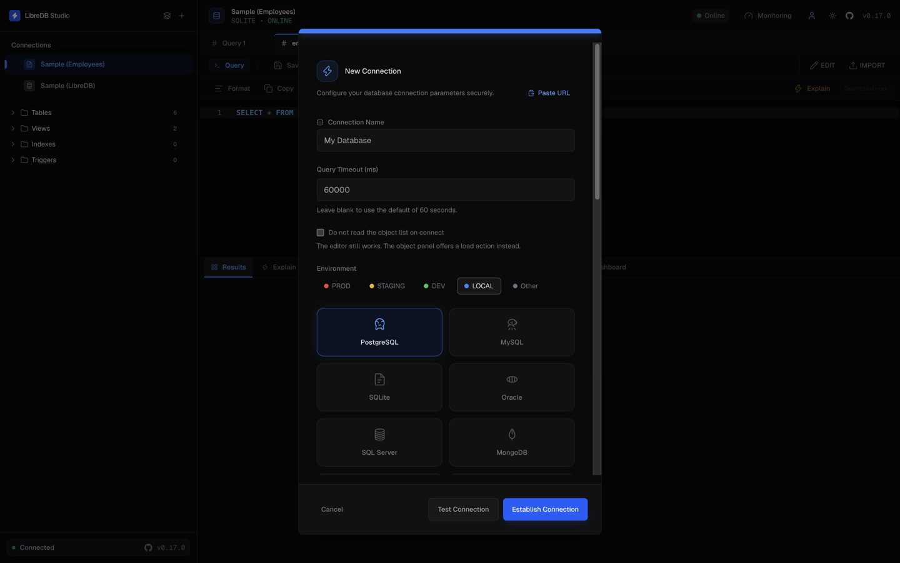
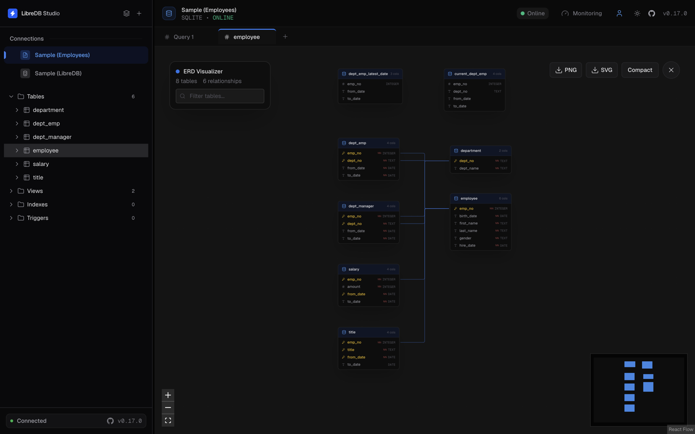
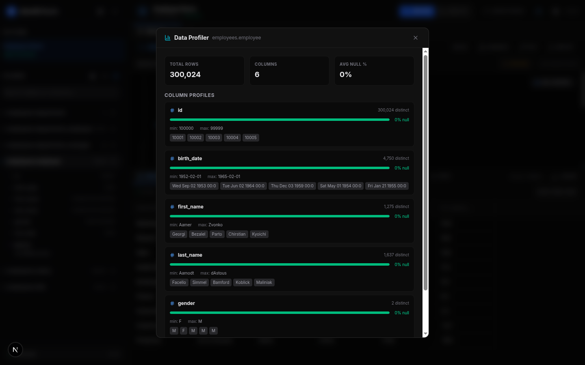
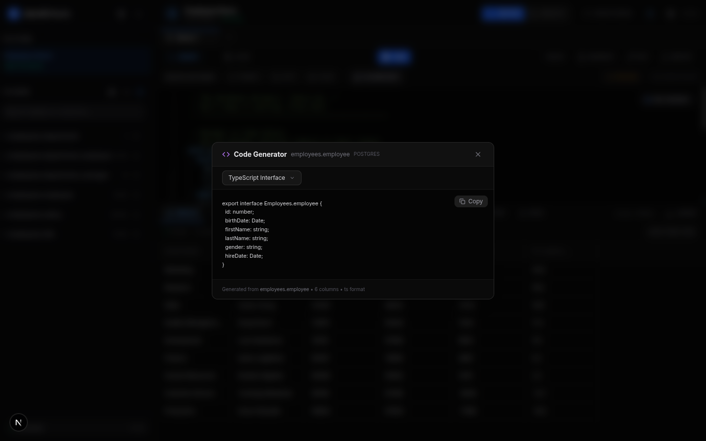

<p align="center">
  
</p>

<h1 align="center">LibreDB Studio</h1>

<p align="center">
  <strong>데이터베이스 에디터를 로컬에 설치하는 대신, 데이터가 위치한 환경에 배포해 사용하세요.</strong>
</p>

<p align="center">
  <a href="README.md">English</a> ·
  <a href="README_zh.md">简体中文</a> ·
  <a href="README_ja.md">日本語</a> ·
  <a href="README_es.md">Español</a> ·
  <a href="README_ur.md">اردو</a> ·
  <a href="README_hi.md">हिन्दी</a> ·
  <b>한국어</b> ·
  <a href="README_pt.md">Português</a> ·
  <a href="README_ru.md">Русский</a>
</p>

<p align="center">
  PostgreSQL 프로젝트 공식 문서에 등재:
  <a href="https://www.postgresql.org/about/news/libredb-studio-an-open-source-self-hosted-sql-ide-for-postgresql-in-the-browser-3368/">News</a>
  ·
  <a href="https://wiki.postgresql.org/wiki/PostgreSQL_Clients#LibreDB_Studio">PostgreSQL Clients</a>
  ·
  <a href="https://www.postgresql.org/download/products/1/#:~:text=LibreDB%20Studio">Software Catalogue</a>
  ·
  <a href="https://wiki.postgresql.org/wiki/Community_Guide_to_PostgreSQL_GUI_Tools#LibreDB_Studio">Community Guide to GUI Tools</a>
</p>
<p align="center">
  또한
  <a href="https://node-oracledb.readthedocs.io/en/latest/user_guide/appendix_b.html#libredb-studio">Oracle</a>,
  <a href="https://planet.mysql.com/showcase/?search=LibreDB">MySQL</a>,
  <a href="https://redis.io/docs/latest/develop/tools/#libredb-studio">Redis</a>,
  <a href="https://clickhouse.com/docs/integrations/connectors/tools/gui#libredb-studio">ClickHouse</a>,
  <a href="https://mariadb.com/docs/server/clients-and-utilities/graphical-and-enhanced-clients/libredb-studio">MariaDB</a>,
  <a href="https://trino.io/ecosystem/client-application#libredb-studio">Trino</a>,
  <a href="https://cloudberry.apache.org/docs/ecosystem/sql-clients/libredb-studio/">Apache Cloudberry</a>,
  <a href="https://docs.yugabyte.com/stable/integrations/tools/libredb-studio/">YugabyteDB</a>,
  <a href="https://www.tigerdata.com/docs/integrate/query-administration/libredb-studio">TimescaleDB</a>,
  <a href="https://www.dragonflydb.io/docs/integrations/libredb-studio">DragonflyDB</a>,
  <a href="https://microsoft.github.io/garnet/docs/welcome/compatibility#gui-tools">Garnet</a>,
  <a href="https://opensearch.org/community-projects/#:~:text=LibreDB%20Studio">OpenSearch</a>,
  <a href="https://duckdb.org/docs/preview/guides/sql_editors/libredb_studio">DuckDB</a>,
  <a href="https://docs.starrocks.io/docs/integrations/IDE_integrations/LibreDB_Studio/">StarRocks</a>,
  <a href="https://aiven.io/docs/products/postgresql/howto/connect-libredb-studio">Aiven for PostgreSQL</a>,
  <a href="https://aiven.io/docs/products/mysql/howto/connect-libredb-studio">Aiven for MySQL</a>,
  <a href="https://cwiki.apache.org/confluence/display/KAFKA/Ecosystem#:~:text=LibreDB%20Studio">Apache Kafka</a>,
  <a href="https://cassandra.apache.org/_/ecosystem.html">Apache Cassandra</a>
  및
  <a href="https://druid.apache.org/libraries/#:~:text=LibreDB%20Studio">Apache Druid</a>
  공식 문서에도 등재되어 있습니다.
</p>

<p align="center">
  
</p>

<p align="center">
  <a href="https://github.com/libredb/libredb-studio"></a>
  <a href="https://opensource.org/licenses/MIT"></a>
  <a href="https://sonarcloud.io/project/overview?id=libredb_libredb-studio"></a>
  <a href="https://codecov.io/github/libredb/libredb-studio"></a>
  <a href="https://deepwiki.com/libredb/libredb-studio"></a>
  <a href="https://artifacthub.io/packages/helm/libredb-studio/libredb-studio"></a>
</p>

> 이 한국어 README는 커뮤니티에서 번역한 문서로, 영문 버전의 최신 내용이 아직 반영되지 않았을 수 있습니다. 내용이 다른 경우 [영문 버전](README.md)을 기준으로 합니다.

<p align="center">
  <a href="https://nextjs.org/"></a>
  <a href="https://react.dev/"></a>
  <a href="https://hub.docker.com/r/libredb/libredb-studio?tag=latest"></a>
  <a href="https://artifacthub.io/packages/helm/libredb-studio/libredb-studio"></a>
</p>

<p align="center">
  <a href="#빠른-시작"><strong>빠른 시작</strong></a> •
  <a href="#온라인-데모"><strong>온라인 데모</strong></a> •
  <a href="#설치-방법"><strong>설치 방법</strong></a> •
  <a href="#one-click-배포"><strong>LibreDB Studio 배포하기</strong></a>
</p>

## 빠른 시작

클론이나 빌드 없이, 명령어 하나로 데이터베이스 에디터를 바로 실행할 수 있습니다.

```bash
# Docker (권장)
docker run -p 3000:3000 ghcr.io/libredb/libredb-studio:latest

# 또는 Docker 없이 Node.js 24+ 사용
npx @libredb/studio
```

그런 다음 [http://localhost:3000](http://localhost:3000)을 엽니다. 처음 실행하면 관리자 비밀번호가 로그에 출력되므로 별도의 설정이 필요하지 않습니다.

> localhost 또는 HTTPS가 아닌 주소로 Studio에 접속하는 경우(예: 로컬 네트워크의 `http://192.168.x.x:3000`)에는 `AUTH_COOKIE_SECURE=false`를 설정해야 합니다. 설정하지 않으면 상태 확인에는 문제가 없더라도 로그인이 실패하여 다시 로그인 페이지로 이동할 수 있습니다.

> Helm, Homebrew, Snap, winget 또는 deb/rpm을 사용하려면 [전체 설치 방법](#설치-방법)을 참고하세요.

## LibreDB Studio가 필요한 이유

호스팅 서비스를 이용하면 Postgres 데이터베이스를 40초 만에 생성해 사용할 수 있습니다.

하지만 막상 데이터베이스 안을 확인하려고 하면 이야기가 달라집니다. 포트를 외부에 노출하거나, 데스크톱 클라이언트를 설치하고 SSH 터널을 구성해야 합니다. 이런 설정이 번거로워 결국 명령줄로 돌아가는 경우도 있습니다. 데이터베이스를 준비하는 데는 40초밖에 걸리지 않았지만, 정작 그 안을 확인하기 위한 환경을 마련하는 데는 몇 시간이 걸릴 수 있습니다.

규모가 커지면 상황은 더 복잡해집니다. 애플리케이션에는 Postgres, 문서에는 Mongo, 캐시에는 Redis, 이벤트에는 ClickHouse를 사용한다고 해보겠습니다. 데이터베이스가 네 개라면 클라이언트도 네 개이고, 각각의 인증 정보도 따로 관리해야 합니다. 새로운 팀원이 합류하면 첫 코드를 작성하기도 전에 어떤 데이터가 어디에 있는지부터 파악해야 합니다. wiki와 메시지를 뒤져 연결 정보를 찾고, VPN 접근 권한을 기다린 뒤, 각 데이터베이스 엔진에 맞는 도구를 설치해야 합니다.

**데이터베이스가 운영되는 환경은 이미 달라졌습니다.** 이제 데이터베이스는 Kubernetes나 관리형 클라우드에서 실행되며, 때로는 점프 호스트를 거쳐야 접근할 수 있는 고객 VPC에 위치하기도 합니다. **하지만 데이터베이스를 다루는 도구는 여전히 데스크톱에 머물러 있습니다.** 무겁고, 사용자 단위로 비용이 부과되며, 사용하기 전에 설치해야 합니다. 하나의 데이터베이스와 하나의 노트북, 그리고 항상 같은 기기를 사용하는 한 명의 사용자를 전제로 만들어진 도구들입니다.

LibreDB Studio는 다른 방식으로 접근합니다. **데이터를 도구가 있는 곳으로 가져오는 대신, 도구를 데이터가 있는 곳으로 가져갑니다.**

이러한 접근 방식은 LibreDB Studio의 설계 방향에도 그대로 반영됩니다.

* 에디터는 브라우저에서 실행되어야 합니다. 데이터가 사용자의 컴퓨터에 있는 것도 아니고, 함께 일하는 사람들도 같은 컴퓨터를 사용하는 것이 아니기 때문입니다.

* 모바일에서도 사용할 수 있어야 합니다. 장애 상황에서 쿼리 하나를 실행해야 할 때 항상 노트북을 사용할 수 있는 것은 아니기 때문입니다.

* Container, Helm chart, Operator, One-click template 등 인프라와 같은 방식으로 배포할 수 있어야 합니다. 데이터베이스와 함께 운영되는 구성 요소들도 같은 방식으로 배포되기 때문입니다.

* 다른 제품에 임베드할 수 있어야 합니다. 데이터베이스 에디터가 가장 유용한 곳은 해당 데이터베이스를 생성한 제품 내부이기 때문입니다.

* 기능이나 사용 범위에 제약이 없어야 합니다. 사용자 단위 라이선스나 요금제에 따른 기능 제한이 있는 도구는 다양한 환경에 자유롭게 배포하기 어렵습니다. **SSO와 같은 필수 기능에 추가 비용이 발생한다면, 어디서든 자유롭게 배포할 수 있다는 원칙을 지키기 어렵습니다.**

> MIT 라이선스는 이러한 아키텍처를 가능하게 하기 위한 필수 조건입니다.


## 온라인 데모

> **설치 없이 바로 LibreDB Studio를 사용해 보세요!**

| 체험 방식          | URL                                            | 인증 정보                                                                                                               |
| -------------- | ---------------------------------------------- | ------------------------------------------------------------------------------------------------------------------- |
| **OIDC 공개 데모** | [app.libredb.org](https://app.libredb.org)     | SSO                                                                                                                 |
| **JWT 공개 데모**  | [trial.libredb.org](https://trial.libredb.org) | [admin@libredb.org](mailto:admin@libredb.org) / Admin!2026  [user@libredb.org](mailto:user@libredb.org) / User!2026 |

데모 환경에는 [Seed Connection](#seed-connection으로-데이터베이스-사전-구성)을 통해 PostgreSQL 연결이 미리 설정되어 있어 별도의 설정 없이 바로 사용할 수 있습니다.

## 개요

LibreDB Studio는 데이터가 있는 환경에 직접 배포하는 방식을 지향합니다. Container, Helm chart, Operator, PaaS One-click template을 이용해 배포하거나, `npm i @libredb/studio`를 사용해 자신의 제품에 직접 임베드할 수도 있습니다. 데이터베이스를 외부에 노출할 필요도 없습니다.

28개의 엔진을 하나의 인터페이스에서 사용할 수 있습니다. PostgreSQL, MySQL, Oracle, Db2 LUW, SQL Server, SQLite, libSQL, DuckDB, MongoDB, Redis, Couchbase, ClickHouse, Druid, Elasticsearch, OpenSearch, Trino, Databend, Apache Cassandra, Prometheus, Apache Kafka, etcd, Neo4j, Milvus, Qdrant, InfluxDB (InfluxQL), InfluxDB 3 (SQL), Oxia, S3-compatible object storage를 모두 동일한 브라우저 환경에서 다룰 수 있으며, 각 엔진이 제공하는 정보에 따라 ER 다이어그램, schema 비교, 모니터링 기능도 사용할 수 있습니다. 이 가운데 Druid, Elasticsearch, OpenSearch는 SQL 인터페이스에서 데이터 조회만 지원하므로 LibreDB Studio에서도 읽기 전용으로 제공됩니다. 이들 엔진에서는 `UPDATE`나 `CREATE TABLE` 같은 명령을 지원하지 않기 때문에, LibreDB Studio에서도 해당 기능을 사용할 수 없는 것으로 명확하게 표시합니다. Cassandra의 경우 제공하는 행 수와 용량 정보가 정확하지 않아 객체 브라우저에 해당 정보를 표시하지 않습니다. 부정확한 값을 보여주는 것보다 아예 표시하지 않는 방식을 택한 것입니다. Cassandra에서 제공하는 파티션 수 추정치는 디스크에 기록된 파일을 기반으로 하는데, 실제 테스트에서는 500개의 행이 있는 테이블이 143개로 추정되기도 했습니다. Trino는 데이터베이스가 아니라 쿼리 엔진이라는 점에서 또 다른 차이가 있습니다. 따라서 primary key나 index 정보를 제공하지 않으며, 표시되는 데이터 크기 역시 Trino 자체가 아닌 연결된 각 connector의 시스템을 기준으로 합니다.

가장 최근에 추가된 엔진은 S3-compatible object storage입니다. 에디터에 입력한 AWS CLI 읽기 명령(`aws s3api list-buckets`, `aws s3 ls`, `aws s3api head-object`, `aws s3api list-object-versions` 등)과 Studio 자체 `preview` 명령은 SDK 없이 S3 REST API로 bucket과 object를 읽으며, 요청은 Connection에 입력한 키만 사용해 Studio 자체 코드로 서명됩니다. 트리에는 bucket이 표시되고 Keys 패널에서는 폴더를 한 단계씩 탐색할 수 있으며, object를 열면 메타데이터와 함께 텍스트, JSON, CSV, Parquet의 미리보기를 크기 제한 안에서 확인할 수 있습니다. Studio는 GET과 HEAD 요청만 보내므로 구조적으로 읽기 전용으로 동작합니다. MinIO, Silo, Garage, RustFS에서 검증되었으며 호스팅 서비스에서는 검증되지 않았습니다.

Databend는 S3-compatible object storage보다 먼저 추가된 엔진입니다. SQL 편집기에서 입력한 쿼리는 별도의 드라이버 없이 Databend 자체 HTTP Query API를 통해 자체 호스팅 Databend 서버 또는 Databend Cloud 웨어하우스에서 실행되며, 데이터 조회와 쓰기를 모두 지원합니다. 객체 브라우저에서는 카탈로그와 데이터베이스를 비롯해 테이블, 뷰, 구체화된 뷰(Materialized View), 동적 테이블(Dynamic Table)을 확인할 수 있습니다. 각 SQL 문은 독립적인 세션에서 실행되므로 트랜잭션은 해당 트랜잭션을 시작한 문장이 종료될 때 함께 종료됩니다.

Oxia는 Databend보다 먼저 추가된 엔진입니다. 에디터에 입력한 `oxia client` 읽기 명령을 gRPC client API를 통해 Oxia 0.16.10 또는 0.17.1 서버에서 실행합니다. 트리에는 shard가 표시되고 key 브라우저에서는 각 key를 확인할 수 있습니다. client는 네 가지 읽기 RPC와 health check만 호출할 수 있어 읽기 전용으로 동작하며, shard leader가 Connection에 지정된 주소 또는 조회된 data server 중 하나일 때만 Studio가 연결합니다.

InfluxDB는 두 가지 Connection type으로 지원되며 각각 서로 다른 query language를 사용합니다. InfluxDB (InfluxQL)는 InfluxDB v1 HTTP API를 통해 InfluxDB 1.x, 2.x, 3에 InfluxQL을 전송하고, InfluxDB 3 (SQL)은 SQL API를 통해 InfluxDB 3 Core와 Enterprise에 SQL을 전송합니다. 브라우저에는 database와 measurement가 표시되며 InfluxDB 3에서는 measurement가 table로 표시됩니다. 두 Connection 모두 설정과 관계없이 읽기 전용으로 동작하며, 읽기 이외의 statement는 요청을 보내기 전에 거부되고 Studio는 write endpoint를 호출하지 않습니다.

Milvus는 에디터에 입력한 Milvus 자체 REST v2 요청을 gRPC API를 통해 Milvus 3.0.2 서버에서 실행합니다. 브라우저에는 database와 collection, field, partition, index, load 상태가 표시되며 vector는 결과 Table의 vector cell로 표시됩니다. 관리자의 Load와 Release를 제외하면 읽기 전용으로 동작하며, console에서는 15개의 읽기 route만 실행하고 서버가 다른 서비스를 호출하도록 만드는 요청은 거부합니다.

Qdrant는 에디터에 입력한 Qdrant 자체 REST 요청을 통해 Qdrant 1.19.1 서버를 조회합니다. 브라우저에는 collection과 vector, payload index, payload key의 sample view가 표시되며 vector는 결과 Table의 vector cell로 표시됩니다. console에서는 17개의 읽기 route만 실행하며 local BM25 model을 제외한 inference input을 거부하므로 읽기 전용으로 동작합니다.

Neo4j는 에디터에 입력한 Cypher를 Bolt를 통해 Neo4j 5.26 database에서 실행합니다. 브라우저에는 node label, relationship type, index, constraint가 표시되고 node, relationship, path는 결과 Table에서 JSON cell로 표시됩니다. 모든 statement가 실행 전에 읽기 정책, 서버 자체의 분류, READ session을 차례로 거치므로 읽기 전용으로 동작합니다.

etcd는 etcd gRPC API를 통해 etcdctl의 일부 명령으로 key를 읽고 쓸 수 있습니다. 브라우저에는 key prefix group과 key browser가 표시되며, key 값은 revision을 조건으로 하는 transaction 안에서 수정됩니다. 관리자는 compact, defragment, alarm 해제를 실행할 수 있습니다. Kubernetes prefix에 대한 write는 거부되며 Kubernetes Secret은 표시하지 않습니다.

Apache Kafka는 JSON 읽기 요청을 통해 Kafka protocol로 partition, offset 또는 timestamp를 기준으로 topic의 message를 조회할 수 있습니다. 브라우저에서는 topic, lag가 포함된 consumer group, broker를 확인할 수 있습니다. Kafka는 읽기 전용으로 지원되며 Studio에서는 message를 produce하거나 offset을 commit하지 않고, consumer group에 join하거나 topic을 생성하지도 않습니다.

Oxia, InfluxDB (InfluxQL), Milvus, Qdrant, Neo4j, etcd, Apache Kafka, Prometheus는 MongoDB나 Redis와 마찬가지로 SQL을 사용하지 않습니다. InfluxQL은 SQL과 비슷해 보이지만 별도의 query language이며 한 번에 하나의 `SELECT`, `SHOW`, `EXPLAIN`을 실행합니다. 반면 InfluxDB 3 (SQL)은 SQL을 사용합니다. Prometheus는 Prometheus HTTP API와 PromQL을 사용해 metric, rule, scrape target을 조회할 수 있으며, Studio에서 서버의 write 또는 관리 endpoint를 호출하지 않기 때문에 읽기 전용으로 지원됩니다.

주요 기능을 별도의 유료 기능으로 제한하지도 않습니다. SSO, ER 다이어그램, AI 기능을 비롯한 모든 NoSQL 엔진이 MIT 라이선스로 제공되는 버전에 포함되어 있습니다. MIT 라이선스는 이러한 아키텍처를 가능하게 하기 위한 필수 조건입니다. 사용자 단위로 라이선스 비용을 부과하거나 요금제에 따라 기능을 제한한다면 필요한 모든 환경에 자유롭게 배포하기 어렵기 때문입니다.

### LibreDB Studio를 선택하는 이유

* **데이터가 있는 환경에 직접 배포**: Container, Helm chart, Rancher, OpenShift Operator, PaaS One-click template을 사용하거나 npm으로 직접 임베드할 수 있습니다.

* **28개의 엔진, 하나의 인터페이스**: PostgreSQL, MySQL, Oracle, Db2 LUW, SQL Server, SQLite, libSQL, DuckDB, MongoDB, Redis, Couchbase, ClickHouse, Druid, Elasticsearch, OpenSearch, Trino, Databend, Cassandra, Prometheus, Apache Kafka, etcd, Neo4j, Milvus, Qdrant, InfluxDB (InfluxQL), InfluxDB 3 (SQL), Oxia, S3-compatible object storage.

* **어디서든 사용 가능**: 브라우저와 모바일은 물론 Windows, macOS, Linux 데스크톱에서도 사용할 수 있습니다.

* **사용자의 모델을 활용하는 읽기 전용 Agent**: 질문을 입력하면 Agent가 SQL을 작성하고 결과를 조회한 뒤, 각 결론의 출처를 포함한 보고서를 생성합니다. Gemini, OpenAI 또는 오픈소스 모델을 실행하는 로컬 Ollama를 사용할 수 있습니다.

* **유료 기능 제한 없음**: RBAC, OIDC SSO, query audit log, ER 다이어그램을 모두 MIT 라이선스로 제공합니다.


<p align="center">
    <br/><em>PostgreSQL, MySQL, Oracle, Db2 LUW, SQL Server, MongoDB, Couchbase, ClickHouse, Druid, Elasticsearch, OpenSearch, Trino, Databend, Cassandra, Redis, SQLite, DuckDB, libSQL, Prometheus, Apache Kafka, etcd, Neo4j, Milvus, Qdrant, InfluxDB (InfluxQL), InfluxDB 3 (SQL), Oxia, S3-compatible object storage에 연결할 수 있으며, SSL/TLS와 SSH 터널을 지원합니다. 단, Kafka는 TLS만 지원하며 SSH 터널은 지원하지 않습니다.</em>
</p>

[](https://deepwiki.com/libredb/libredb-studio)

## 핵심 기능

### 전문 SQL 에디터

* **Monaco 엔진**: VS Code와 동일한 Monaco Editor를 사용합니다.
* **스마트 자동 완성**: schema 정보를 기반으로 테이블명, 컬럼명, SQL 키워드를 자동으로 제안합니다.
* **Command Palette**: `Cmd/Ctrl+K`를 사용해 테이블, Connection, 저장된 쿼리 및 다양한 기능으로 빠르게 이동할 수 있습니다.
* **멀티탭 Workspace**: 여러 작업을 동시에 진행할 수 있으며, 각 탭의 실행 상태는 독립적으로 관리됩니다.
* **저장된 쿼리 백업**: 저장된 쿼리 전체를 JSON으로 내보낼 수 있습니다. 가져올 때는 파일의 유효성을 검사하고 기존 쿼리의 metadata를 유지하면서 새로운 항목을 병합합니다. ID가 중복된 경우 이를 알려주며 기존 쿼리는 변경하지 않습니다.
* **Connection 복제**: Connection Editor에서 저장된 Connection의 독립적인 `(copy)`를 만들어 설정을 수정한 뒤 새로운 Connection으로 저장할 수 있습니다. 취소하더라도 기존 Connection은 변경되지 않으며, 관리자가 관리하는 Connection은 복제할 수 없습니다.
* **시각화 EXPLAIN**: 실행 계획을 시각적으로 확인하여 성능 병목 지점을 파악할 수 있습니다.
* **인터랙티브 ER 다이어그램**: 실제 foreign key 관계와 cardinality를 시각화하며, MiniMap 탐색, 테이블 검색 및 필터링, Compact Mode, PNG/SVG 내보내기를 지원합니다. ELK.js를 사용해 자동으로 계층형 레이아웃을 구성합니다.
* **Schema 비교 및 마이그레이션**: schema snapshot 또는 서로 다른 Connection의 schema를 나란히 비교할 수 있습니다. 추가, 삭제, 변경된 항목을 색상으로 구분하고 migration SQL을 자동으로 생성합니다. PostgreSQL, MySQL, SQLite, Oracle, SQL Server를 지원하며 ClickHouse의 컬럼 변경도 지원합니다.
* **Snapshot Timeline**: schema snapshot을 가로형 Timeline으로 확인할 수 있습니다. 원하는 두 시점을 선택해 즉시 비교하고 시간에 따른 schema 변화를 추적할 수 있습니다.

<p align="center">
  
  <br/><em>ReactFlow 기반의 시각적 schema 브라우저와 인터랙티브 ER 다이어그램을 제공합니다.</em>
</p>


### Database Agent

Studio의 주요 AI 인터페이스는 에디터 옆에 있는 **Agent 사이드바**이며, 아래에 설명된 모델 기반 기능들이 이를 보완합니다. “*어느 부서에 직원이 가장 많아?*”, “*이 쿼리는 왜 느리지?*”처럼 궁금한 내용을 입력하고 Start를 누르면 됩니다. Agent는 연결된 데이터베이스를 대상으로 SQL을 작성하고 결과를 조회한 뒤, 각 결론에 해당 결과의 출처가 명시된 보고서를 생성합니다.

* **데이터를 변경할 수 없는 읽기 전용 Agent.** Agent가 실행하는 모든 쿼리는 별도의 실행 경로를 거칩니다. 데이터베이스 드라이버에 전달되기 전에 허용된 작업인지 확인하고, 실행 내역을 기록하고, 사용량 제한을 확인합니다(`executeAuditedOperation`, `src/lib/db/operations/execution.ts:129`). 또한 각 데이터베이스가 제공하는 읽기 전용 기능을 사용합니다. PostgreSQL에서는 읽기 전용 transaction을 사용하고, SQLite에서는 각 쿼리마다 `PRAGMA query_only`를 다시 설정합니다. DuckDB에서는 `READ_ONLY` 엔진 핸들과 SQL guard를 함께 사용합니다. `READ_ONLY` 설정만으로는 `COPY … TO`, `EXPORT DATABASE`, 로컬 파일을 읽는 table function까지 허용되기 때문입니다. SQL Server에는 읽기 전용 transaction이 없기 때문에 네 단계의 보호 장치를 사용합니다. Connection을 열 때 session principal에 쓰기 권한이 없는지 먼저 확인하고, optimizer를 통해 쿼리를 실제로 실행하지 않은 상태에서 각 쿼리의 허용 여부를 검증합니다. 서버에서 반환되는 행 수도 제한하며, 마지막으로 쿼리를 항상 rollback되는 transaction 안에서 실행합니다. 쓰기 작업과 DDL은 데이터베이스에 전달되기 전에 차단되며, 실제로 쿼리를 실행하는 `EXPLAIN ANALYZE`도 기본적으로 허용되지 않습니다. 이러한 실행 방식은 Agent에만 적용됩니다. 에디터에서 사용자가 직접 실행하는 쿼리는 provider를 바로 호출하며(`src/app/api/db/query/route.ts:44`), Agent에 적용되는 실행 확인이나 기록 과정은 거치지 않습니다.

* **Agent 모드에서 읽기를 지원하는 엔진은 PostgreSQL, SQLite, DuckDB, SQL Server입니다.** 데이터베이스의 읽기 전용 기능을 사용하기 때문에 이를 구현한 provider에서만 사용할 수 있습니다. 현재 `queryReadOnly`가 구현된 provider는 `postgres.ts`, `sqlite.ts`, `duckdb/index.ts`, `mssql.ts`뿐입니다. 다른 엔진에서 쿼리를 실행하는 Agent 모드 workflow를 시작하면 실제 실행이 시작되기 전에 차단됩니다. 요청이 provider factory까지 전달되더라도 `engine-unsupported`로 종료됩니다. **Plan** 모드는 모든 Connection에서 사용할 수 있습니다. Plan 모드에서는 모델이 tool을 사용하거나 쿼리를 실행하지 않으며, 데이터를 변경하지도 않습니다. 사용자가 직접 실행할 쿼리만 작성해 줍니다. GROUNDING은 모든 엔진을 지원합니다. PostgreSQL과 SQLite에서는 서버가 catalog query를 직접 구성하고, 다른 Connection에서는 해당 Connection의 provider를 통해 schema 정보를 가져옵니다. 이는 사이드바에서 이미 사용하는 조회 방식이므로 별도의 읽기 전용 쿼리 실행 기능이 필요하지 않습니다. 따라서 두 제한은 서로 별개입니다. Agent 모드는 네 가지 엔진에서 지원되지만 GROUNDING은 모든 엔진에서 사용할 수 있습니다. schema 정보를 가져오지 못한 경우에는 이를 명확하게 알리며 존재하지 않는 테이블명을 임의로 만들어내지 않습니다.

* **세 가지 workflow**: **Investigate**(질문에 답변), **Optimize**(예상 실행 계획을 비교하고 index 추가 또는 쿼리 개선 방법 제안), **Assess**(테이블을 분석하며 통계 수치만 사용하고 실제 데이터 값은 포함하지 않음).

* **자동으로 실행하지 않음.** Agent는 스스로 실행을 시작하거나 에디터에 내용을 입력하지 않으며, 자신이 제안한 쿼리를 실행하지도 않습니다. 제안을 적용할지는 사용자가 직접 결정합니다.

* **근거가 있는 결론만 제공.** 출처가 없는 결론은 보고서에 포함할 수 없습니다. 실행이 끝나면 “*Run answered*” 또는 “*Run did not answer*”로 질문에 답했는지를 판단하고 실행 종료 상태와 함께 표시합니다.

* **명확한 실행 제한**: workflow에 따라 한 번의 실행에서 18-45개의 쿼리를 실행할 수 있으며, 전체 실행 시간은 360-900초, 한 번의 조회 결과는 최대 200행으로 제한됩니다. workflow별 세부 제한은 [docs/AGENT.md](docs/AGENT.md)에서 확인할 수 있습니다.

* **사용자가 원하는 모델 사용 가능.** Gemini(기본값), OpenAI, Ollama 또는 OpenAI-compatible endpoint를 사용할 수 있습니다. **Agent** 모드에서는 tool calling을 지원하는 모델이 필요합니다. Ollama에서는 제조사의 문서만을 기준으로 판단하지 않고 실제 테스트를 통해 지원 여부를 확인하며, 자세한 방법은 가이드에서 확인할 수 있습니다. **Plan** 모드는 tool을 사용하지 않으며 별도의 테스트도 수행하지 않습니다(`src/lib/agent/capability-gate.ts:74`). 따라서 Agent 모드에서 사용할 수 없는 모델이라도 Plan 모드에서는 사용할 수 있으며, 사이드바에서도 이 방법을 안내합니다.

* **모델을 설정하지 않으면 AI 기능도 활성화되지 않음.** `LLM_*` 설정이 전혀 없다면 사이드바 자체가 표시되지 않으며 데이터가 네트워크 외부로 전송되지 않습니다. 단, API key 자체가 AI 기능의 활성화 여부를 결정하는 것은 아닙니다. Ollama와 custom endpoint는 API key 없이도 모델을 설정할 수 있으며, 이 경우 AI 기능은 활성화됩니다. Agent를 사용할 때 외부로 전송되는 데이터는 [`docs/AGENT_DATA_FLOW.md`](docs/AGENT_DATA_FLOW.md)에서 확인할 수 있습니다.

Standalone 애플리케이션에서만 사용할 수 있습니다. 임베드용 `@libredb/studio` 패키지에는 Agent 인터페이스가 포함되지 않습니다. **가이드:** [`docs/AGENT_GUIDE.md`](docs/AGENT_GUIDE.md) · **외부로 전송되는 데이터:** [`docs/AGENT_DATA_FLOW.md`](docs/AGENT_DATA_FLOW.md) · **동작 및 제한 사항:** [`docs/AGENT.md`](docs/AGENT.md) · **사용할 로컬 모델 선택:** [`docs/llms/`](docs/llms/README.md)

### 모델 기반 기능

* **다양한 LLM 지원**: 기본적으로 Gemini를 사용하며 OpenAI, Ollama 및 OpenAI-compatible endpoint(LM Studio, LiteLLM, vLLM)도 지원합니다.
* **쿼리 안전성 분석**: 데이터에 영향을 줄 수 있는 쿼리(DELETE, DROP, TRUNCATE)를 실행하기 전에 AI를 이용해 위험 요소를 분석합니다. provider가 설정되어 있지 않은 경우에도 확인 대화상자는 표시되며 일반적인 쿼리 경고가 함께 표시됩니다. `LLM_PROVIDER`만 설정하고 필요한 인증 정보를 입력하지 않았다면 설정이 완료되지 않은 것으로 처리되어 해당 오류가 계속 표시됩니다. 다른 설정 오류나 서비스 오류도 마찬가지로 표시됩니다.
* **AI 쿼리 설명**: EXPLAIN 실행 계획을 이해하기 쉬운 설명으로 바꾸고 최적화 방법을 제안합니다.
* **Schema 인식**: 연결된 데이터베이스의 schema가 context로 함께 전달되므로 사용자의 실제 테이블과 컬럼을 기반으로 설명합니다.
* **데이터 프로파일링 요약**: profiler가 수집한 컬럼별 통계를 읽기 쉬운 설명으로 정리합니다. 이 context에는 각 컬럼의 `min`과 `max`, 즉 실제 데이터 값이 포함됩니다. 자세한 내용은 [Agent 데이터 흐름](docs/AGENT_DATA_FLOW.md)을 참고하세요.

### 전문 데이터 관리

* **범용 Data Grid**: TanStack 기반의 virtualized rendering을 사용해 수백만 행 규모의 데이터를 처리할 수 있습니다.
* **인라인 편집**: 셀을 더블 클릭해 Grid에서 값을 직접 수정할 수 있습니다. SQL에서 단일 테이블의 행 업데이트를 지원하는 엔진에서만 사용할 수 있으며, 다른 엔진에서는 해당 기능이 표시되지 않습니다.
* **컬럼 필터링**: 쿼리 결과를 컬럼별 텍스트로 필터링하여 데이터를 빠르게 탐색할 수 있습니다.
* **인터랙티브 Pivot Table**: 클라이언트에서 Pivot Table을 구성할 수 있으며 5가지 aggregation function(COUNT, SUM, AVG, MIN, MAX)과 SQL 생성을 지원합니다.
* **다양한 데이터 내보내기**: CSV와 JSON으로 바로 내보낼 수 있습니다. CSV 가져오기와 결과 내보내기에서는 쉼표(기본값), 세미콜론, 탭을 delimiter로 사용할 수 있습니다. 내보내기 메뉴에서 파일로 저장할 수 있는 모든 형식은 클립보드로 바로 복사할 수도 있습니다.

### 고급 데이터 시각화

* **8가지 차트 지원**: Bar, Line, Pie, Area, Scatter, Histogram, Stacked Bar, Stacked Area 차트를 지원하며 Recharts를 사용합니다.
* **데이터 집계**: SUM, AVG, COUNT, MIN, MAX를 기준으로 데이터를 집계할 수 있습니다. 날짜 데이터는 시간, 일, 주, 월 또는 연도 단위로 그룹화할 수 있습니다.
* **차트 저장**: 차트 설정을 저장해 언제든 다시 불러올 수 있으며 저장된 차트를 한곳에서 관리할 수 있습니다.
* **차트 Dashboard**: 저장된 모든 차트를 Grid 형태로 표시하여 하단 패널에서 데이터를 한눈에 확인할 수 있습니다.

### 화면 데이터 마스킹 (Preview)

* **클라이언트 화면에서 민감 정보 마스킹**: 화면 공유나 데모 중 민감한 값이 노출되는 것을 줄이기 위해 브라우저 UI에서 값을 마스킹합니다. **서버에서 데이터를 차단하는 기능은 아닙니다.** 인증된 사용자가 Query API를 통해 받는 응답에는 원본 값이 그대로 포함됩니다.

* **컬럼명 패턴 매칭**: 이메일, 전화번호, 신용카드, SSN, 비밀번호, IP, 날짜, 금융 정보 등을 포함한 10개의 기본 패턴을 이용해 **결과 컬럼의 이름**을 정규식으로 검사합니다. 출력되는 컬럼명 자체가 패턴과 일치할 때 적용됩니다(예: `SELECT salary`). 현재 alias(`salary AS x`)를 사용하거나 aggregation(`SUM(salary)`)을 적용하면 마스킹되지 않습니다.

* **설정 가능한 규칙**: Admin Panel에서 마스킹 패턴을 추가하거나 수정하고 활성화/비활성화할 수 있습니다. 이메일, 전화번호, 신용카드, SSN preset을 선택하면 “Add Pattern” 양식에 기본값이 입력되어 저장하기 전에 컬럼 패턴을 수정할 수 있습니다. Custom Pattern에는 정규식을 사용할 수 있습니다. 설정은 브라우저의 localStorage에 저장됩니다.

* **RBAC 기반 UI 제어**: user 역할에서는 마스킹 기능을 끄거나 마스킹된 셀의 원본 값을 확인할 수 없습니다. admin 역할에서는 마스킹을 켜거나 끌 수 있으며 개별 셀의 원본 값을 일시적으로 확인할 수 있습니다(10초 후 자동으로 다시 숨겨집니다).

* **내보내기 및 클립보드**: 화면에서 마스킹이 활성화되어 있다면 CSV, JSON, SQL INSERT를 파일로 저장하거나 클립보드에 복사할 때도 마스킹된 값이 사용됩니다. 단, API나 브라우저 DevTools를 사용하거나 admin 권한으로 원본 값을 확인하는 것까지 차단하지는 않습니다.

* **UI 적용 범위**: Grid, 모바일 카드/테이블 View, Row Detail Panel, 클립보드 복사에서도 현재 적용 중인 마스킹 설정을 따릅니다.

### 분석가 및 개발자 도구

* **AI 데이터 프로파일링**: 한 번의 작업으로 테이블을 분석해 컬럼별 통계(null 비율, cardinality, 최솟값/최댓값, sample value)와 AI가 생성한 요약 설명을 제공합니다.

* **ORM 코드 생성기**: 실제 테이블 schema를 기반으로 TypeScript interface, Zod schema, Prisma model, Go struct, Python dataclass, Java POJO를 생성합니다.

* **테스트 데이터 생성기**: schema를 기반으로 테스트용 데이터를 생성하며 이메일, 전화번호, 이름, 주소 등 30개 이상의 semantic column type을 자동으로 인식합니다. 결과를 INSERT 문 또는 MongoDB insertMany JSON으로 생성할 수 있습니다.

* **데이터베이스 문서화**: 실제 schema를 기반으로 검색 가능한 Data Dictionary를 자동으로 생성합니다. AI 기반 설명을 추가할 수 있으며 Markdown 내보내기도 지원합니다.


<p align="center">
  
  <br/><em>한 번의 작업으로 30만 행 이상의 데이터를 분석해 컬럼별 null 비율, cardinality, 최솟값·최댓값, sample value를 확인할 수 있습니다.</em>
</p>

<p align="center">
  
  <br/><em>실제 schema를 기반으로 TypeScript interface, Prisma model, Go struct 등을 생성합니다.</em>
</p>


### 인증 및 SSO

* **두 가지 인증 방식**: 로컬 이메일/비밀번호 로그인 또는 OpenID Connect(OIDC) SSO를 사용할 수 있으며, 환경 변수를 통해 전환할 수 있습니다.
* **특정 provider에 종속되지 않는 OIDC**: Auth0, Keycloak, Okta, Azure AD, Zitadel, Google 등 OIDC 표준을 준수하는 모든 provider를 사용할 수 있습니다.
* **명령어 하나로 실행하는 SSO 데모**: `docker compose -f docker-compose.oidc-demo.yml up`을 실행하면 Keycloak이 미리 설정된 Studio를 시작할 수 있으며, 로컬에서 SSO와 역할 매핑을 직접 사용해 볼 수 있습니다([실행 방법](docs/OIDC.md#try-it-locally-with-keycloak)).
* **PKCE 보안**: Authorization Code Flow와 Proof Key for Code Exchange(S256)를 함께 사용해 인증 보안을 강화합니다.
* **자동 역할 매핑**: claim을 기반으로 역할을 매핑할 수 있으며, 중첩된 claim은 점 표기법으로 지정할 수 있습니다(예: `realm_access.roles`).
* **provider 로그아웃**: 로그아웃하면 로컬 JWT session과 identity provider의 session이 모두 종료됩니다.

### DBA 운영 도구 (관리자 전용)

* **실시간 모니터링 Dashboard**: 개요, 성능, 쿼리, session, 테이블, 스토리지, Connection Pool의 7개 탭에서 상태를 모니터링할 수 있습니다.
* **시계열 추이 차트**: Connection 수, cache hit rate, buffer pool, deadlock 등의 실시간 metric 추이를 확인할 수 있으며, 자동으로 갱신되는 ring buffer에 이전 데이터가 유지됩니다.
* **설정 가능한 자동 새로고침**: 5초에서 60초 사이의 polling interval을 설정할 수 있으며 재생/일시정지 기능을 제공합니다.
* **임계값 알림**: cache hit rate, Connection 사용률, deadlock, buffer pool 사용률을 상태에 따라 색상으로 구분해 표시합니다(정상/경고/심각).
* **Connection Pool 통계**: 전체/활성/유휴/대기 Connection 수를 실시간으로 확인할 수 있으며 사용률 progress bar를 제공합니다.
* **원클릭 유지보수**: 데이터베이스 엔진에 따라 `VACUUM`, `ANALYZE`, `REINDEX`, `UPDATE STATISTICS`, `DBCC CHECKDB`, `ALTER INDEX REBUILD`를 실행할 수 있습니다.
* **Query Audit Log**: 조직 전체에서 실행된 모든 쿼리의 전체 기록을 확인할 수 있습니다. 관리자 Audit 탭에서는 현재 불러온 작업 및 쿼리 기록을 적용된 필터 조건 그대로 CSV 또는 JSON으로 내보낼 수 있습니다.

## 지원 데이터베이스

| 데이터베이스               | Driver                                                                  | 기능                                                                                                                                                                                                                                                                                                                                                                                                                                                                                                                                                                                                                                                                                                                                                                                                                                                                                       |
| :------------------- | :---------------------------------------------------------------------- | :--------------------------------------------------------------------------------------------------------------------------------------------------------------------------------------------------------------------------------------------------------------------------------------------------------------------------------------------------------------------------------------------------------------------------------------------------------------------------------------------------------------------------------------------------------------------------------------------------------------------------------------------------------------------------------------------------------------------------------------------------------------------------------------------------------------------------------------------------------------------------------------- |
| **PostgreSQL**       | `pg`                                                                    | 전체 SQL IDE, EXPLAIN 실행 계획, transaction, 쿼리 취소(`pg_cancel_backend`)                                                                                                                                                                                                                                                                                                                                                                                                                                                                                                                                                                                                                                                                                                                                                                                                                       |
| **MySQL**            | `mysql2`                                                                | 전체 SQL IDE, EXPLAIN 실행 계획, transaction, 쿼리 취소(`KILL QUERY`)                                                                                                                                                                                                                                                                                                                                                                                                                                                                                                                                                                                                                                                                                                                                                                                                                              |
| **Oracle**           | `oracledb`(Thin 모드)                                                     | 전체 SQL IDE, `FETCH FIRST N ROWS` pagination, `V$` 모니터링 View, `ANALYZE TABLE`, `ALTER INDEX REBUILD`, transaction                                                                                                                                                                                                                                                                                                                                                                                                                                                                                                                                                                                                                                                                                                                                                                         |
| **Db2 LUW**          | `db2-node`(Rust로 작성된 DRDA client, native N-API plugin, IBM client 불필요) | Db2 for Linux, UNIX, Windows용 SQL IDE. table, view, materialized query table, alias, sequence, module, routine, trigger의 구조 탐색과 저장된 definition text, `FETCH FIRST` / `OFFSET` pagination, table별 RUNSTATS와 REORG를 지원합니다. 안전하지 않은 Connection을 명시적으로 선택하지 않는 한 TLS가 필요합니다. TLS를 사용하지 않으면 Driver가 비밀번호를 평문으로 전송합니다. Driver가 일부 type(non-ASCII text, 2^53을 초과하는 BIGINT, BOOLEAN, XML, LOB)을 잘못 읽는 문제가 있어 인라인 편집, 가져오기, EXPLAIN, transaction, 취소 기능은 비활성화되어 있습니다. 알려진 문제는 [`docs/providers/db2.md`](docs/providers/db2.md)를 참고하세요. |
| **SQL Server**       | `mssql`(tedious)                                                        | 전체 SQL IDE, `TOP N` / `OFFSET FETCH` pagination, `sys.dm_*` DMV, `UPDATE STATISTICS`, `DBCC CHECKDB`, transaction, Azure SQL 자동 감지                                                                                                                                                                                                                                                                                                                                                                                                                                                                                                                                                                                                                                                                                                                                                       |
| **SQLite**           | `bun:sqlite` / `node:sqlite`(런타임에서 자동 선택)                               | 전체 SQL IDE, 파일 또는 메모리 기반 데이터베이스(파일은 서버 로컬에 위치)                                                                                                                                                                                                                                                                                                                                                                                                                                                                                                                                                                                                                                                                                                                                                                                                                                           |
| **libSQL**           | Driver 없음, HTTP 사용(Hrana 프로토콜, `POST /v2/pipeline`, 포트 8080)            | libSQL 서버 또는 Turso Cloud를 위한 전체 SQL IDE. 위의 SQLite와 같은 dialect를 사용하지만 디스크에서 직접 읽는 대신 네트워크를 통해 접근합니다. `EXPLAIN QUERY PLAN`, `sqlite_master`, `pragma_*`를 통한 introspection과 `dbstat`을 이용한 실제 테이블별 byte 크기를 지원하며, 이는 위의 파일 기반 Driver에서는 확인할 수 없습니다. 인증에는 비밀번호 대신 auth token을 사용합니다. 유지보수 작업은 `REINDEX`와 `PRAGMA integrity_check` 두 가지만 지원합니다. 서버에서 `VACUUM`, `ANALYZE`, `PRAGMA optimize`, `PRAGMA wal_checkpoint`를 직접 거부하므로 해당 기능은 제공하지 않습니다.                                                                                                                                                                                                                                                                                                                                                                                                                                              |
| **DuckDB**           | `@duckdb/node-api`(네이티브 N-API 플러그인, 약 68MB, 플랫폼별 빌드)                    | 애플리케이션이 실행되는 서버의 로컬 DuckDB 파일 또는 `:memory:`를 위한 전체 SQL IDE. `EXPLAIN (FORMAT JSON)` 물리 실행 계획 트리, `duckdb_*` catalog introspection, `pragma_storage_info`의 block allocation을 이용한 실제 테이블별 byte 크기, Driver의 `interrupt()`를 이용한 쿼리 취소를 지원합니다. 유지보수 작업은 `VACUUM`, `ANALYZE`, `CHECKPOINT` 세 가지입니다. `REINDEX`는 parsing error가 발생하고 `PRAGMA integrity_check`와 `PRAGMA optimize`는 존재하지 않으므로 해당 기능은 제공하지 않습니다. slow query log와 session 목록도 제공하지 않습니다. DuckDB 자체에서 두 정보를 제공하지 않기 때문에 해당 Panel에서는 0으로 표시하는 대신 지원되지 않는다는 사실을 그대로 안내합니다. 파일은 하나의 OS process에서만 열 수 있으며 읽기 전용 모드에서도 동일하므로, 다른 Studio instance에서는 현재 instance가 사용 중인 데이터베이스를 열 수 없습니다.                                                                                                                                                                                                                                                  |
| **MongoDB**          | `mongodb`                                                               | JSON Query Editor, collection 작업(find, aggregate, insert, update, delete)                                                                                                                                                                                                                                                                                                                                                                                                                                                                                                                                                                                                                                                                                                                                                                                                                |
| **Couchbase**        | Driver 없음, HTTP 사용(Query + 관리 REST)                                     | 전체 SQL++ IDE, EXPLAIN 실행 계획, bucket/scope/collection 브라우저, `INFER` 컬럼 추론, read-your-own-writes consistency, `UPDATE STATISTICS` / `BUILD INDEX` / 요청 종료                                                                                                                                                                                                                                                                                                                                                                                                                                                                                                                                                                                                                                                                                                                                  |
| **ClickHouse**       | Driver 없음, HTTP 사용(SQL 인터페이스, 포트 8123)                                  | 전체 SQL IDE, JSON EXPLAIN 실행 계획 트리, system table schema introspection, `OPTIMIZE TABLE` / 테이블 통계 / 쿼리 종료 등의 유지보수 작업                                                                                                                                                                                                                                                                                                                                                                                                                                                                                                                                                                                                                                                                                                                                                                       |
| **Apache Druid**     | Driver 없음, HTTP 사용(`POST /druid/v2/sql`, Router 포트 8888 또는 Broker 8082) | 읽기 전용 SQL IDE, native query EXPLAIN 실행 계획 트리, `INFORMATION_SCHEMA` datasource introspection, `sys.*` 모니터링(segment, server, ingestion task). Druid SQL에는 `UPDATE`, `DELETE`, `CREATE TABLE`이 없으며 유지보수 작업도 제공하지 않습니다. datasource는 에디터에서 직접 수정하는 것이 아니라 ingestion을 통해 변경됩니다.                                                                                                                                                                                                                                                                                                                                                                                                                                                                                                                                                                                                                |
| **Elasticsearch**    | Driver 없음, HTTP 사용(`POST /_sql?format=json`, 포트 9200)                   | 읽기 전용 SQL IDE, mapping 기반 index/field 브라우저, cluster health, index별 document 수 및 storage size. EXPLAIN, 유지보수 작업, slow query 및 session Panel은 제공하지 않습니다. 이러한 정보는 log file과 statistics API에 존재하지만 SQL 인터페이스에서는 접근할 수 없습니다. Elasticsearch SQL에는 `OFFSET`도 없기 때문에 결과의 두 번째 페이지를 요청할 수 없으며, 쿼리 조건을 좁히거나 조회 제한을 높여야 합니다.                                                                                                                                                                                                                                                                                                                                                                                                                                                                                                                                                                        |
| **OpenSearch**       | Driver 없음, HTTP 사용(`POST /_plugins/_sql`, 포트 9200)                      | Elasticsearch와 동일한 provider module을 사용하며 동일한 읽기 전용 SQL IDE와 브라우저를 제공합니다. OpenSearch에서는 `LIMIT n OFFSET m`을 사용할 수 있어 pagination도 지원합니다.                                                                                                                                                                                                                                                                                                                                                                                                                                                                                                                                                                                                                                                                                                                                                   |
| **Trino**            | Driver 없음, HTTP 사용(Client Protocol, `POST /v1/statement`, 포트 8080)      | 설정된 모든 catalog를 대상으로 하는 전체 SQL IDE, `EXPLAIN (FORMAT JSON)` 실행 계획 트리, Connection에 지정된 catalog의 `information_schema` schema tree, `system.runtime` + `jmx` 모니터링, `SHOW STATS`를 통한 실제 행 수, 쿼리 취소 및 `kill_query` 유지보수를 지원합니다. Trino는 데이터를 직접 저장하지 않는 쿼리 엔진이므로 primary key, foreign key, index를 제공하지 않습니다. 따라서 ER 다이어그램에는 테이블만 표시되고 관계선은 표시되지 않으며 인라인 편집도 비활성화됩니다. 용량 Panel 역시 임의의 저장 용량을 표시하지 않고 catalog를 표시합니다. 실패한 쿼리도 HTTP 200으로 반환되며, 인증이 비활성화된 cluster에서도 일반 HTTP를 통한 비밀번호 전송은 거부됩니다.                                                                                                                                                                                                                                                                                                                                                                                                  |
| **Databend** | 없음 — HTTP (Databend 전용 Query API, `POST /v1/query`, 포트 8000) | 자체 호스팅 Databend 서버 또는 Databend Cloud Warehouse에 연결하는 SQL IDE입니다. 객체 브라우저에서 catalog, database, table, view, materialized view, dynamic table을 탐색할 수 있습니다. 일반 텍스트 `EXPLAIN` 실행 계획, 기본 catalog의 `system.*` 모니터링, Sessions 패널에서 `KILL QUERY`를 통한 쿼리 취소를 지원합니다. 각 statement는 독립된 session에서 실행되므로 transaction과 temporary table은 해당 statement가 끝날 때 종료됩니다. Databend는 key를 제공하지 않으므로 인라인 행 편집과 Create Table은 비활성화됩니다. loopback 또는 SSH tunnel을 사용하지 않는 호스트에 일반 HTTP로 비밀번호를 전송하려면 Connection에서 명시적으로 허용해야 합니다. Cloud Connection은 Warehouse를 지정하며, 객체 트리를 조회하는 첫 요청부터 Warehouse가 재개되고 과금될 수 있습니다. 사용자 지정 CA 및 client certificate를 사용하는 TLS와 SSH tunnel을 지원합니다. |
| **Apache Cassandra** | `cassandra-driver`(순수 JavaScript, 네이티브 module 없음)                       | Native Protocol(포트 9042) 기반 CQL IDE, partition key와 clustering key를 표시하는 keyspace 브라우저, `system_views` 개요, uptime 및 실행 중인 statement를 제공합니다. EXPLAIN은 지원하지 않으며(CQL에 해당 keyword가 없음), 쿼리 취소 기능도 없고(protocol에서 지원하지 않음), 유지보수 작업도 제공하지 않습니다(각 작업은 `nodetool`을 통해 수행). 또한 **행 수와 용량을 표시하지 않습니다.** Cassandra가 제공하는 수치는 flush된 파일을 기반으로 한 partition 추정치와 정수 단위의 mebibyte뿐이므로, 부정확한 값을 표시하는 대신 아예 표시하지 않습니다.                                                                                                                                                                                                                                                                                                                                                                                                                                                                                    |
| **Prometheus**       | Driver 없음, HTTP 사용(Prometheus HTTP API, 포트 9090)                        | PromQL Editor에서 입력한 텍스트를 그대로 서버로 전송하며 결과는 Table과 Chart 페이지에 표시됩니다. `rate(x[5m])[1h:1m]`처럼 step이 포함된 subquery는 timestamp를 X축으로 하는 Line Chart로 표시됩니다. 처음에는 첫 번째 series만 표시되며 나머지는 Y-Axis 메뉴에서 선택해 추가할 수 있습니다. series별로 하나의 선이 표시되고 최대 8개까지 동시에 표시되며, 이를 초과하면 “Showing first 8 of N series”가 표시됩니다. 단, Chart에서는 누락된 sample과 `NaN` 또는 `Inf` 값을 0으로 표시하므로 target별 scrape 시간이 다른 raw range query에서는 실제로 존재하지 않는 0 값이 표시될 수 있습니다. metric 브라우저는 label name을 컬럼으로 사용하고 metadata를 source로 사용합니다. rule group과 recording/alerting rule을 표시하며 현재 firing 중인 alert는 tree에서 별도로 표시됩니다. scrape pool과 scrape target을 확인할 수 있고 down 상태의 target도 tree에 표시됩니다. health, version, uptime, TSDB statistics도 제공합니다. 설계상 읽기 전용이며 관리 API를 호출하거나 remote write를 수행하지 않습니다. EXPLAIN과 유지보수 작업은 지원하지 않으며, parse endpoint는 아직 experimental 단계입니다. 일반 HTTP에서도 인증 정보 전송 자체를 차단하지 않으므로 신뢰할 수 없는 네트워크를 통과하는 경우 TLS를 사용해야 합니다. |
| **Apache Kafka**     | `@platformatic/kafka`(순수 TypeScript, 포트 9092)                           | JSON 읽기 요청을 통해 partition, offset 또는 timestamp를 기준으로 topic을 읽거나 earliest offset 또는 최신 message부터 읽을 수 있습니다. key, value, header는 JSON, text 또는 base64로 decode되며 Confluent 형식의 value에는 schema id가 표시됩니다. topic 브라우저에서는 partition과 기본값이 아닌 설정을 확인할 수 있고 offline 상태이거나 replica가 부족한 topic은 별도로 표시됩니다. 두 protocol의 consumer group과 partition별 lag, broker와 해당 설정, health 상태, topic 수, disk usage도 확인할 수 있습니다. 설계상 읽기 전용으로, message를 produce하거나 offset을 commit하지 않으며 consumer group에 join하거나 topic을 생성하지 않습니다. custom CA와 client certificate를 사용하는 TLS를 지원하며 SASL PLAIN 또는 SCRAM은 TLS를 통해서만 사용할 수 있습니다. broker가 자신이 advertise한 주소를 통해 접근되기 때문에 SSH 터널은 지원하지 않습니다.                                                                                                                                                                                                                                |
| **etcd**              | `@grpc/grpc-js`(순수 JavaScript, gRPC, 포트 2379) | 에디터에서 etcdctl의 일부 명령(`get`, `put`, `del`, `txn`, lease, 제한된 `watch`, member, alarm, user, role)을 지원합니다. 트리에서는 key prefix별로 그룹화하고 key browser에서 각 key를 확인할 수 있습니다. key 값은 revision을 조건으로 하는 transaction에서 편집하며, 관리자는 compact, defragment, alarm 해제를 실행할 수 있습니다. 각 관리 작업은 Connection 이름을 입력해 확인해야 합니다. Kubernetes prefix 또는 `compact_rev_key`에 대한 write는 거부하며 Kubernetes Secret과 protobuf 또는 암호화된 값은 표시하지 않습니다. custom CA를 사용하는 TLS, client certificate(Common Name을 etcd user로 사용), TLS에서만 가능한 password login, SSH 터널, Seed Connection으로 지정하는 읽기 전용 모드를 지원합니다. |
| **Neo4j**             | `neo4j-driver-lite`(순수 JavaScript, Bolt, 포트 7687) | Neo4j 5.26 LTS용 읽기 전용 Cypher Editor로 한 번에 하나의 statement를 실행합니다. 트리에는 node label과 relationship type(property는 column으로 표시), index, constraint가 표시됩니다. node, relationship, path는 결과 Table에서 label이 포함된 JSON cell로 표시되며 64비트 integer와 시간 값의 정밀도를 유지합니다. Community Edition에서 제공하는 모니터링 Panel도 지원합니다. 각 statement는 token 기반 읽기 정책, 서버의 `EXPLAIN` 분류(허용된 SHOW 형식은 제외), READ session을 차례로 거쳐 실행됩니다. EXPLAIN/PROFILE View, 유지보수 작업, Agent 실행, MCP `run_read_query`는 지원하지 않습니다. custom CA TLS와 SSH 터널을 지원하며 Connection string은 지원하지 않습니다. |
| **Milvus**            | `@grpc/grpc-js`(순수 JavaScript, gRPC, 포트 19530) | 에디터에서 Milvus 자체 REST v2 요청(JSON body를 포함한 `POST /v2/vectordb/<route>`)을 사용해 읽기, 정확한 count, BM25와 hybrid search를 포함한 모든 vector type의 vector search를 수행합니다. 트리에는 database, collection, field, partition, index, load 상태가 표시되며 vector cell에는 차원이 표시되고 전체 값을 복사할 수 있습니다. 관리자는 preview와 확인 절차를 거쳐 Load와 Release를 실행할 수 있습니다. Studio는 데이터를 쓰지 않으며 서버가 다른 서비스를 호출하도록 만드는 요청을 거부하고 기본 `root` 비밀번호 사용 시 경고합니다. custom CA와 client certificate를 사용하는 TLS를 지원하며 password는 TLS, loopback 주소 또는 SSH 터널을 통해서만 사용할 수 있습니다. Seed Connection으로 지정하는 읽기 전용 모드도 지원합니다. |
| **Qdrant**            | Driver 없음, HTTP 사용(Qdrant REST API, 포트 6333) | 에디터에서 Qdrant 자체 REST 요청(JSON body를 포함한 `METHOD /path`)을 사용합니다. point 조회, scroll, 정확한 count, facet, dense·sparse·multi-vector 데이터의 query, batch query, group query 등 17개의 읽기 전용 route를 지원하며 local BM25 model도 사용할 수 있습니다. 트리에는 collection과 vector, payload index, payload key의 sample view가 표시되며 vector cell에는 차원이 표시되고 전체 값을 복사할 수 있습니다. Studio는 데이터를 쓰지 않으며 local BM25 이외의 inference input을 거부하고, 만료 시간이 없거나 관리 권한이 있는 JWT 사용 시 경고합니다. custom CA와 client certificate를 사용하는 TLS를 지원하며 API key는 TLS, loopback 주소 또는 SSH 터널을 통해서만 사용할 수 있습니다. Seed Connection으로 지정하는 읽기 전용 모드도 지원합니다. |
| **InfluxDB (InfluxQL)** | Driver 없음, HTTP 사용(InfluxDB v1 API, 포트 8086) | InfluxDB 1.x, 2.x, 3을 v1 `/query` API로 조회하는 읽기 전용 InfluxQL Editor입니다. 한 번에 하나의 `SELECT`, `SHOW`, `EXPLAIN`을 실행합니다. 트리에는 database와 measurement가 표시되고 measurement의 tag와 field가 column으로 표시됩니다. 2^53을 초과하는 integer와 nanosecond timestamp도 결과 Table에서 정확하게 유지됩니다. Connection 설정과 관계없이 읽기 전용이며, 읽기가 아닌 statement는 요청 전에 거부되고 write endpoint도 호출하지 않습니다. username/password 또는 password 필드의 token을 사용할 수 있습니다. loopback이나 터널을 사용하지 않는 host로 인증 정보를 평문 HTTP로 보내는 것은 해당 Connection에서 명시적으로 허용하지 않는 한 거부됩니다. InfluxDB 3 서버에서는 `_internal`을 읽지 않습니다. |
| **InfluxDB 3 (SQL)**  | Driver 없음, HTTP 사용(InfluxDB 3 SQL API, 포트 8181) | InfluxDB 3 Core와 Enterprise용 읽기 전용 SQL Editor입니다. 트리에는 Connection이 가리키는 database의 table과 column이 표시됩니다. Connection 설정과 관계없이 읽기 전용이며 write, token, cache, plugin endpoint를 호출하지 않습니다. 설정 endpoint 중에서는 database 목록을 조회하는 GET만 사용합니다. 읽기 keyword로 시작하지 않는 statement는 요청 전에 거부되며 서버의 query planner도 write를 거부합니다. 인증에는 token만 사용하며 username은 사용하지 않습니다. loopback이나 터널을 사용하지 않는 host로 token을 평문 HTTP로 보내는 것은 해당 Connection에서 명시적으로 허용하지 않는 한 거부됩니다. 1.x 또는 2.x 서버를 지정하면 InfluxDB (InfluxQL)를 대신 사용하도록 안내합니다. |
| **Oxia**              | `@grpc/grpc-js`(순수 JavaScript, gRPC, 포트 6648) | 읽기 전용 `oxia client` 명령(`get`, `list`, `range-scan`)을 지원합니다. 트리에는 shard가 표시되고 key browser에서는 각 key를 확인할 수 있습니다. |
| **S3-compatible object storage** | Driver 없음, HTTP 사용(S3 REST API, path style, Studio 자체 SigV4 코드로 서명, Parquet 미리보기에는 `hyparquet`) | 읽기 전용 AWS CLI 읽기 명령(`aws s3 ls`, `aws s3api list-buckets`, `aws s3api head-object`, `aws s3api list-object-versions`)과 Studio 자체 `preview`를 지원합니다. 트리에는 bucket이, Keys 패널에는 folder가 한 단계씩 표시되며, object의 metadata와 text, JSON, CSV, Parquet의 상한이 있는 미리보기를 제공합니다. MinIO, Silo, Garage, RustFS에서 검증했으며 AWS S3와 호스팅 서비스에서는 검증하지 않았습니다 |
| **Redis**            | `ioredis`                                                               | Command Editor, key 브라우저, INFO 기반 모니터링                                                                                                                                                                                                                                                                                                                                                                                                                                                                                                                                                                                                                                                                                                                                                                                                                                                   |

> **자체 Driver가 없는 엔진도 27개 더 지원합니다.** 위의 28개 엔진은 이 빌드에 포함된 Driver를 직접 사용합니다. 이외에도 27개 엔진이 동일한 wire protocol을 사용하는 기존 Driver를 통해 연결되므로, 28개의 네이티브 엔진과 27개의 호환 엔진으로 총 55개의 엔진을 지원합니다. MariaDB, Percona Server for MySQL, TiDB, Vitess, StarRocks, Apache Doris, OceanBase, SingleStore, Citus, Percona Distribution for PostgreSQL, ParadeDB, OrioleDB, TimescaleDB, YugabyteDB, AlloyDB Omni, Apache Cloudberry(Incubating), CockroachDB, Materialize, RisingWave는 PostgreSQL 또는 MySQL 방식으로 연결됩니다. Valkey, DragonflyDB, KeyDB, Garnet은 Redis 방식으로, FerretDB는 MongoDB 방식으로, ScyllaDB는 Cassandra 방식으로, VictoriaMetrics는 Prometheus 방식으로, Redpanda는 Apache Kafka 방식으로 연결됩니다. 각 엔진은 실제 instance에 연결해 테스트했으며 사용할 수 있는 기능은 엔진에 따라 다릅니다. MariaDB, 두 Percona 배포판, TiDB, Vitess, AlloyDB Omni, Citus, TimescaleDB, YugabyteDB, ParadeDB, OrioleDB, Valkey, DragonflyDB, KeyDB, FerretDB는 기본적으로 해당 Driver의 원래 엔진과 동일하게 동작합니다. 다만 이 가운데 세 엔진은 신뢰하기 어려운 통계 값을 반환합니다. Citus의 distributed table과 TimescaleDB의 hypertable은 행 수와 용량을 누락하는 대신 잘못된 값을 반환하며, YugabyteDB는 `ANALYZE`를 실행하기 전까지 계속 0을 반환합니다. Vitess는 이 세 엔진에 포함되지 않습니다. 행 수와 용량을 byte 단위까지 정확하게 반환하지만 실행 중인 쿼리는 취소할 수 없습니다. vtgate가 `KILL QUERY`를 거부하므로 쿼리는 끝날 때까지 계속 실행됩니다. AlloyDB Omni 역시 이 세 엔진에 포함되지 않습니다. 2,000행은 정확히 2,000행으로, 270336 byte는 정확히 270336 byte로 표시합니다. 다만 두 가지 특이점이 있습니다. `version()` 결과 어디에도 AlloyDB라는 이름이 포함되지 않아 version Panel에서는 기본 PostgreSQL 17과 구분할 수 없습니다. 또한 AlloyDB의 `google_ml` 테이블 8개가 객체 브라우저에 표시되며 Connection 권한이 있는 모든 role에서 이를 읽을 수 있습니다. StarRocks는 자신을 MySQL 5.1로 표시하며 개요, health, session Panel을 사용할 수 없습니다. 모니터링 Panel은 6개만 표시되고 session Panel에는 해당 엔진에서 반환한 거부 사유가 표시됩니다. Apache Doris는 StarRocks에서 fork된 엔진으로 개요와 health Panel만 사용할 수 없습니다. Doris의 syntax에서 지원하지 않는 statement 형식이 원인입니다. 반면 실제 통계에서는 StarRocks보다 정확합니다. 실제로 해당 데이터가 있는 테이블에서 Doris는 2,000행과 10187 byte를 반환하지만 StarRocks는 처음에는 둘 다 0으로 표시합니다. StarRocks 자체의 background statistics collector가 더 느리기 때문이며, 3.3.22에서 실제 측정한 결과 StarRocks는 약 4.5분, Doris는 약 1분이 걸렸습니다. 또한 2026-09-16 수정 이전에는 StarRocks의 `INDEX_LENGTH`가 Doris처럼 실제 0이 아니라 NULL을 반환해 provider의 SQL에서 계산한 합계까지 NULL이 되면서 용량이 계속 0으로 표시되었습니다. index는 보고되지 않으며 foreign key는 생성할 수 있고 `SHOW CONSTRAINTS`에도 표시되지만 ER 다이어그램에서는 보이지 않고 실제로 강제되지도 않습니다. Cloudberry에서는 모니터링 Panel과 테이블/index 통계를 사용할 수 없습니다. 세 기능 모두 동일한 MPP planner 제한 때문입니다. 또한 foreign key가 실제로 강제되는 것처럼 읽히지만 실제로는 그렇지 않습니다. 다만 행 수는 정확합니다. CockroachDB에서는 객체 브라우저와 용량 Panel을 사용할 수 없습니다. OceanBase는 15개 화면 중 14개에서 응답하지만 실제로 유용한 화면은 12개입니다. health Panel은 tenant에 `performance_schema` 데이터베이스 자체가 없어 바로 실패하며 모든 용량 값은 0 B로 표시됩니다. 다만 `ANALYZE TABLE`을 실행한 이후에는 행 수가 정확하게 표시됩니다. SingleStore에서는 5개 화면을 사용할 수 없는데 원인은 SingleStore가 아니라 현재 provider 구현에 있습니다. provider가 모든 statement를 prepared statement protocol로 실행하지만 SingleStore는 4개 Panel에서 필요한 `SHOW`와 `EXPLAIN` statement에 이 protocol을 허용하지 않습니다. 현재 이 가운데 4개는 복구되었으며 아직 지원되지 않는 것은 Explain Panel입니다. 해당 syntax에는 `EXPLAIN JSON`이 필요하지만 이 statement는 두 protocol 모두에서 실패합니다. 통계 값은 잘못된 값이 아니라 누락된 상태로, 2,000행의 테이블도 0행과 0 B로 표시되며 `ANALYZE`를 실행해도 달라지지 않습니다. ScyllaDB에서는 Test Connection을 포함해 6개 화면을 사용할 수 없었으며 모두 동일하게 존재하지 않는 keyspace가 원인이었습니다. 개요, health, performance metric, active session, 모니터링 Panel이 Cassandra의 `system_views` virtual table을 읽지만 ScyllaDB에는 `system_views` keyspace가 없습니다. 현재는 이 다섯 화면이 오류를 발생시키는 대신 빈 상태로 처리되므로 Test Connection이 성공하고 Connection을 저장할 수 있습니다. 이 변경 전에는 Connection 자체를 저장할 수 없었습니다. Editor와 객체 브라우저는 정상적으로 사용할 수 있으며 18가지 CQL type 모두 같은 테스트에서 확인한 Cassandra 5.0.9와 동일한 byte를 반환합니다. ParadeDB와 OrioleDB는 모두 전체 기능을 사용할 수 있지만 서로 반대되는 특성이 있습니다. ParadeDB에서는 9개의 extension으로 인해 사용자 테이블이 2개뿐이어도 객체 브라우저에 41개의 객체가 표시되며 Agent Plan 모드는 최소 권한 역할에서는 정상적으로 동작하지만, 일반 PostgreSQL과 마찬가지로 `postgres` 슈퍼유저로 실행하면 거부됩니다. 반면 OrioleDB의 브라우저는 깔끔하지만 자체 storage가 PostgreSQL의 용량 함수에 표시되지 않기 때문에 모든 index가 0 byte로 표시되고 cache hit rate는 N/A로 표시됩니다. Materialize와 RisingWave는 일부 기능만 지원합니다. 객체 브라우저에서 table, view, materialized view와 해당 컬럼을 확인할 수 있지만 행 수, 크기, 모니터링 통계는 표시되지 않습니다. Garnet은 Redis와 동일하게 동작하며 Valkey, DragonflyDB와 함께 Redis와 유사한 세 엔진 중 하나입니다. 이들의 `INFO`에는 Redis compatibility level과 자체 version이 함께 표시되며, 개요에서는 자체 version을 먼저 표시합니다. 예를 들어 `Garnet 2.1.5 (Redis 7.4.3)`과 같이 표시됩니다. 다만 두 통계 값은 숫자로 표시되지만 실제로는 정보가 없는 경우입니다. `used_memory`를 제공하지 않아 모든 용량이 0 B로 표시되고 keyspace counter를 제공하지 않아 cache hit rate가 100%로 표시됩니다. VictoriaMetrics는 Prometheus Driver를 통해 PromQL을 실행하고 metric과 해당 label column, scrape target, series 수가 가장 많은 최대 50개의 metric을 표시합니다. 다만 single-node server에서는 rule을 평가하지 않으므로 rule folder는 비어 있습니다. 또한 Prometheus endpoint 가운데 필요한 세 가지를 제공하지 않아 개요, storage statistics, scrape pool folder는 동작하지 않습니다. metric source에는 unit이 표시되지 않고 target source에는 scrape interval과 timeout이 표시되지 않는데, VictoriaMetrics에서 해당 field를 보내지 않기 때문입니다. 아직 scrape되지 않은 target도 down으로 표시됩니다. 또한 string expression은 어떠한 행도 반환하지 않고 subquery의 data point는 evaluation time을 기준으로 이전 시점부터 계산되며, 결과 옆에는 PromQL의 info 또는 warning 메시지가 표시되지 않습니다. Redpanda는 Apache Kafka Driver를 통해 모든 Kafka 화면을 지원하며 topic, lag가 포함된 consumer group, broker, 데이터 읽기를 사용할 수 있습니다. 다만 개요에서는 최대 Connection 수가 0으로 표시되고 broker source에는 설정이 9개만 표시됩니다. Redpanda가 broker configuration 요청에 해당 항목만 반환하기 때문입니다. storage statistics에는 사용률이 표시되지 않습니다. 모든 consumer group은 classic으로 표시되며, Redpanda에서는 다른 group protocol을 지원하지 않으므로 이는 정상적인 결과입니다.

> 각 엔진의 세부 정보와 테스트에 사용한 정확한 version은 [`docs/providers/README.md`](docs/providers/README.md#wire-compatible-engines)에서 확인할 수 있습니다. 실제 엔진에 연결해 테스트한 경우에만 해당 엔진의 이름을 문서에 추가하므로, 이 문서에 없는 엔진은 지원하지 않는다는 의미가 아니라 아직 테스트하지 않았다는 의미입니다.

> **전송 계층 보안은 특정 엔진에 종속된 기능이 아니라 모든 엔진에 공통으로 적용되는 기능입니다.** SSH 터널은 provider가 Connection을 생성하기 전에 설정되며 Connection 주소가 로컬 endpoint로 변경되므로 특정 엔진에 종속되지 않습니다. 따라서 Connection에 host와 port가 설정되어 있다면 사용할 수 있습니다. 단, Kafka는 예외입니다. Kafka client는 각 broker가 advertise한 주소를 통해 접근하기 때문에 하나의 주소만 forwarding하는 SSH 터널로는 이를 처리할 수 없어 Kafka Connection에서는 터널을 지원하지 않습니다. Connection string을 사용하는 방식(MongoDB, Couchbase, ClickHouse, libSQL)은 host/port가 없으므로 SSH 터널을 사용하지 않습니다. SQLite와 DuckDB 역시 host와 port를 사용하지 않습니다. SSL/TLS Panel은 SQLite, DuckDB, 임베드된 LibreDB를 제외한 모든 엔진에서 사용할 수 있습니다. 이 세 엔진은 파일 기반이므로 보호해야 할 네트워크 전송 구간 자체가 없습니다. Trino에서는 TLS가 선택 사항이 아니라 중요한 요소입니다. coordinator가 일반 HTTP를 통한 비밀번호 전송을 거부하기 때문입니다. Oracle은 별도의 설명이 필요한 유일한 엔진입니다. Thin Driver에서는 항상 certificate chain을 검증하므로 서버에서 self-signed certificate를 사용하는 경우 `require`와 함께 해당 서버의 CA도 제공해야 합니다. 전체 Connection string을 붙여 넣는 경우에는 그 안에 지정된 protocol을 그대로 유지합니다.

> 모든 SQL 데이터베이스에서 공통으로 제공하는 기능은 schema 브라우저, ER 다이어그램, schema 비교 및 migration, 화면 데이터 마스킹(Preview), 모니터링 Panel, Connection string 가져오기입니다. Druid, Elasticsearch, OpenSearch, Trino에는 두 가지 예외가 있습니다. 이들의 HTTP SQL API에는 현재 빌드에서 해석할 수 있는 URI 형식이 없으므로 host와 port를 사용해 설정해야 합니다. 또한 생성된 migration에서는 이러한 제한을 명확하게 안내하며, SQL 자체에 컬럼 변경 statement가 존재하지 않는 엔진에 컬럼 변경 DDL을 생성하지 않습니다. schema가 없는 Couchbase collection도 마찬가지입니다. 검색 cluster의 ER 다이어그램에는 테이블만 표시되고 관계선은 표시되지 않습니다. index에서 foreign key를 정의하지 않으며 엔진의 데이터 모델에도 foreign key 자체가 없기 때문입니다. provider에서는 빈 목록만 반환해 이를 추측하게 하는 대신 `declaresForeignKeys: false`로 명시합니다.

> **Provider 참고 문서:** 각 데이터베이스별 상세 문서(설계, Connection, 쿼리 형식, 모니터링, 제한 사항)는 [`docs/providers/`](docs/providers/README.md)에서 확인할 수 있습니다. provider 아키텍처는 [`docs/DATABASE_PROVIDERS.md`](docs/DATABASE_PROVIDERS.md), 새로운 데이터베이스 추가 방법은 [`docs/ADDING_A_PROVIDER.md`](docs/ADDING_A_PROVIDER.md)를 참고하세요.

## 기술 스택

| 구성 요소          | 기술                                                                                                                                                                                               | 대상 플랫폼   |
| :------------- | :----------------------------------------------------------------------------------------------------------------------------------------------------------------------------------------------- | :------- |
| **Framework**  | Next.js 16(App Router), React 19                                                                                                                                                                 | Web, 모바일 |
| **UI 엔진**      | Tailwind CSS 4, Radix UI, [shadcn/ui](https://ui.shadcn.com/)                                                                                                                                    | Web, 모바일 |
| **Theme**      | CSS 변수 + `@theme inline`([가이드](docs/ui/theming.md))                                                                                                                                              | Web, 모바일 |
| **Editor**     | Monaco Editor(VS Code 엔진)                                                                                                                                                                        | Web      |
| **AI**         | 멀티 모델(Gemini, OpenAI, Ollama, custom)                                                                                                                                                            | Web, 모바일 |
| **인증**         | JWT(`jose`) + OIDC(`openid-client`), PKCE, 역할 매핑                                                                                                                                                 | Web, 모바일 |
| **데이터베이스**     | PostgreSQL, MySQL, Oracle, Db2 LUW, SQL Server, SQLite, libSQL, DuckDB, MongoDB, Couchbase, ClickHouse, Apache Druid, Elasticsearch, OpenSearch, Trino, Apache Cassandra, Redis, Prometheus, Apache Kafka, etcd, Neo4j, Milvus, Qdrant, InfluxDB (InfluxQL), InfluxDB 3 (SQL), Oxia | Web, 모바일 |
| **Chart**      | Recharts(Bar, Line, Pie, Area, Scatter, Histogram, Stacked Chart)                                                                                                                                | Web, 모바일 |
| **ERD**        | React Flow, ELK.js(자동 layout)                                                                                                                                                                    | Web      |
| **상태 및 Table** | TanStack Table 및 Virtual                                                                                                                                                                         | Web, 모바일 |
| **배포**         | Docker, Kubernetes                                                                                                                                                                               | Web      |

## 설치 방법

### 설치

| 설치 방식                             | 명령어                                                                                                                                                       | 설명                                                                                                                                                                                                                                                                      |
| :-------------------------------- | :-------------------------------------------------------------------------------------------------------------------------------------------------------- | :---------------------------------------------------------------------------------------------------------------------------------------------------------------------------------------------------------------------------------------------------------------------- |
| **Docker**                        | `docker run -p 3000:3000 ghcr.io/libredb/libredb-studio:latest`                                                                                           | 별도의 설정 없이 실행할 수 있으며, 처음 시작할 때 관리자 비밀번호가 log에 출력됩니다.                                                                                                                                                                                                                     |
| **Helm (Kubernetes)**             | `helm install libredb oci://ghcr.io/libredb/charts/libredb-studio`                                                                                        | 별도의 설정 없이 실행할 수 있으며, 처음 시작할 때 관리자 인증 정보가 Pod log에 출력됩니다.                                                                                                                                                                                                                |
| **npx**                           | `npx @libredb/studio`                                                                                                                                     | Linux/macOS/Windows 지원. Node 24+ 필요(24 LTS가 기준 runtime). release의 서버 archive를 다운로드합니다.                                                                                                                                                                                  |
| **Homebrew**                      | `brew trust libredb/tap && brew install libredb/tap/libredb-studio`                                                                                       | `brew trust`를 한 번 실행해야 합니다(Homebrew 6+; 알 수 없는 명령어라는 메시지가 표시되면 먼저 `brew update` 실행).                                                                                                                                                                                    |
| **deb / rpm**                     | `sudo dpkg -i libredb-studio_<version>_amd64.deb`                                                                                                         | 각 GitHub release에 포함되며 systemd service가 함께 제공됩니다.                                                                                                                                                                                                                       |
| **Snap**                          | `sudo snap install libredb-studio`                                                                                                                        | 별도의 설정 없이 실행할 수 있으며, 처음 실행할 때 관리자 비밀번호가 `sudo snap logs libredb-studio`에 출력됩니다([Snap Store 페이지](https://snapcraft.io/libredb-studio)).                                                                                                                                  |
| **winget (Windows)**              | `winget install LibreDB.Studio`                                                                                                                           | Node.js runtime이 포함된 portable zip. `libredb-studio`를 실행해 시작합니다([winget community repository에 등록](https://github.com/microsoft/winget-pkgs/tree/master/manifests/l/LibreDB/Studio)).                                                                                     |
| **Chocolatey (Windows)**          | `choco install libredb-studio`                                                                                                                            | 동일한 standalone zip package를 사용하며 [Chocolatey community repository](https://community.chocolatey.org/packages/libredb-studio)에 등록되어 있습니다. 최초 제출 버전(0.9.59)은 2026-08-24에 승인을 받았으며 이후 각 release가 자동으로 배포됩니다([#114](https://github.com/libredb/libredb-studio/issues/114)). |
| **Portable zip (Windows)**        | `.\libredb-studio.exe`                                                                                                                                    | [GitHub Releases](https://github.com/libredb/libredb-studio/releases)에서 다운로드할 수 있습니다. Node runtime이 포함되어 있어 별도의 package manager가 필요하지 않습니다.                                                                                                                             |
| **Desktop App (Linux, AppImage)** | `chmod +x libredb-studio-desktop-<version>-linux-x64.AppImage && ./libredb-studio-desktop-<version>-linux-x64.AppImage`                                   | 브라우저 탭이나 로그인 페이지를 별도로 열지 않는 native window 방식이며, 서버는 로컬 sidecar로 실행됩니다. sandbox 환경이 필요하다면 아래의 Flatpak 설치 방법을 사용하세요([#232](https://github.com/libredb/libredb-studio/issues/232)).                                                                                        |
| **Desktop App (Debian/Ubuntu)**   | `sudo apt install ./libredb-studio-desktop-<version>_amd64.deb`                                                                                           | 동일한 Desktop App을 애플리케이션 메뉴에 설치합니다. FUSE에 의존하지 않으며 WebKitGTK는 배포판에서 제공합니다. 이 package는 서버용 package가 아닙니다. 서버용은 `libredb-studio_<version>_<arch>.deb`입니다.                                                                                                                  |
| **Desktop App (Flatpak)**         | `flatpak --user remote-add --if-not-exists flatpark https://dl.flatpark.org/flatpark.flatpakrepo`<br>`flatpak --user install flatpark org.libredb.Studio` | [FlatPark](https://flatpark.org/) remote repository에서 제공하는 sandboxed Desktop App으로 파일 시스템 접근 권한이 전혀 없습니다. 데이터베이스에는 TCP로 접근합니다. 개발자가 공식적으로 등록을 승인했습니다([#241](https://github.com/libredb/libredb-studio/issues/241)).                                                     |

> Homebrew, deb/rpm, Snap, Windows Portable zip, winget/Chocolatey, Desktop AppImage 및 Debian package, npx launcher는 모두 각 GitHub release에 포함된 standalone artifact를 사용합니다. 각 설치 방식의 전체 가이드(명령어, 설정, systemd 사용법, Docker image tag 모델)는 [`docs/DISTRIBUTION.md`](docs/DISTRIBUTION.md)에서 확인할 수 있습니다. 플랫폼 및 유형별 지원 현황은 [`docs/CHANNELS.md`](docs/CHANNELS.md)에서 확인할 수 있습니다.

### 빠른 시작 (Docker)

명령어 하나로 LibreDB Studio를 실행할 수 있습니다. 클론, 설치, 빌드가 필요하지 않습니다 :

```bash
docker run \
  --name libredb-studio \
  -p 3000:3000 \
  -e ADMIN_EMAIL=admin@libredb.org \
  ghcr.io/libredb/libredb-studio:latest
```

> **Image Registry**: `ghcr.io/libredb/libredb-studio`가 기본 image입니다(Kubernetes/CI 환경에서는 pull rate limit이 없으므로 이 image 사용을 권장합니다). 동일한 image는 편의를 위해 Docker Hub의 [`libredb/libredb-studio`](https://hub.docker.com/r/libredb/libredb-studio?tag=latest)에도 동기화됩니다.

> **Image Variant**: 각 tag에는 Alpine 버전도 함께 제공됩니다. `:latest-alpine`은 동일한 제품을 musl 기반 image에서 실행해 OS attack surface를 크게 줄인 버전입니다. `:latest-alpine-slim`은 DuckDB Driver를 제외해 크기를 더 줄였습니다. 기본 tag는 계속 Debian이며 Oracle Thick 모드를 추가할 수 있는 유일한 버전입니다. 자세한 내용은 [`docs/DISTRIBUTION.md`](docs/DISTRIBUTION.md#image-tag-model)를 참고하세요.

> **IPv6**: Container는 시작할 때 bind address를 자동으로 선택하며 `::`를 우선 사용합니다. 하나의 socket에서 IPv4와 IPv6를 모두 처리하므로 IPv6-only host에서도 추가 설정이 필요하지 않습니다. namespace에서 IPv6를 사용할 수 없다면 `0.0.0.0`으로 fallback하며 선택된 주소가 log에 기록됩니다. `-e HOSTNAME=0.0.0.0`을 추가하면 IPv4로 고정할 수 있습니다. 자세한 내용과 Kubernetes에서의 설정 방법은 [`docs/DISTRIBUTION.md`](docs/DISTRIBUTION.md#network-exposure-bind-address)를 참고하세요.

[http://localhost:3000](http://localhost:3000)을 엽니다. 위 명령어에서는 비밀번호를 설정하지 않았으므로 처음 실행할 때 비밀번호가 자동으로 생성되어 Container log에 출력됩니다. `docker logs libredb-studio`로 확인한 뒤 `admin@libredb.org`와 출력된 비밀번호로 로그인하거나 `ADMIN_PASSWORD`를 직접 설정할 수 있습니다.

> **인증 환경 변수 (local provider):** `AUTH_BOOTSTRAP=off`인 경우에만 `ADMIN_PASSWORD`와 `JWT_SECRET`을 반드시 설정해야 합니다. 그 외에는 두 값 모두 처음 실행할 때 자동으로 생성됩니다(아래 [별도 설정 없이 처음 실행](#별도-설정-없이-처음-실행) 참고). `USER_EMAIL` / `USER_PASSWORD`는 선택 사항이며, 설정하지 않으면 관리자 계정만 생성됩니다(기본 사용자 비밀번호를 임의로 설정하지 않습니다). `ADMIN_EMAIL`의 기본값은 `admin@libredb.org`입니다. OIDC(`NEXT_PUBLIC_AUTH_PROVIDER=oidc`)를 사용하는 경우에는 이 설정들이 필요하지 않습니다.

> **Tip**: `-e LLM_PROVIDER=gemini -e LLM_API_KEY=your_key -e LLM_MODEL=gemini-2.5-flash`를 추가하면 AI 기능을 활성화할 수 있습니다.

### 별도 설정 없이 처음 실행

`JWT_SECRET` / `ADMIN_PASSWORD`를 설정하지 않아도 바로 실행할 수 있습니다. 누락된 값은 처음 실행할 때 생성되어 `<데이터 디렉터리>/auth-bootstrap.json`에 저장됩니다 (파일 권한 0600). 관리자 비밀번호는 서버 log에 한 번만 출력됩니다. 명시적으로 설정한 환경 변수는 항상 우선 적용됩니다. 
`AUTH_BOOTSTRAP=off`를 설정하면 필요한 값을 직접 설정하도록 변경할 수 있습니다(프로덕션 배포에서는 이 방식을 권장합니다).

직접 설정하는 `JWT_SECRET`은 최소 32자여야 합니다. 더 짧은 값을 사용하면 시작 과정에서 오류가 발생합니다.
서버는 문제가 무엇인지 출력하고 exit code 1로 종료됩니다. health check는 정상으로 표시되지만 로그인할 때마다 503을 반환하는 상태로 실행되지는 않습니다. 안전한 `JWT_SECRET`을 자동으로 생성하려면 해당 환경 변수를 별도로 설정하지 않아도 됩니다.

### Linux Package (.deb / .rpm)

Debian/Ubuntu 및 RHEL/Fedora용 native package(amd64 및 arm64)는 각
[GitHub release](https://github.com/libredb/libredb-studio/releases)에 포함됩니다. standalone 서버와 전용 Node.js runtime을 함께 package로 제공하므로 별도의 설치가 필요하지 않으며 systemd service도 등록됩니다.

```bash
# Debian / Ubuntu
sudo dpkg -i libredb-studio_<version>_amd64.deb

# RHEL / Fedora / Rocky
sudo rpm -i libredb-studio-<version>.x86_64.rpm

# Service 시작 (처음 실행할 때 생성된 관리자 비밀번호가 journal에 출력됩니다)
sudo systemctl enable --now libredb-studio
journalctl -u libredb-studio
```

설정은 `/etc/libredb-studio/env`에 저장됩니다(unit에서 불러오며 주석이 포함된 template이 함께 설치됩니다).
상태 정보(SQLite storage와 생성된 인증 정보)는 `/var/lib/libredb-studio`에 저장됩니다.
`libredb-studio` 명령어를 사용해 systemd를 거치지 않고 직접 실행할 수도 있습니다. 이 방법을 포함한 모든 설치 방식의 자세한 설명은 [`docs/DISTRIBUTION.md`](docs/DISTRIBUTION.md)를 참고하세요.

### 사전 요구 사항

* [Bun](https://bun.sh/)(권장) 또는 Node.js 24+
* 쿼리를 실행할 수 있는 대상 데이터베이스(PostgreSQL, MySQL, Oracle, Db2 LUW, SQL Server, SQLite, libSQL, DuckDB, MongoDB, Couchbase, ClickHouse, Apache Druid, Elasticsearch, OpenSearch, Trino, Apache Cassandra, Redis, Prometheus, Apache Kafka, etcd, Neo4j, Milvus, Qdrant, InfluxDB (InfluxQL), InfluxDB 3 (SQL) 또는 Oxia)

### 빠른 시작 (로컬)

1. **클론 및 설치**

   ```bash
   git clone https://github.com/libredb/libredb-studio.git
   cd libredb-studio
   bun install
   ```

2. **환경 설정**

   `.env.local` 파일을 생성합니다.

   ```env
   # 인증 (이메일 / 비밀번호)
   ADMIN_EMAIL=admin@libredb.org
   USER_EMAIL=user@libredb.org
   JWT_SECRET=your_32_character_random_string

   # 선택 사항: OIDC SSO (Auth0, Keycloak, Okta, Azure AD 등)
   # NEXT_PUBLIC_AUTH_PROVIDER=oidc
   # OIDC_ISSUER=https://your-provider.com
   # OIDC_CLIENT_ID=your_client_id
   # OIDC_CLIENT_SECRET=your_client_secret

   # LLM 설정
   LLM_PROVIDER=gemini # 선택 사항: gemini, openai, ollama, custom
   LLM_API_KEY=your_api_key
   LLM_MODEL=gemini-2.5-flash
   LLM_API_URL=http://localhost:11434/v1 # 로컬 LLM (Ollama) 선택 사항
   ```

3. **실행**

   ```bash
   bun dev
   ```

   [http://localhost:3000](http://localhost:3000)을 엽니다.


### 자체 애플리케이션에 임베드 (`@libredb/studio`)

Studio는 서버뿐 아니라 npm package로도 배포되므로 Editor를 자체 제품 안에 직접 포함할 수 있습니다.

```bash
npm i @libredb/studio
```

**Next.js 설정에서도 Studio의 보안 response header를 사용할 수 있습니다.** `@libredb/studio/security`
subpath에서는 response header 정책을 순수 데이터 형태로 제공합니다. `securityHeaders()`는 일반적인
`Record<string, string>`을 반환하며 해당 module에서는 다른 module을 import하지 않으므로 path alias나
Studio runtime이 아직 설정되지 않은 `next.config.ts`에서도 안전하게 불러올 수 있습니다.

```ts
// next.config.ts
import { securityHeaders } from "@libredb/studio/security";

export default {
  async headers() {
    return [
      {
        source: "/:path*",
        headers: Object.entries(securityHeaders()).map(([key, value]) => ({ key, value })),
      },
    ];
  },
};
```

옵션: `reportOnly`는 강제 적용되는 header 대신 `Content-Security-Policy-Report-Only`를 출력합니다.
`hsts: false`는 HSTS를 비활성화합니다(객체를 전달해 직접 설정할 수도 있습니다). `allowEval`은 `'unsafe-eval'`을 추가하며
React의 **개발** 빌드에서 필요합니다. `monacoVsPath`는 Monaco bundle이 same-origin이 아닐 때 해당
source를 추가합니다. `extra`를 사용하면 directive별로 자체 source를 병합할 수 있습니다. `studioCspDirectives()`와 `HSTS_MAX_AGE_SECONDS`도 export되므로 정책을 직접 조합해야 하는 설정에서 사용할 수 있습니다.

이 정책을 그대로 적용하기 전에 내용을 확인하세요. CSP에서는 inline script를 허용합니다. 각 document route가 static prerendering되고 nonce가 없는 hydration script를 포함하기 때문입니다. 따라서 이 정책은 삽입된 script의 실행 자체를 차단하는 것이 아니라 데이터가 **전송될 수 있는 위치**를 제한합니다.
이러한 설계상의 trade-off와 Next.js 애플리케이션에서 해당 response header를 제공하는 두 가지 방법은 [`docs/SECURITY.md`](docs/SECURITY.md)에서 자세히 설명합니다.

## 유료화의 기준

Studio가 MIT 라이선스로 제공되는 이유는 어디에나 자유롭게 배포할 수 있어야 하기 때문입니다. 유료 제품인 libredb-platform은 hosting, multi-tenancy, billing, support처럼 **운영 자체를 대신해 주는 서비스**에 비용을 부과하며, 특정 기능을 유료화하는 방식이 아닙니다.

**업그레이드를 유도하기 위해 특정 기능을 유료 영역으로 옮기지 않습니다.** SSO, RBAC, Query Audit, ER 다이어그램, AI 기능, 모든 NoSQL 엔진이 MIT 라이선스 버전에 포함되어 있습니다.


## 개발용 데이터베이스

테스트용 데이터베이스가 필요한 경우, 지원하는 모든 엔진을 바로 실행할 수 있는 Container를 제공합니다.

```bash
# 기본 profile에 포함된 모든 데이터베이스 실행 (PostgreSQL, MySQL, MongoDB, SQL Server, Oracle 등)
docker compose -f database-compose.yml up -d

# 또는 필요한 데이터베이스만 실행
docker compose -f database-compose.yml up -d postgres
docker compose -f database-compose.yml up -d mssql
docker compose -f database-compose.yml up -d oracle

# Apache Druid는 profile로 관리되므로 일반적인 `up -d` 명령으로는 실행되지 않습니다. Druid는 분산 시스템이며,
# 단일 Container 모드가 없습니다. SQL 쿼리 하나를 처리하기 위해서도 5개의 Druid process와 ZooKeeper,
# 자체 metadata database가 필요합니다. 따라서 기본 stack의 규모를 두 배로 늘리지 않도록 7개 service 모두
# `profiles: [druid]`로 구성되어 있습니다. Router의 8888 포트(또는 동일한 endpoint 역할을 하는 Broker의
# 8082 포트)에 연결하면 되며 설정 방식에는 차이가 없습니다.
docker compose -f database-compose.yml --profile druid up -d

# 전자상거래 sample data가 포함된 PostgreSQL 실행
docker compose -f docker/postgres.yml up -d

# 중지 (데이터 유지)
docker compose -f database-compose.yml down

# 중지 후 모든 데이터 삭제
docker compose -f database-compose.yml down -v

# Druid Container를 종료할 때도 profile을 지정해야 합니다. 지정하지 않으면 `down`을 실행해도 계속 실행됩니다.
docker compose -f database-compose.yml --profile druid down -v
```

### Connection 정보

| 데이터베이스           | Host      | Port                           | User     | Password     | Database/Service                                                 |
| ---------------- | --------- | ------------------------------ | -------- | ------------ | ---------------------------------------------------------------- |
| **PostgreSQL**   | localhost | 5432                           | postgres | postgres     | postgres                                                         |
| **MySQL**        | localhost | 3306                           | root     | root         | mysql                                                            |
| **SQL Server**   | localhost | 1433                           | sa       | Password123! | master                                                           |
| **Oracle**       | localhost | 1521                           | system   | Password123! | freepdb1                                                         |
| **MongoDB**      | localhost | 27017                          | admin    | admin        | 없음                                                               |
| **Apache Druid** | localhost | 8888 (Router) 또는 8082 (Broker) | 없음       | 없음           | 없음 (catalog는 하나뿐이며 항상 `druid`)                                   |
| **Trino**        | localhost | 8080                           | 없음       | 없음           | `tpch` (*catalog*이며 `tpcds`, `memory`, `system`, `jmx`도 설정되어 있음) |

### PostgreSQL sample data

`docker/postgres.yml`에는 미리 구성된 전자상거래 schema가 포함되어 있습니다.

| 기능                     | 설명                                 |
| ---------------------- | ---------------------------------- |
| **PostgreSQL 18**      | `pg_stat_statements`가 포함된 공식 image |
| **pg_stat_statements** | 쿼리 모니터링을 위해 미리 활성화되어 있음            |
| **Sample schema**      | 전자상거래 데이터베이스 (`app` schema)        |
| **Sample data**        | 고객 25명, 상품 30개, 주문 100건            |
| **View**               | 주문 요약, 상품 판매 현황, 고객 LTV            |

Sample table: `app.customers`, `app.products`, `app.orders`, `app.order_items`, `app.product_reviews`, `app.categories`, `app.coupons`, `app.audit_log`

> 이 구성은 실제 `pg_stat_statements` 데이터를 이용해 **모니터링 Panel** 기능을 테스트하기에 적합합니다.

## 테스트

LibreDB Studio는 7개 계층에 걸쳐 549개의 테스트 파일과 17,692개의 테스트를 갖추고 있으며, 별도로 93개의 브라우저 테스트를 제공합니다. CI에서는 **100% line coverage**를 필수 조건으로 적용합니다(`bun run coverage:check`).

### 자주 사용하는 명령어

```bash
# 모든 테스트 파일 실행 — 각 파일은 별도의 bun process에서 실행됩니다.
bun run test

# 계층별 실행
bun run test:unit          # 순수 함수 테스트 (328개 파일)
bun run test:api           # API route handler 테스트 (35개 파일)
bun run test:integration   # Database provider 테스트 (24개 파일)
bun run test:hooks         # React hook 테스트 (21개 파일)
bun run test:security      # 보안 관련 테스트 (21개 파일)
bun run test:evals         # LLM prompt 평가 테스트 (13개 파일)
bun run test:components    # Component 테스트 (107개 파일: tests/components 및 tests/isolated)

# 원하는 subset 실행 및 runner가 실행할 테스트 확인
bun tests/run-tests.ts tests/integration/db/duckdb-provider.test.ts
bun tests/run-tests.ts --list
bun tests/run-tests.ts --jobs=4          # 동시 실행 수 제한

# E2E 테스트 (먼저 build 필요)
bun run test:e2e           # Playwright 브라우저 테스트 (93개 case, Chromium 및 WebKit)

# Coverage report (lcov)
bun run test:coverage
```

### 테스트 아키텍처

| 계층              | 디렉터리                                   | 파일 수 | 테스트 수 | 테스트 범위                                                                                                                                     |
| --------------- | -------------------------------------- | ---- | ----- | ------------------------------------------------------------------------------------------------------------------------------------------ |
| **Unit**        | `tests/unit/`                          | 328  | 9,645 | 순수 함수: SQL parser, Connection string, 데이터 마스킹, 쿼리 rate limiting, schema 비교, error class, 데이터베이스 icon, showcase query, packaging 및 chart 목록 |
| **API**         | `tests/api/`                           | 35   | 602   | Route handler: 인증, 쿼리, transaction, 유지보수, AI endpoint, middleware                                                                          |
| **Integration** | `tests/integration/`                   | 24   | 2,768 | Database provider: PG, MySQL, SQLite, MongoDB, Couchbase, Redis, Oracle, MSSQL, ClickHouse, Druid, Elasticsearch, OpenSearch, Trino        |
| **Hooks**       | `tests/hooks/`                         | 21   | 566   | React hook: 인증, Connection, tab, 쿼리 실행, transaction, 인라인 편집, 모니터링                                                                          |
| **Security**    | `tests/security/`                      | 21   | 322   | `docs/SECURITY.md`에 명시된 보안 항목: route 노출, response header, 실행 기록 경로, 인증 정보 처리                                                               |
| **Evals**       | `tests/evals/`                         | 13   | 198   | 미리 기록된 모델을 기준으로 LLM prompt 동작 평가                                                                                                           |
| **Components**  | `tests/components/`, `tests/isolated/` | 107  | 3,376 | `happy-dom`을 이용한 UI component 테스트: Studio, Sidebar, QueryEditor, ResultsGrid, Admin Dashboard, Chart, ERD                                  |
| **E2E**         | `e2e/`                                 | 20   | 93    | 전체 브라우저 흐름: 로그인, Connection, 쿼리 실행, tab, 내보내기, Admin Panel                                                                                 |

'파일 수' 열의 앞 7개 항목은 2026-09-15에 `bun tests/run-tests.ts --list`로 집계한 결과입니다. 마지막 항목의 수치는 2026-09-26에 `playwright test --list`로 집계했으며, 하나의 테스트가 실행되는 각 project마다 하나의 테스트로 계산됩니다.

'테스트 수' 열의 앞 7개 항목은 2026-09-15에 수행한 이전 전체 테스트 결과를 기준으로 합니다. 당시 repository에 있던 542개 파일을 대상으로 했기 때문에 계층별 테스트 수의 합계는 위의 17,692개보다 조금 적습니다. 현재 branch와 main에서 병합된 `tests/unit/`의 테스트 파일 7개, 그리고 이 branch에서 runner 자체 테스트 파일에 새로 추가된 case는 해당 집계에 포함되어 있지 않습니다.

`e2e/`의 21번째 spec인 `base-path.spec.ts`는 위의 20개에 포함되지 않습니다. 별도의 서버 설정이 필요하며 `bun run test:e2e:base-path`로 따로 실행합니다.

### 주요 세부 사항

* **Test runner**: [`tests/run-tests.ts`](tests/run-tests.ts)는 `bun:test`를 기반으로 합니다. `tests/live/`를 제외한 `tests/` 아래의 모든 `*.test.ts`와 `*.test.tsx` 파일을 찾아 실행하므로 새로운 테스트 파일을 추가하면 별도의 등록 없이 자동으로 실행 대상에 포함됩니다. 각 파일은 별도의 bun process에서 실행되며 여러 파일을 동시에 실행합니다. 기본적으로 CPU 수만큼 동시에 실행하며 `--jobs=N`으로 조정할 수 있습니다.

* **파일마다 별도의 process를 사용하는 이유**: bun의 `mock.module()`은 process 전체에 적용되며 해제할 수 없습니다. 전체 module mock은 `tests/api/`에서 일반적으로 사용하는 방식이기 때문에 여러 테스트 파일이 같은 process를 사용하면 서로 영향을 줄 수 있습니다. 20-core Linux 환경에서 bun 1.4.2를 사용해 측정한 결과, 테스트를 한 번에 1개씩 실행하면 211초, 4개씩 실행하면 61초, 20개씩 실행하면 36초가 걸렸습니다. 이 결과는 2026-09-15 당시 repository의 538개 파일을 기준으로 측정했으며 `docs/BACKLOG.md` D86에도 동일한 조건과 수치가 기록되어 있습니다.

* **모든 플랫폼에서 동일한 명령어 사용**: runner를 shell이 아닌 TypeScript로 작성해 Linux, macOS, Windows에서 동일한 명령어를 사용할 수 있습니다. 이전에 사용하던 bash script에서는 이것이 불가능했습니다. 그중 하나가 bash 4의 built-in command인 `mapfile`을 사용했는데, macOS에 기본으로 포함된 bash 3.2에서는 사용할 수 없었기 때문입니다.

* **E2E**: Playwright는 Chromium에서 전체 테스트를 실행하고 WebKit에서는 `security-headers` spec(`webkit-security`)을 실행합니다. 모두 production build(`bun run build && bun start`)를 대상으로 합니다.

* **CI**: GitHub Actions에서는 lint + typecheck + build, Ubuntu에서 반드시 통과해야 하는 `Unit & Integration Tests` job(`bun run test:coverage` 실행 후 `bun run coverage:check`), windows-latest 및 macos-latest에서 필수가 아닌 `Cross-platform Tests` job, E2E 테스트, SonarCloud 분석을 실행합니다.

* **Coverage**: `bun run test:coverage`는 동일한 runner에 `--coverage`를 적용한 것입니다. 각 테스트 파일이 개별 lcov 파일을 생성하고 `scripts/merge-lcov.mjs`가 이를 `coverage/lcov.info`로 병합해 coverage 기준 검사와 SonarCloud에서 사용합니다.

> **중요**: 항상 `bun run test`를 사용하고 전체 디렉터리에 `bun test`를 직접 실행하지 마세요. `bun test tests/api`를 실행하면 모든 파일이 하나의 process에서 실행되므로 한 파일의 module mock이 다른 모든 파일에 영향을 줄 수 있습니다. 단일 파일을 실행하려면 runner에 해당 파일을 전달하세요: `bun tests/run-tests.ts tests/api/proxy.test.ts`.


## One-click 배포

DigitalOcean, Koyeb, Render, Railway, Sealos, CapRover 또는 Dokploy에서 클릭 한 번으로 LibreDB Studio 인스턴스를 배포할 수 있습니다.

 [](https://app.koyeb.com/deploy?name=libredb-studio&type=docker&image=ghcr.io%2Flibredb%2Flibredb-studio%3Alatest&instance_type=free&regions=fra&instances_min=0&autoscaling_sleep_idle_delay=3900&env%5BADMIN_EMAIL%5D=admin%40libredb.org&env%5BJWT_SECRET%5D=set_a_real_secret&env%5BLLM_API_KEY%5D=your_GEMINI_API_KEY&env%5BLLM_MODEL%5D=gemini-2.5-flash&env%5BLLM_PROVIDER%5D=gemini&env%5BNEXT_PUBLIC_AUTH_PROVIDER%5D=local&env%5BSTORAGE_PROVIDER%5D=local&ports=3000%3Bhttp%3B%2F&hc_protocol%5B3000%5D=tcp&hc_grace_period%5B3000%5D=5&hc_interval%5B3000%5D=30&hc_restart_limit%5B3000%5D=3&hc_timeout%5B3000%5D=5&hc_path%5B3000%5D=%2F&hc_method%5B3000%5D=get)  
 [](https://render.com/deploy?repo=https://github.com/libredb/libredb-studio)  
 [](https://railway.com/deploy/libredb-studio?referralCode=libredb&utm_medium=integration&utm_source=template&utm_campaign=generic)  
 [](https://sealos.io/products/app-store/libredb-studio)  
 [](https://marketplace.digitalocean.com/apps/libredb-studio)  
 [](https://github.com/caprover/one-click-apps/blob/master/public/v4/apps/libredb-studio.yml)  
 [](docs/FLY.md)  
 [](https://templates.dokploy.com)  

> **DigitalOcean:** [Marketplace 등록 페이지](https://marketplace.digitalocean.com/apps/libredb-studio)에서 사전 구성된 Droplet을 생성합니다. 처음 실행할 때 전용 관리자 인증 정보가 생성되며, 시작 메시지(MOTD)에서 해당 정보를 확인할 수 있는 위치를 안내합니다.
>
> **CapRover:** CapRover Panel에서 **Apps → One-Click Apps/Databases**로 이동해 **LibreDB Studio**를 검색한 다음 배포합니다.
>
> **Koyeb:** 배포하기 전에 안전한 `JWT_SECRET`(최소 32자, `openssl rand -base64 32`로 생성)과 필요한 인증 정보를 설정해야 합니다. Koyeb에서는 secret을 자동으로 생성할 수 없습니다. 미리 입력된 값은 의도적으로 사용할 수 없게 설정되어 있습니다. 해당 secret은 최소 길이인 32자보다 짧기 때문에 그대로 사용하면 애플리케이션이 실행을 중단하고 이유를 안내합니다. README에 그대로 노출된 secret으로 애플리케이션이 실행되는 것을 방지하기 위한 것입니다. 배포 버튼에는 `STORAGE_PROVIDER=local`이 설정되어 있어 Connection metadata가 브라우저에 저장되며, 이는 Koyeb의 임시 파일 시스템에 적합합니다. 재배포 후에도 Connection을 유지하려면 `STORAGE_PROVIDER=postgres`로 변경하고 `STORAGE_POSTGRES_URL`을 Koyeb에서 호스팅하는 Postgres 또는 Neon 데이터베이스로 설정하세요. 배포 버튼에는 `LLM_PROVIDER`/`LLM_MODEL`/`LLM_API_KEY`도 미리 설정되어 있지만, Agent 모드에서는 서버에 저장된 Connection이 필요합니다. 따라서 `STORAGE_PROVIDER`가 `sqlite` 또는 `postgres`로 설정되기 전까지 Start 버튼은 비활성화됩니다([docs/AGENT.md](docs/AGENT.md#turning-it-on) 참고). 자세한 내용은 [`deploy/koyeb/`](deploy/koyeb/)에서 확인할 수 있습니다.
>
> **Fly.io:** repository에 바로 사용할 수 있는 [`fly.toml`](fly.toml)이 포함되어 있습니다. 애플리케이션 이름, volume, secrets를 포함한 전체 배포 과정은 [`docs/FLY.md`](docs/FLY.md)를 참고하세요.
>
> **Cosmos:** [Cosmos](https://cosmos-cloud.io) Marketplace에서 **LibreDB Studio**를 검색해 클릭 한 번으로 설치할 수 있습니다. Cosmos가 secret을 자동으로 생성하고 영구 SQLite volume을 구성한 뒤 SmartShield reverse proxy를 통해 서비스를 제공합니다. 자세한 내용은 [`deploy/cosmos/`](deploy/cosmos/)를 참고하세요.
>
> **Dokploy:** [Dokploy Template Directory](https://templates.dokploy.com)에서 클릭 한 번으로 설치할 수 있습니다. Dokploy Panel에서 **Create Service → Template**으로 이동해 **LibreDB Studio**를 검색한 다음 배포합니다. Dokploy가 `ADMIN_PASSWORD`, `USER_PASSWORD`, `JWT_SECRET`을 자동으로 생성하며, Connection은 Traefik 뒤의 SQLite volume에 영구 저장됩니다. 자세한 내용은 [`deploy/dokploy/`](deploy/dokploy/)를 참고하세요.

### 환경 변수

| 변수                          | 필수        | 설명                                                                                                                                                         |
| --------------------------- | --------- | ---------------------------------------------------------------------------------------------------------------------------------------------------------- |
| `ADMIN_EMAIL`               | 아니요       | 관리자 이메일 (기본값: `admin@libredb.org`)                                                                                                                         |
| `ADMIN_PASSWORD`            | 예 (자동 생성) | 관리자 비밀번호. `AUTH_BOOTSTRAP=off`가 아닌 경우 처음 실행할 때 자동으로 생성됩니다.                                                                                                 |
| `USER_EMAIL`                | 아니요       | 선택적으로 사용할 일반 사용자 계정의 이메일 (기본값: `user@libredb.org`)                                                                                                         |
| `USER_PASSWORD`             | 아니요       | 선택 사항입니다. 이 값을 설정한 경우에만 일반 사용자 계정이 생성됩니다.                                                                                                                  |
| `JWT_SECRET`                | 예 (자동 생성) | JWT secret (최소 32자). `AUTH_BOOTSTRAP=off`가 아닌 경우 처음 실행할 때 자동으로 생성됩니다. 32자보다 짧은 값을 설정하면 서버가 시작되지 않습니다. 로그인할 때마다 실패하는 상태로 배포되는 대신, 잘못된 설정을 실행 단계에서 바로 차단합니다. |
| `AUTH_BOOTSTRAP`            | 아니요       | `off`로 설정하면 별도 설정 없이 인증 정보를 자동 생성하는 기능을 비활성화합니다. 엄격한 설정이 필요한 production 환경에 권장됩니다.                                                                         |
| `AUTH_COOKIE_SECURE`        | 아니요       | `false`로 설정하면 인증 cookie의 `Secure` 속성을 제거합니다. 브라우저에서 애플리케이션에 일반 HTTP로 직접 접속하는 경우에만 필요합니다(예: 로컬 네트워크 또는 홈 서버). 진입 지점에서 TLS를 종료하는 환경에서는 필요하지 않습니다.            |
| `NEXT_PUBLIC_AUTH_PROVIDER` | 아니요       | `local`(기본값) 또는 `oidc`(SSO)                                                                                                                                |
| `OIDC_ISSUER`               | 아니요       | OIDC issuer URL (`oidc` 사용 시 필수)                                                                                                                           |
| `OIDC_CLIENT_ID`            | 아니요       | OIDC client ID (`oidc` 사용 시 필수)                                                                                                                            |
| `OIDC_CLIENT_SECRET`        | 아니요       | OIDC client secret (`oidc` 사용 시 필수)                                                                                                                        |
| `OIDC_ADMIN_ROLES`          | 아니요       | 쉼표로 구분한 관리자 역할 값 (기본값: `admin`)                                                                                                                            |
| `OIDC_ROLE_CLAIM`           | 아니요       | 역할 정보가 저장된 claim 경로 (예: `realm_access.roles`)                                                                                                              |
| `OIDC_SCOPE`                | 아니요       | OIDC scope (기본값: `openid profile email`)                                                                                                                   |
| `LLM_PROVIDER`              | 아니요       | AI provider: `gemini`, `openai`, `ollama`, `custom`(self-hosted OpenAI-compatible endpoint)                                                                |
| `LLM_API_KEY`               | 아니요       | AI 기능에서 사용할 API key                                                                                                                                        |
| `LLM_MODEL`                 | 아니요       | 모델명 (예: `gemini-2.5-flash`)                                                                                                                                |
| `LLM_API_URL`               | 아니요       | `ollama`와 `custom`에서 사용할 API URL. `custom`에서는 필수이며, `ollama`의 기본값은 `http://localhost:11434/v1`입니다.                                                         |
| `STORAGE_PROVIDER`          | 아니요       | Storage provider: `local`(기본값), `sqlite` 또는 `postgres`                                                                                                     |
| `STORAGE_SQLITE_PATH`       | 아니요       | SQLite 파일 경로 (예: `/app/data/libredb-storage.db`)                                                                                                           |
| `STORAGE_POSTGRES_URL`      | 아니요       | PostgreSQL Connection URL (`STORAGE_PROVIDER=postgres` 사용 시 필수)                                                                                            |
| `SEED_CONFIG_PATH`          | 아니요       | Seed Connection YAML 설정 파일의 경로 ([Seed Connection](#seed-connection으로-데이터베이스-사전-구성) 참고)                                                                     |
| `SEED_CACHE_TTL_MS`         | 아니요       | Seed 설정의 cache TTL(밀리초 단위, 기본값: `60000`)                                                                                                                   |

> **팁:** 로컬에서 개발할 때는 `.env.example`을 `.env.local`로 복사해 사용하세요.

## 배포 (DevOps)

reverse proxy의 하위 경로(예: `/tools/libredb`)에 배포하려면 `BASE_PATH`를 지정해 build하고 [하위 경로 배포 가이드](docs/SUBPATH.md)를 따르세요. 미리 build된 image는 root path를 사용합니다.

> Maintainer 참고: 각 배포 채널은
> [`distribution/channels.yaml`](distribution/channels.yaml)에 등록되어 있습니다. `bun run distribution:check`를 실행하면
> 배포 채널 간의 버전 차이를 확인할 수 있습니다
> ([docs/DISTRIBUTION.md](docs/DISTRIBUTION.md#channel-inventory-and-drift-check) 참고).

### Koyeb

1. [One-click 배포](#one-click-배포)의 **Deploy to Koyeb** 버튼을 사용하면 미리 build된 `ghcr.io/libredb/libredb-studio:latest` image를 실행할 수 있습니다.

2. 실행하기 전에 배포 설정에서 안전한 `JWT_SECRET`(32자 이상)을 지정해야 합니다. Koyeb에서는 secret을 자동으로 생성할 수 없으며, 미리 입력된 값은 의도적으로 32자보다 짧게 설정되어 있습니다. 따라서 값을 변경하지 않고 배포하면 애플리케이션이 실행을 중단하고 그 이유를 안내합니다. 비밀번호는 미리 입력되어 있지 않습니다. `ADMIN_PASSWORD`를 비워 두면 처음 실행할 때 애플리케이션이 자동으로 비밀번호를 생성하고 Koyeb runtime log에 출력합니다. 직접 비밀번호를 지정할 수도 있습니다. `USER_PASSWORD`는 자동으로 생성되지 않습니다. 이 값을 설정하지 않으면 일반 사용자 계정 자체가 생성되지 않으며, 공개 URL로 배포할 때는 이 설정이 더 안전한 기본값입니다.

3. 재배포 후에도 Connection을 유지하려면 `STORAGE_PROVIDER=postgres`로 설정하고 `STORAGE_POSTGRES_URL`에 Koyeb에서 호스팅하는 Postgres 또는 Neon Connection string을 지정하세요. 배포 버튼의 기본값은 `STORAGE_PROVIDER=local`이며, 이 경우 Connection metadata는 브라우저에 저장됩니다.

전체 설정 및 storage 옵션은 [`deploy/koyeb/`](deploy/koyeb/)에서 확인할 수 있습니다.

### Railway

LibreDB Studio는 클릭 한 번으로 배포할 수 있는 [Railway](https://railway.com) template을 제공합니다.
Template 정의, 설치 방법 및 release checklist는 [`deploy/railway/`](deploy/railway/)에서 확인할 수 있습니다.
이 template은 미리 build된 `ghcr.io/libredb/libredb-studio` image를 실행하고 SQLite 데이터를 Railway volume에 영구 저장합니다. CapRover와 마찬가지로 Docker image template은 release할 때마다 버전을 수동으로 업데이트해야 합니다.

### CapRover

LibreDB Studio는 공식 [CapRover One-Click Apps](https://github.com/caprover/one-click-apps/blob/master/public/v4/apps/libredb-studio.yml) 목록에 등록되어 있습니다.

1. **CapRover Panel 열기** → **Apps → One-Click Apps/Databases**
2. **LibreDB Studio** 검색
3. **변수 입력** (관리자/사용자 인증 정보, `JWT_SECRET`, 선택 사항인 AI/storage 설정)
4. **배포 !**

애플리케이션은 미리 build된 `ghcr.io/libredb/libredb-studio` image를 실행합니다. Railway와 마찬가지로 Docker image template은 release할 때마다 버전을 수동으로 업데이트해야 합니다.

### Kubero

LibreDB Studio는 공식 [Kubero Template Directory](https://www.kubero.dev/templates)에 등록되어 있습니다. Kubero는 self-hosted 방식으로 운영할 수 있는 "Kubernetes 기반 Heroku 대안"입니다.
Kubero Panel에서 **Templates**로 이동해 **LibreDB Studio**를 검색하고 인증 정보와 `JWT_SECRET`을 입력한 다음 배포합니다. Template은 미리 build된 `ghcr.io/libredb/libredb-studio` image를 실행하며, SQLite 데이터는 `/app/data`에 연결된 5Gi volume에 영구 저장됩니다.
설치 방법과 설치 후 설정은 [`deploy/kubero/`](deploy/kubero/)에서 확인할 수 있습니다. Railway와 CapRover와 마찬가지로 Docker image template은 release할 때마다 버전을 수동으로 업데이트해야 합니다.

### Cosmos

LibreDB Studio는 공식 [Cosmos servapp Marketplace](https://github.com/azukaar/cosmos-servapps-official)에 등록되어 있습니다. [Cosmos](https://cosmos-cloud.io)는 self-hosted 서버 관리 및 보안 reverse proxy를 제공하는 도구입니다.
Cosmos Panel에서 **Marketplace**를 열고 **LibreDB Studio**를 검색한 다음 설치합니다. Cosmos가 인증 정보와 `JWT_SECRET`을 자동으로 생성하고 `/app/data`에 영구 SQLite volume을 구성한 뒤 SmartShield로 보호되는 경로를 통해 서비스를 제공합니다.
설치 방법과 설치 후 설정은 [`deploy/cosmos/`](deploy/cosmos/)에서 확인할 수 있습니다. Railway, CapRover, Kubero와 마찬가지로 Docker image template은 release할 때마다 버전을 수동으로 업데이트해야 합니다.

### Render (클라우드 배포 권장)

LibreDB Studio에는 One-click 배포를 위한 `render.yaml` Blueprint가 포함되어 있습니다.

1. **이 repository를 Fork합니다.**
2. **Render에 연결합니다.** [dashboard.render.com](https://dashboard.render.com) → New → Blueprint
3. **Fork한 repository를 선택합니다.** Render가 `render.yaml`을 자동으로 인식합니다.
4. **Render Panel에서 환경 변수를 설정합니다.**
5. **배포 !**

### Docker Compose (Self-hosted)

미리 준비된 [`docker-compose.example.yml`](docker-compose.example.yml)을 사용할 수 있습니다. 이 파일은 배포된 image(`ghcr.io/libredb/libredb-studio:latest`)를 가져오기 때문에 source code에서 직접 build할 필요가 없습니다. 인증, OIDC, storage, LLM, Seed Connection을 포함해 지원하는 모든 환경 변수가 문서화되어 있으며, 자주 사용하지 않는 항목은 주석으로 제공됩니다.

```bash
# 1. 준비된 compose 파일 복사
cp docker-compose.example.yml docker-compose.yml

# 2. .env 생성 (최소한 JWT_SECRET / ADMIN_PASSWORD / USER_PASSWORD 설정)
cp .env.example .env

# 3. 실행
docker compose up -d   # → http://localhost:3000
```

이 파일은 특정 플랫폼에 종속되지 않으므로 일반적인 `docker-compose.yml`을 사용하는 PaaS 도구(Dokploy, Coolify, Portainer 등)에서도 사용할 수 있습니다. 해당 도구에서 이 파일을 사용하도록 설정하고 secret은 환경 변수로 지정하면 됩니다.

> repository의 기본 `docker-compose.yml`은 source code에서 image를 build하도록 설정되어 있으며(`build: .`), 로컬 개발용입니다.

### Kubernetes (Helm Chart)

```bash
helm repo add libredb https://libredb.org/libredb-studio/
helm install libredb libredb/libredb-studio

# Pod log에서 자동 생성된 관리자 인증 정보 확인
kubectl logs deployment/libredb-libredb-studio | grep -A 4 "generated admin credentials"
```

또는 OCI registry를 사용할 수 있습니다.

```bash
helm install libredb oci://ghcr.io/libredb/charts/libredb-studio
```

Production 환경에서는 자동 생성되는 secret에 의존하지 말고 직접 설정하는 것을 권장합니다.

```bash
helm install libredb libredb/libredb-studio \
  --set secrets.jwtSecret=$(openssl rand -base64 32) \
  --set secrets.adminPassword=MyAdmin123
```

지원 기능: PostgreSQL subchart, Ingress/TLS, HPA, PDB, NetworkPolicy, ExternalSecrets. 전체 문서는 [charts/libredb-studio/README.md](charts/libredb-studio/README.md)를 참고하세요.

### Seed Connection으로 데이터베이스 사전 구성

YAML 설정 파일을 이용해 데이터베이스 Connection을 미리 구성할 수 있습니다. 사용자가 로그인하면 별도의 설정 없이 준비된 Connection을 바로 확인할 수 있습니다. 관리자가 팀에서 사용할 데이터베이스를 미리 구성해야 하는 플랫폼/SaaS 배포 환경에 적합합니다.

**주요 기능:**

* 역할 기반 접근 제어 (`admin`, `user`, `*` wildcard)
* 두 가지 관리 방식: `managed: true`(읽기 전용, 관리자가 제어) 또는 `managed: false`(사용자가 수정할 수 있는 복사본 제공)
* 인증 정보는 `${ENV_VAR}` 문법을 통해 주입되며 설정 파일에 직접 저장되지 않습니다.
* Hot reload: 재시작하지 않아도 설정 변경 사항이 60초 이내에 반영됩니다.
* Docker, docker-compose, Kubernetes(Helm)에서 사용할 수 있습니다.

**1. 설정 파일 생성** (`seed-connections.yaml`):

```yaml
version: "1"

defaults:
  managed: true
  environment: production

connections:
  - id: "prod-analytics"
    name: "Production Analytics"
    type: postgres
    host: analytics-db.internal
    port: 5432
    database: analytics
    user: "readonly_user"
    password: "${ANALYTICS_DB_PASSWORD}"
    roles: ["admin"]
    color: "#10B981"

  - id: "dev-sandbox"
    name: "Dev Sandbox"
    type: mysql
    host: dev-mysql.internal
    port: 3306
    database: sandbox
    user: "dev_user"
    password: "${DEV_DB_PASSWORD}"
    roles: ["*"]
    managed: false
```

**2. Mount 및 설정:**

<details>

<summary><strong>Docker</strong></summary>

```bash
docker run -v ./seed-connections.yaml:/app/config/seed-connections.yaml:ro \
  -e SEED_CONFIG_PATH=/app/config/seed-connections.yaml \
  -e ANALYTICS_DB_PASSWORD=secret \
  -e DEV_DB_PASSWORD=devsecret \
  ghcr.io/libredb/libredb-studio:latest
```

</details>

<details>

<summary><strong>Docker Compose</strong></summary>

```yaml
services:
  app:
    image: ghcr.io/libredb/libredb-studio:latest
    volumes:
      - ./seed-connections.yaml:/app/config/seed-connections.yaml:ro
    environment:
      SEED_CONFIG_PATH: /app/config/seed-connections.yaml
      ANALYTICS_DB_PASSWORD: ${ANALYTICS_DB_PASSWORD}
      DEV_DB_PASSWORD: ${DEV_DB_PASSWORD}
```

</details>

<details>

<summary><strong>Kubernetes (Helm)</strong></summary>

```yaml
# values.yaml
seedConnections:
  enabled: true
  config:
    version: "1"
    connections:
      - id: "prod-analytics"
        name: "Production Analytics"
        type: postgres
        host: analytics-db.internal
        password: "${ANALYTICS_DB_PASSWORD}"
        roles: ["admin"]

# 인증 정보는 K8s Secret을 통해 제공합니다.
extraEnvFrom:
  - secretRef:
      name: seed-db-credentials
```

</details>

**설정 항목:**

| 필드                          | 필수  | 설명                                                                                                                                                          |
| --------------------------- | --- | ----------------------------------------------------------------------------------------------------------------------------------------------------------- |
| `version`                   | 예   | 반드시 `"1"`이어야 합니다.                                                                                                                                           |
| `defaults`                  | 아니요 | 모든 Connection에 공통으로 적용할 기본값                                                                                                                                 |
| `connections[].id`          | 예   | 고유한 slug (`[a-z0-9-]+`, 최대 64자)                                                                                                                             |
| `connections[].name`        | 예   | UI에 표시되는 이름                                                                                                                                                 |
| `connections[].type`        | 예   | `postgres`, `mysql`, `sqlite`, `mongodb`, `redis`, `oracle`, `mssql`, `libredb`, `couchbase`, `clickhouse`, `druid`, `elasticsearch`, `opensearch`, `trino` |
| `connections[].roles`       | 예   | `["*"]`(모든 사용자), `["admin"]`, `["user"]` 또는 `["admin", "user"]`                                                                                             |
| `connections[].managed`     | 아니요 | `true` = 읽기 전용(기본값), `false` = 사용자가 수정할 수 있는 복사본 제공                                                                                                         |
| `connections[].password`    | 아니요 | secret에는 `${ENV_VAR}` 문법을 사용하세요.                                                                                                                            |
| `connections[].environment` | 아니요 | `production`, `staging`, `development`, `local`, `other`                                                                                                    |
| `connections[].group`       | 아니요 | Sidebar에 표시되는 그룹 label                                                                                                                                      |
| `connections[].color`       | 아니요 | Badge에 사용할 16진수 색상 (예: `#10B981`)                                                                                                                           |

**환경 변수:**

| 변수                  | 기본값                                 | 설명                               |
| ------------------- | ----------------------------------- | -------------------------------- |
| `SEED_CONFIG_PATH`  | `/app/config/seed-connections.yaml` | 설정 파일 경로                         |
| `SEED_CACHE_TTL_MS` | `60000`                             | cache TTL(밀리초 단위, hot reload 간격) |

### 명령어 하나로 Vault 데모 실행

[`docker-compose.vault-demo.yml`](docker-compose.vault-demo.yml)은 Studio, PostgreSQL, dev mode의 HashiCorp Vault와 일회성 init Container를 함께 실행합니다. init Container는 데이터베이스 비밀번호를 Vault에 저장하고 Seed Connection 파일을 Studio에 mount된 volume에 작성합니다. 배포된 image를 가져와 사용하기 때문에 별도의 build 과정은 필요하지 않습니다. 이 구성에서 정의된 Connection은 환경 변수가 아니라 `${vault:secret/data/prod/postgres#password}` 참조를 통해 Vault에서 비밀번호를 가져옵니다.

```bash
docker compose -f docker-compose.vault-demo.yml up
```

[**http://localhost:3000**](http://localhost:3000)을 열고, 처음 실행할 때 Studio log에 출력된 관리자 인증 정보로 로그인합니다. 자세한 내용은 [빠른 시작](#빠른-시작)을 참고하세요. Sidebar에 **Postgres (password from Vault)** Connection이 표시됩니다. 해당 Connection을 열어 아무 쿼리나 실행하면 Vault에 저장된 비밀번호를 사용해 데이터베이스에 연결합니다.

비밀번호 rotation을 확인하려면 Vault와 PostgreSQL 양쪽에서 비밀번호를 변경한 다음, 이 파일에 설정된 10초의 cache 시간이 지난 후 Connection을 다시 열면 됩니다. Container를 재시작하지 않아도 새로운 비밀번호를 사용해 인증합니다.

> 이 파일의 Vault는 dev mode로 실행됩니다(in-memory storage, root token, TLS 없음, policy 없음). 따라서 데모 용도로만 사용해야 합니다. 참조 문법, `VAULT_*` 환경 변수, rotation 적용 시간 및 두 가지 rotation 명령어는 [`docs/SEED_CONNECTIONS.md`](docs/SEED_CONNECTIONS.md#vault-references)에서 확인할 수 있습니다. 실제 환경에 배포할 때는 HashiCorp의 [Production Hardening 가이드](https://developer.hashicorp.com/vault/tutorials/operations/production-hardening)를 참고하세요.

## 로드맵

* [x] **Phase 1**: Monaco SQL Editor 및 멀티탭 지원
* [x] **Phase 2**: Multi-model AI(Gemini, OpenAI, Ollama, Custom) 통합
* [x] **Phase 3**: 전문 Data Grid 및 virtualization
* [x] **Phase 4**: 다중 데이터베이스 지원(PostgreSQL, MySQL, SQLite, MongoDB, Redis)
* [x] **Phase 5**: 인터랙티브 ER 다이어그램(시각적 schema graph)
* [x] **Phase 6**: 엔터프라이즈 기반 기능(Connection 테스트, SSL/TLS, SSH tunnel, transaction 제어, 쿼리 취소)
* [x] **Phase 7**: AI 기능(쿼리 안전성 분석, AI 쿼리 설명, AI가 생성하는 schema 설명)
* [x] **Phase 8**: 분석가 및 개발자 도구(데이터 프로파일링, 코드 생성기, 테스트 데이터 생성기, Pivot Table, 컬럼 필터링, 데이터베이스 문서화)
* [x] **Phase 9**: 화면 데이터 마스킹(Preview): 컬럼명 패턴 매칭, 설정 가능한 규칙, RBAC UI 제어, 클라이언트 내보내기/클립보드 마스킹
* [x] **Phase 10**: 고급 ERD(실제 foreign key 연결, ELK.js 자동 layout, MiniMap, PNG/SVG 내보내기, Compact Mode, 테이블 검색)
* [x] **Phase 11**: Schema 비교 및 마이그레이션(Snapshot Timeline, Connection 간 비교, PostgreSQL, MySQL, SQLite, Oracle, SQL Server용 migration SQL 생성 및 ClickHouse 컬럼 변경)
* [x] **Phase 12**: 고급 차트(Scatter, Histogram, Stacked Chart, aggregation, 날짜 grouping, 차트 저장/불러오기, Chart Dashboard)
* [x] **Phase 13**: 모니터링 강화(time-series trend, threshold alert, Connection Pool 통계, 설정 가능한 polling)
* [x] **Phase 14**: 엔터프라이즈 데이터베이스 지원(oracledb Thin mode를 통한 Oracle Database 지원, mssql/tedious를 통한 Microsoft SQL Server 지원)
* [x] **Phase 15**: SSO 통합: provider에 종속되지 않는 OIDC 인증(Auth0, Keycloak, Okta, Azure AD, Zitadel), PKCE, 역할 매핑 및 provider logout 지원
* [ ] **Phase 16**: DBA 및 모니터링(lock dependency graph, Vacuum scheduler, Prometheus export)
* [ ] **Phase 17**: 엔터프라이즈 협업(user identity, 공유 Workspace, SAML 2.0)
* [ ] **Phase 18**: 서버에서 강제 적용되는 데이터 마스킹(SQL output lineage, 배포 단위 global policy, fail-closed API masking, alias/aggregation 지원)
* [x] **Phase 19**: Driverless provider: Couchbase(Query REST API를 통한 SQL++). runtime dependency를 추가하지 않는 최초의 provider입니다. 이 방식은 [새로운 provider 추가](docs/ADDING_A_PROVIDER.md)에 문서화되어 있습니다.
* [x] **Phase 20**: 분석형 데이터베이스: ClickHouse([#264](https://github.com/libredb/libredb-studio/issues/264))와 Apache Druid([#265](https://github.com/libredb/libredb-studio/issues/265)). 두 엔진 모두 HTTP를 사용하며 별도의 driver가 필요하지 않습니다. Druid는 본래 읽기 전용으로 `UPDATE`, `DELETE`, `CREATE TABLE`을 지원하지 않습니다. 따라서 provider 역시 지원하지 않는 기능을 그대로 명시하고, 실행해도 실패할 작업을 UI에 제공하지 않습니다.
* [x] **Phase 21**: Federated Query: Trino([#424](https://github.com/libredb/libredb-studio/issues/424), Phase 2). Trino 자체 client protocol을 사용하며 별도의 driver가 필요하지 않습니다. 그동안 해결되지 않았던 제품 설계 문제는 **하나의 Connection이 하나의 catalog를 사용하도록 하는 방식**으로 정리되었습니다. 하나의 PostgreSQL Connection이 하나의 데이터베이스를 사용하는 것과 같은 방식이며, 객체 tree 역시 두 단계 구조를 유지합니다. 각 catalog마다 `information_schema`를 모두 펼쳐 표시하는 방식은 규모가 무제한으로 커질 수 있습니다. 예를 들어 `jmx.current`만 해도 각 MBean마다 하나의 테이블을 제공합니다. Editor에서는 이름을 완전히 지정하면 catalog 간 쿼리도 계속 사용할 수 있습니다. PrestoDB는 향후 별도의 type-id로 추가될 예정입니다. Transport layer는 이미 dialect prefix를 기반으로 response header를 생성하므로 새로운 구현이 아니라 descriptor만 추가하면 됩니다.

## 커뮤니티 및 품질

| 리소스                                                                            | 설명                                                                           |
| ------------------------------------------------------------------------------ | ---------------------------------------------------------------------------- |
| [DeepWiki](https://deepwiki.com/libredb/libredb-studio)                        | 코드베이스와 항상 동기화되는 AI 기반 문서                                                     |
| [SonarCloud](https://sonarcloud.io/project/overview?id=libredb_libredb-studio) | 코드 품질, 보안 분석 및 기술 부채 추적                                                      |
| [API 문서](docs/API_DOCS.md)                                                     | 전체 REST API reference                                                        |
| [Agent 가이드](docs/AGENT_GUIDE.md)                                               | Agent 사용 방법: 한 번의 실행, 세 가지 workflow, "answered"의 의미, budget 표 및 Ollama 사용 방법 |
| [Agent 데이터 흐름](docs/AGENT_DATA_FLOW.md)                                        | 어떤 데이터가 언제 로컬 환경을 벗어나 어느 model provider로 전송되는지 호출 지점별로 설명                    |
| [로컬 모델](docs/llms/README.md)                                                   | 실제 Agent 실행이 가능한 로컬 모델을 세 가지 workflow에서 테스트한 결과. 모델별 문서 제공                   |
| [Agent Runtime](docs/AGENT.md)                                                 | Agent의 동작, 경계, 배포 방법 및 알려진 제한 사항                                             |
| [OIDC SSO](docs/OIDC.md)                                                       | SSO 설정(Auth0, Keycloak, Okta, Azure AD, Zitadel, Google) 및 내부 구현과 보안 모델      |
| [2단계 인증](docs/MFA.md)                                                          | local provider에서 사용하는 TOTP: secret 생성, 앱 등록, Docker/Helm 설정 및 지원 범위          |
| [Theme 가이드](docs/ui/theming.md)                                                | CSS theme, Dark Mode 및 스타일 설정                                                |
| [로그인 페이지](docs/ui/login-page.md)                                               | 로그인 페이지 layout, OIDC/local mode 및 디자인 시스템                                    |
| [Editor 문서](docs/editor/)                                                      | SQL Editor 내부 구현: 자동 완성, 성능, 쿼리 최적화                                          |
| [아키텍처](docs/ARCHITECTURE.md)                                                   | 시스템 아키텍처 및 디자인 패턴                                                            |
| [새로운 provider 추가](docs/ADDING_A_PROVIDER.md)                                   | 데이터베이스 provider를 단계별로 추가하는 방법과 driver 필요 여부를 판단하는 방법                         |
| [Backlog](docs/BACKLOG.md)                                                     | 알려진 문제와 아직 issue로 등록되지 않은 보류 작업                                              |

### 크로스 브라우저 테스트

이 제품은 브라우저 애플리케이션이므로 브라우저에서 발생하는 bug 역시 제품의 bug입니다. CI에서는 Desktop Chromium에서 전체 Playwright 테스트를 실행하고 WebKit에서는 `security-headers` spec(`webkit-security`)을 실행합니다.

이 WebKit spec 하나를 제외하면 Safari 및 이전 버전 WebKit의 regression, 모바일 layout, Linux Desktop 버전에서 사용하는 WebKitGTK 엔진은 실제 환경에서 테스트해야 합니다. LibreDB Studio는 이를 위해 BrowserStack을 사용합니다.

## 후원

libredb-studio는 무료 오픈소스 프로젝트입니다. 이 프로젝트가 개인이나 팀에 도움이 되었다면 [프로젝트를 후원](https://github.com/sponsors/libredb)해 주세요. 후원금은 프로젝트 유지보수, bug 수정, 새로운 데이터베이스 provider 개발 및 오픈소스 버전의 지속적인 개발에 사용됩니다.

[](https://github.com/sponsors/libredb)

## 스폰서

<!-- sponsors-start -->

**libredb-studio의 첫 번째 스폰서가 되어 주세요!**

<!-- sponsors-end -->


## 지원 파트너

위의 스폰서와는 다릅니다. 아래는 프로젝트 운영에 필요한 비용이나 인프라를 지원하는 오픈소스 프로그램입니다. **비용을 지불한다고 해서 이 목록에 등록되는 것은 아니며, 목록에 포함된 회사가 libredb-studio를 공식적으로 후원하거나 보증한다는 의미도 아닙니다.**

각 프로그램에서 제공하는 지원 내용과 표기 요건은 [libredb.org/supporters](https://libredb.org/supporters/)에서 확인할 수 있습니다.

* **[Docker](https://www.docker.com/community/open-source/)**: Docker-Sponsored Open Source 프로그램을 통해 Docker Hub의 `libredb` namespace를 지원받고 있습니다. 이 프로그램 덕분에 공개 image를 pull하는 사용자에게 rate limit이 적용되지 않습니다. 기본 image registry는 여전히 GHCR이지만, Docker Hub의 mirror image도 계정 없이 사용할 수 있습니다. 2026-09-01부터 지원받고 있습니다.

* **[BrowserStack](https://www.browserstack.com/opensource)**: BrowserStack Open Source 프로그램을 통해 크로스 브라우저 테스트를 지원받고 있습니다. Desktop Chromium에서는 전체 Playwright 테스트를 실행하고 WebKit에서는 `security-headers` spec(`webkit-security`)을 실행합니다. 이 WebKit spec 하나를 제외한 Safari 및 이전 버전 WebKit의 regression, 모바일 layout, Linux Desktop 버전에서 사용하는 WebKitGTK 엔진은 실제 환경에서 테스트해야 합니다. 2026-08-31부터 지원받고 있습니다.

* **[Tailscale](https://tailscale.com/opensource)**: GitHub Community 프로그램을 통해 Maintainer가 데이터베이스 테스트용 host에 접근할 때 사용하는 private network를 지원받고 있습니다. 이를 통해 실제 데이터베이스 엔진을 테스트하면서 데이터베이스 port를 공개 인터넷에 노출하지 않아도 됩니다. 2026-08-30부터 지원받고 있습니다.

## 문서

아래의 상세 문서는 현재 영어로만 제공됩니다.

* [아키텍처](docs/ARCHITECTURE.md) · [Database Provider](docs/DATABASE_PROVIDERS.md) · [엔진별 Reference](docs/providers/README.md)

* [API 문서](docs/API_DOCS.md) · [OIDC 설정](docs/OIDC.md) · [Storage Layer](docs/STORAGE.md)

* [Helm Chart](docs/HELM_CHART.md) · [배포 채널](docs/CHANNELS.md) · [새로운 데이터베이스 추가](docs/ADDING_A_PROVIDER.md)

## 기여

Issue와 PR을 환영합니다. 한국어로 작성해도 괜찮습니다. 먼저 [CONTRIBUTING.md](CONTRIBUTING.md)를 읽어 주세요.

커뮤니티의 기여를 환영합니다! Bug 수정, 새로운 기능 추가, 문서 개선 등 어떤 형태의 기여든 좋습니다.

1. 이 프로젝트를 Fork합니다.
2. 기능 branch를 생성합니다(`git checkout -b feature/AmazingFeature`).
3. 변경 사항을 commit합니다(`git commit -m 'Add some AmazingFeature'`).
4. branch를 push합니다(`git push origin feature/AmazingFeature`).
5. Pull Request를 생성합니다.

모든 변경 사항은 해당 테스트와 함께 하나의 Pull Request에 포함되어야 하며, **100% line coverage** 기준을 반드시 충족해야 합니다. 이 기준을 달성하는 것은 의미 있는 기여이므로, 이를 충족한 contributor는 자신이 기여한 변경 사항의 링크와 함께 [`CONTRIBUTORS.md`](CONTRIBUTORS.md)에 기록됩니다.

이 페이지에서는 숫자로 기여도를 평가하지 않습니다. merge 횟수나 변경한 line 수를 집계하지 않으며, 그 이유는 [`CONTRIBUTING.md`](CONTRIBUTING.md#the-contributor-ladder)에 설명되어 있습니다.

처음 기여한다면 [`good first issue`](https://github.com/libredb/libredb-studio/labels/good%20first%20issue)부터 시작할 수 있습니다. 각 issue에는 작업 완료 여부를 직접 확인할 수 있는 명령어가 함께 제공됩니다.

## 라이선스

MIT 라이선스로 배포됩니다. 자세한 내용은 `LICENSE`를 참고하세요. 직접 dependency 중 `elkjs`는 reciprocal license인 EPL-2.0을 사용합니다. 자세한 내용은 [`docs/THIRD_PARTY_LICENSES.md`](docs/THIRD_PARTY_LICENSES.md)를 참고하세요.

<p align="center">
  DBA와 개발자를 위해 만들었습니다.
</p>

