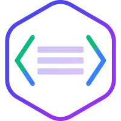
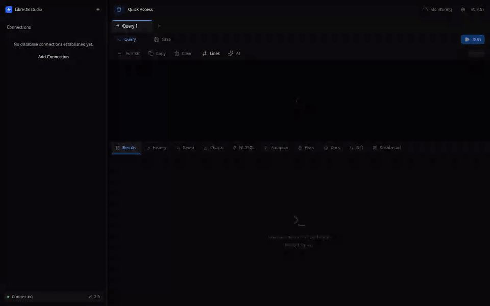

<p align="center">
  
</p>

<h1 align="center">LibreDB Studio</h1>

<p align="center">
  <strong>Редактор баз данных, который запускается рядом с данными, а не на вашем ноутбуке.</strong>
</p>

<p align="center">
  <a href="README.md">English</a> ·
  <a href="README_zh.md">简体中文</a> ·
  <a href="README_ja.md">日本語</a> ·
  <a href="README_es.md">Español</a> ·
  <a href="README_ur.md">اردو</a> ·
  <a href="README_hi.md">हिन्दी</a> ·
  <a href="README_ko.md">한국어</a> ·
  <a href="README_pt.md">Português (Brasil)</a> ·
  <b>Русский</b>
</p>

<p align="center">
  В списках проекта PostgreSQL:
  <a href="https://www.postgresql.org/about/news/libredb-studio-an-open-source-self-hosted-sql-ide-for-postgresql-in-the-browser-3368/">News</a>
  ·
  <a href="https://wiki.postgresql.org/wiki/PostgreSQL_Clients#LibreDB_Studio">PostgreSQL Clients</a>
  ·
  <a href="https://www.postgresql.org/download/products/1/#:~:text=LibreDB%20Studio">Software Catalogue</a>
  ·
  <a href="https://wiki.postgresql.org/wiki/Community_Guide_to_PostgreSQL_GUI_Tools#LibreDB_Studio">Community Guide to GUI Tools</a>
</p>
<p align="center">
  А также в официальной документации
  <a href="https://node-oracledb.readthedocs.io/en/latest/user_guide/appendix_b.html#libredb-studio">Oracle</a>,
  <a href="https://planet.mysql.com/showcase/?search=LibreDB">MySQL</a>,
  <a href="https://redis.io/docs/latest/develop/tools/#libredb-studio">Redis</a>,
  <a href="https://clickhouse.com/docs/integrations/connectors/tools/gui#libredb-studio">ClickHouse</a>,
  <a href="https://mariadb.com/docs/server/clients-and-utilities/graphical-and-enhanced-clients/libredb-studio">MariaDB</a>,
  <a href="https://trino.io/ecosystem/client-application#libredb-studio">Trino</a>,
  <a href="https://cloudberry.apache.org/docs/ecosystem/sql-clients/libredb-studio/">Apache Cloudberry</a>,
  <a href="https://docs.yugabyte.com/stable/integrations/tools/libredb-studio/">YugabyteDB</a>,
  <a href="https://www.tigerdata.com/docs/integrate/query-administration/libredb-studio">TimescaleDB</a>,
  <a href="https://www.dragonflydb.io/docs/integrations/libredb-studio">DragonflyDB</a>,
  <a href="https://microsoft.github.io/garnet/docs/welcome/compatibility#gui-tools">Garnet</a>,
  <a href="https://opensearch.org/community-projects/#:~:text=LibreDB%20Studio">OpenSearch</a>,
  <a href="https://duckdb.org/docs/preview/guides/sql_editors/libredb_studio">DuckDB</a>,
  <a href="https://docs.starrocks.io/docs/integrations/IDE_integrations/LibreDB_Studio/">StarRocks</a>,
  <a href="https://aiven.io/docs/products/postgresql/howto/connect-libredb-studio">Aiven for PostgreSQL</a>,
  <a href="https://aiven.io/docs/products/mysql/howto/connect-libredb-studio">Aiven for MySQL</a>,
  <a href="https://cwiki.apache.org/confluence/display/KAFKA/Ecosystem#:~:text=LibreDB%20Studio">Apache Kafka</a>,
  <a href="https://cassandra.apache.org/_/ecosystem.html">Apache Cassandra</a>
  и
  <a href="https://druid.apache.org/libraries/#:~:text=LibreDB%20Studio">Apache Druid</a>
</p>

<p align="center">
  
</p>

<p align="center">
  <a href="https://opensource.org/licenses/MIT"></a>
  <a href="https://sonarcloud.io/project/overview?id=libredb_libredb-studio"></a>
  <a href="https://codecov.io/github/libredb/libredb-studio"></a>
  <a href="https://artifacthub.io/packages/helm/libredb-studio/libredb-studio"></a>
</p>

> Этот README на русском языке переведён сообществом и может отставать от английского. Если тексты расходятся, верной считается [английская версия](README.md).

## Быстрый старт

Полноценный редактор баз данных с запуском одной командой: ничего не нужно клонировать и собирать.

```bash
# Docker (рекомендуется)
docker run -p 3000:3000 ghcr.io/libredb/libredb-studio:latest

# или Node.js 24+, без Docker
npx @libredb/studio
```

После запуска откройте **http://localhost:3000**. Пароль администратора при первом запуске выводится в лог, никаких файлов конфигурации не требуется.

> Если вы открываете Studio не через localhost и не по HTTPS (например, по адресу `http://192.168.x.x:3000` в локальной сети), задайте ещё и `AUTH_COOKIE_SECURE=false`. Иначе проверка состояния (health check) проходит, но войти не получится: после ввода пароля вас без сообщения об ошибке вернёт на страницу входа.

Нужен deb- или rpm-пакет с сервисом systemd, Snap, AppImage, архив tar.gz, Homebrew, winget или Helm? Все варианты перечислены в разделе [Установка](#установка).

## Зачем ещё один инструмент для баз данных

Вы разворачиваете Postgres на управляемой платформе, и через сорок секунд он готов.

Потом вам нужно посмотреть, что внутри. Для этого приходится либо открывать доступ к базе из интернета, либо ставить настольный клиент и пробрасывать SSH-туннель, либо махнуть рукой и вернуться в командную строку. База поднялась за сорок секунд, а на то, чтобы в неё заглянуть, ушло полдня.

Теперь представьте то же самое в масштабе команды. Приложение работает с Postgres, документы лежат в Mongo, кэш в Redis, события в ClickHouse. Четыре базы, четыре клиента, четыре набора учётных данных. В понедельник приходит новый сотрудник, и до первой строчки кода ему нужно выяснить, где какие данные лежат, собрать строки подключения из вики и трёх личных переписок, дождаться доступа к VPN и установить отдельную программу для каждой СУБД.

**Базы данных уже переехали.** Они ушли в Kubernetes, в облачные сервисы, в закрытые сети (VPC), куда можно попасть только через промежуточный сервер (bastion host). **А инструменты для работы с ними остались на месте.** Это всё те же настольные приложения: тяжёлые, с лицензией на каждое рабочее место, требующие установки. Они рассчитаны на то, что у вас одна база, один ноутбук и один человек, который всегда работает с одного и того же компьютера.

LibreDB Studio устроен наоборот: **инструмент приходит к данным, а не данные к инструменту.**

Если отнестись к этому всерьёз, получается не пожелание, а список требований.

- Редактор должен работать в браузере, потому что и данные, и ваши коллеги находятся не на вашем компьютере.
- Он должен открываться с телефона, потому что авария не будет ждать, пока вы доберётесь до ноутбука.
- Он должен устанавливаться так же, как остальная инфраструктура: контейнером, через Helm chart, Operator или шаблон в один клик. Так ставится всё, что работает рядом с базой данных.
- Он должен встраиваться в другие продукты, потому что удобнее всего работать с базой там же, где она была создана.
- В нём не должно быть платных ограничений. Инструмент с лицензией на каждое рабочее место и функциями, доступными только за деньги, не поставишь во все окружения, за которые вы отвечаете. **Если единый вход (SSO) нужно оплачивать отдельно, разворачивать такой инструмент по умолчанию уже не получится.**

> Лицензия MIT здесь — не щедрость, а необходимость: без неё такая архитектура не работает.

## Основные возможности

### Двадцать семь СУБД, один интерфейс

PostgreSQL · MySQL · Oracle · Db2 LUW · SQL Server · SQLite · libSQL · DuckDB · MongoDB · Redis · Couchbase · ClickHouse · Apache Druid · Elasticsearch · OpenSearch · Trino · Databend · Apache Cassandra · Prometheus · Apache Kafka · etcd · Neo4j · Milvus · Qdrant · InfluxDB (InfluxQL) · InfluxDB 3 (SQL) · Oxia

Для всех SQL-СУБД доступен одинаковый набор инструментов: дерево объектов базы (схемы, таблицы, столбцы), ER-диаграммы, сравнение схем и панели мониторинга. MongoDB и Redis работают не на SQL, поэтому ER-диаграмм и сравнения схем для них нет.

У Druid, Elasticsearch, OpenSearch и Trino есть два ограничения. Во-первых, к ним нельзя подключиться по строке подключения: у их SQL-интерфейсов поверх HTTP нет общепринятого формата URI, поэтому указываются только хост и порт. Во-вторых, для них не генерируется SQL для миграции: в их диалекте SQL нет команд для изменения столбцов, и Studio прямо сообщает об этом, а не выдаёт неработающий DDL. То же касается коллекций Couchbase, у которых нет схемы.

ER-диаграмма для Elasticsearch и OpenSearch показывает индексы без связей между ними: внешних ключей в этих СУБД не существует.

| СУБД | Драйвер | Возможности |
| :--- | :--- | :--- |
| **PostgreSQL** | `pg` | Полноценная SQL IDE, планы выполнения EXPLAIN, транзакции, отмена запросов (`pg_cancel_backend`) |
| **MySQL** | `mysql2` | Полноценная SQL IDE, EXPLAIN, транзакции, отмена запросов (`KILL QUERY`) |
| **Oracle** | `oracledb` (тонкий клиент, режим Thin) | Полноценная SQL IDE, постраничный вывод через `FETCH FIRST N ROWS`, представления мониторинга `V$`, `ANALYZE TABLE`, `ALTER INDEX REBUILD`, транзакции |
| **Db2 LUW** | `db2-node` (DRDA-клиент на Rust в нативном аддоне N-API, без клиента IBM) | SQL IDE для Db2 for Linux, UNIX and Windows: обозреватель схем с таблицами, представлениями, материализованными таблицами запросов, псевдонимами, последовательностями, модулями, процедурами, функциями и триггерами, сохранённые определения, постраничный вывод через `FETCH FIRST` / `OFFSET`, RUNSTATS и REORG для отдельной таблицы. TLS обязателен, если вы сознательно его не отключили, потому что без него драйвер передаёт пароль открытым текстом. Драйвер неверно читает некоторые типы (не-ASCII текст, BIGINT больше 2^53, BOOLEAN, XML, LOB), поэтому редактирование строк, импорт, EXPLAIN, транзакции и отмена запроса отключены; известные проблемы описаны в [`docs/providers/db2.md`](docs/providers/db2.md) |
| **SQL Server** | `mssql` (tedious) | Полноценная SQL IDE, постраничный вывод через `TOP N` / `OFFSET FETCH`, системные представления `sys.dm_*`, `UPDATE STATISTICS`, `DBCC CHECKDB`, транзакции, автоопределение Azure SQL |
| **SQLite** | `bun:sqlite` / `node:sqlite` (в зависимости от среды выполнения) | Полноценная SQL IDE, база в файле на сервере или в памяти |
| **libSQL** | Без драйвера, по HTTP (протокол Hrana, `POST /v2/pipeline`, порт 8080) | Полноценная SQL IDE для своего сервера libSQL (`sqld`) и для Turso Cloud. Это тот же диалект SQLite, только по сети. Есть `EXPLAIN QUERY PLAN` и реальный размер таблиц и индексов из `dbstat`. Вместо пароля используется токен доступа. Из операций обслуживания доступны только `REINDEX` и `PRAGMA integrity_check`, остальные (`VACUUM`, `ANALYZE`, `PRAGMA optimize`) сервер не принимает |
| **DuckDB** | `@duckdb/node-api` (нативный модуль, около 68 МБ на платформу) | Полноценная SQL IDE для локального файла DuckDB или базы в памяти (`:memory:`). Файл должен лежать на том же сервере, где запущена Studio. Есть дерево плана через `EXPLAIN (FORMAT JSON)`, реальный размер таблиц и отмена запросов. Операции обслуживания: `VACUUM`, `ANALYZE` и `CHECKPOINT`. Журнала медленных запросов и списка сеансов в DuckDB нет, и соответствующие панели прямо об этом сообщают. Файл базы может открыть только один процесс, даже на чтение, поэтому второй экземпляр Studio к той же базе не подключится |
| **MongoDB** | `mongodb` | Редактор запросов в формате JSON, операции с коллекциями (find, aggregate, insert, update, delete) |
| **Couchbase** | Без драйвера, по HTTP (REST API запросов и управления) | Полноценная IDE для SQL++, EXPLAIN, просмотр бакетов, скоупов и коллекций, определение полей через `INFER` |
| **ClickHouse** | Без драйвера, по HTTP (SQL-интерфейс, порт 8123) | Полноценная SQL IDE, дерево EXPLAIN в JSON, чтение схемы из системных таблиц, `OPTIMIZE TABLE` |
| **Apache Druid** | Без драйвера, по HTTP (`POST /druid/v2/sql`) | SQL IDE только для чтения, дерево EXPLAIN, чтение схемы из `INFORMATION_SCHEMA`, мониторинг по таблицам `sys.*` |
| **Elasticsearch** | Без драйвера, по HTTP (`POST /_sql?format=json`, порт 9200) | SQL IDE только для чтения, просмотр индексов и полей, состояние кластера, число документов и размер каждого индекса. Нет EXPLAIN, операций обслуживания, панелей медленных запросов и сеансов. В SQL Elasticsearch нет `OFFSET`, поэтому вторую страницу результатов получить нельзя |
| **OpenSearch** | Без драйвера, по HTTP (`POST /_plugins/_sql`, порт 9200) | То же, что и для Elasticsearch: IDE только для чтения и просмотр индексов. Отличие в том, что `LIMIT n OFFSET m` здесь работает, поэтому постраничный вывод доступен |
| **Trino** | Без драйвера, по HTTP (клиентский протокол, `POST /v1/statement`, порт 8080) | Полноценная SQL IDE по всем настроенным каталогам, дерево схемы из `information_schema`, мониторинг по `system.runtime` и `jmx`, реальное число строк через `SHOW STATS`, отмена запросов. Trino только выполняет запросы и сам ничего не хранит, поэтому в нём нет ни ключей, ни индексов. Из-за этого ER-диаграмма показывает таблицы без связей, правка строк отключена, а вместо размеров выводится список каталогов. Пароль по незашифрованному HTTP Trino не принимает, даже если аутентификация на кластере отключена |
| **Databend** | Без драйвера, по HTTP (собственный API запросов Databend, `POST /v1/query`, порт 8000) | SQL IDE для своего сервера Databend или warehouse в Databend Cloud: каталоги и базы данных в дереве с таблицами, представлениями, материализованными представлениями и динамическими таблицами, текстовые планы `EXPLAIN`, мониторинг по `system.*` каталога по умолчанию, отмена запросов через `KILL QUERY` из панели сессий. Каждый оператор выполняется в отдельной сессии, поэтому транзакция или временная таблица заканчивается вместе с оператором, который её открыл. Databend не объявляет ключей, поэтому правка строк отключена, как и Create Table. Пароль по незашифрованному HTTP к хосту, который не loopback и не за туннелем, отклоняется, если подключение не дало на это согласия. Подключение к Cloud указывает свой warehouse, который возобновляется на первом операторе, и с этого момента за него берётся плата; открытие подключения тоже считается, потому что оно читает дерево объектов. TLS со своим CA и клиентскими сертификатами; SSH-туннель |
| **Apache Cassandra** | `cassandra-driver` (чистый JavaScript, без нативных модулей) | IDE для CQL (порт 9042), просмотр keyspace с пометкой ключей партиционирования и кластеризации, сводка из `system_views`, время работы и выполняющиеся запросы. Для подключения **обязательно указать `localDataCenter`**, иначе драйвер не соединится. В CQL нет EXPLAIN, протокол не умеет отменять запросы, а обслуживание (compaction, repair, flush) выполняется утилитой `nodetool`, поэтому этих функций нет. **Число строк и размер таблиц не показываются**: Cassandra отдаёт только грубые оценки (таблица из 500 строк оценивалась в 143), а неверное число хуже, чем никакого |
| **Prometheus** | Без драйвера, по HTTP (HTTP API Prometheus, порт 9090) | Редактор PromQL: запрос уходит на сервер без изменений, результат выводится таблицей и графиком. На графике одновременно рисуется не больше восьми рядов. Учтите, что пропущенные значения, `NaN` и `Inf` график рисует как 0. Есть просмотр метрик с их метками, групп правил записи и оповещения (сработавшие оповещения помечаются), целей опроса (недоступные помечаются), а также состояние, версия, время работы и статистика TSDB. Только чтение: Studio не вызывает административный API и remote write. EXPLAIN и операций обслуживания нет. Учётные данные отправляются и по незашифрованному HTTP, поэтому в недоверенной сети включайте TLS |
| **Apache Kafka** | `@platformatic/kafka` (чистый TypeScript, порт 9092) | Чтение сообщений топика (topic): можно выбрать партицию (partition) и начать с нужного смещения (offset) или момента времени, с самого начала или с последних сообщений. Ключи, значения и заголовки (headers) показываются как JSON, текст или base64. Есть просмотр топиков с партициями и настройками (проблемные топики помечаются), групп потребителей (consumer groups) с отставанием (lag) по каждой партиции, брокеров (brokers), а также состояние, число топиков и объём на диске. Только чтение: Studio не отправляет сообщения, не фиксирует смещения, не вступает в группы и не создаёт топики. Поддерживаются TLS с собственным CA и клиентскими сертификатами, SASL PLAIN и SCRAM только поверх TLS. SSH-туннель не поддерживается, потому что клиент Kafka подключается к каждому брокеру по адресу, который тот сам сообщает |
| **etcd** | `@grpc/grpc-js` (чистый JavaScript, gRPC, порт 2379) | Подмножество etcdctl в редакторе (`get`, `put`, `del`, `txn`, аренды (leases), ограниченный `watch`, участники кластера, тревоги (alarms), пользователи и роли); группы по префиксу ключа в дереве и каждый ключ в панели ключей; значение ключа меняется одной транзакцией с проверкой его ревизии; сжатие истории, дефрагментация и снятие тревог для администраторов, каждое с подтверждением вводом имени подключения. Любая запись под префиксом Kubernetes или в `compact_rev_key` отклоняется, а секреты Kubernetes и значения в protobuf или зашифрованные никогда не показываются. TLS с собственным CA, клиентские сертификаты (их Common Name как пользователь etcd) и вход по паролю только поверх TLS; SSH-туннель; режим только для чтения, заданный в seed-файле |
| **Neo4j** | `neo4j-driver-lite` (чистый JavaScript, Bolt, порт 7687) | Cypher только для чтения в редакторе, один оператор за запуск, для Neo4j 5.26 LTS; метки узлов и типы связей с их свойствами в качестве столбцов, индексы и ограничения в дереве; узлы, связи и пути в таблице как помеченные JSON-ячейки, 64-битные целые и значения даты и времени без потери точности; панели мониторинга, доступные в Community. Каждый оператор проходит политику чтения по его токенам, затем собственную классификацию сервера через `EXPLAIN` (разрешённая форма SHOW её пропускает) и выполняется в сеансе READ, так что запись должна преодолеть все три уровня. Нет просмотра EXPLAIN и PROFILE, нет обслуживания, нет выполнения агентом и нет `run_read_query` в MCP. TLS с собственным CA и SSH-туннель; без строки подключения |
| **Milvus** | `@grpc/grpc-js` (чистый JavaScript, gRPC, порт 19530) | Собственные запросы REST v2 Milvus в редакторе (`POST /v2/vectordb/<маршрут>` с одним телом JSON) для чтения, точного подсчёта и векторного поиска по всем типам векторов, включая BM25 и гибридный поиск; базы данных и коллекции в дереве с полями, разделами, индексами и состоянием загрузки; векторные ячейки с размерностью и копированием полного значения; Load и Release для администраторов, с предпросмотром и подтверждением. Studio не записывает данные, отклоняет запросы, из-за которых сервер обратился бы к другому сервису, и предупреждает о пароле `root` по умолчанию. TLS с собственным CA и клиентскими сертификатами; пароль только поверх TLS, на loopback или через SSH-туннель; режим только для чтения, заданный в seed-файле |
| **Qdrant** | нет, HTTP (REST API Qdrant, порт 6333) | Собственные REST-запросы Qdrant в редакторе (`МЕТОД /путь` с одним телом JSON), семнадцать маршрутов чтения: чтение точек, прокрутка, точный подсчёт, фасеты, а также запросы, пакеты и сгруппированные запросы по плотным, разреженным и мультивекторным данным, включая локальную модель BM25; коллекции в дереве с векторами, индексами payload и выборочным видом ключей payload; векторные ячейки с размерностью и копированием полного значения. Studio ничего не записывает, отклоняет любой ввод для инференса, кроме локальной BM25, и предупреждает о JWT без срока действия или с правами управления. TLS с собственным CA и клиентскими сертификатами; ключ только поверх TLS, на loopback или через SSH-туннель; режим только для чтения, заданный в seed-файле |
| **InfluxDB (InfluxQL)** | нет, HTTP (API v1 InfluxDB, порт 8086) | InfluxQL только для чтения в редакторе для InfluxDB 1.x, 2.x и 3 через API v1 `/query`, один `SELECT`, `SHOW` или `EXPLAIN` за запуск; базы данных и measurements в дереве, теги и поля measurement как его столбцы, а целые числа больше 2^53 и наносекундные метки времени в таблице результатов точны. Только чтение, что бы ни было указано в подключении: на 1.x и 2.x собственная политика чтения Studio единственный барьер перед `DROP DATABASE`, поэтому любой другой оператор отклоняется до отправки запроса, и ни один endpoint записи не вызывается. Пользователь и пароль либо токен в поле пароля; учётные данные по незашифрованному HTTP к хосту, который не loopback и не за туннелем, отклоняются, если подключение не дало на это согласия; `_internal` на сервере InfluxDB 3 никогда не читается |
| **InfluxDB 3 (SQL)** | нет, HTTP (SQL API InfluxDB 3, порт 8181) | SQL только для чтения в редакторе для InfluxDB 3 Core и Enterprise; таблицы базы данных подключения в дереве со столбцами. Только чтение, что бы ни было указано в подключении: таблица маршрутов не достигает ни одного endpoint записи, токенов, кэша или плагинов, а из endpoint настройки только списка баз данных, GET-запроса, любой оператор, который не начинается с ключевого слова чтения, отклоняется до отправки запроса, а планировщик сервера отклоняет любую запись сверх того. Токен и без имени пользователя; токен по незашифрованному HTTP к хосту, который не loopback и не за туннелем, отклоняется, если подключение не дало на это согласия; при подключении к серверу 1.x или 2.x предлагает выбрать InfluxDB (InfluxQL) |
| **Oxia** | `@grpc/grpc-js` (чистый JavaScript, gRPC, порт 6648) | Команды `oxia client` только для чтения (`get`, `list`, `range-scan`), шарды в дереве и каждый ключ в панели ключей |
| **Redis** | `ioredis` | Редактор команд, просмотр ключей, мониторинг на основе INFO |

> **Защита соединения настраивается одинаково для всех СУБД.** SSH-туннель открывается до подключения к базе, поэтому он работает с любой СУБД, если подключение задано хостом и портом. Исключение — Kafka: её клиент подключается к каждому брокеру по отдельному адресу, и туннель до одного адреса здесь не поможет. Если подключение задано строкой подключения (так можно для MongoDB, Couchbase, ClickHouse и libSQL), туннель не используется. У SQLite и DuckDB сетевого соединения нет вообще. Настройки SSL/TLS доступны для всех СУБД, кроме файловых. Для Trino TLS обязателен: без него координатор не принимает пароль.

> Redis не является SQL-базой, но показывается в том же интерфейсе. Ключи группируются в «таблицы» по префиксам, для этого используется `SCAN`, который не блокирует сервер (**команда `KEYS *` не используется никогда**). Состояние и метрики берутся из `INFO`, медленные запросы и сеансы из `SLOWLOG GET` и `CLIENT LIST`.

### Профессиональный SQL-редактор

- **Движок Monaco**: то же ядро, что и в VS Code.
- **Автодополнение с учётом схемы**: таблицы, столбцы и ключевые слова SQL.
- **Палитра команд**: быстрый доступ к таблицам, подключениям, сохранённым запросам и действиям по `Cmd/Ctrl+K`.
- **Вкладки**: запросы в разных вкладках выполняются независимо друг от друга.
- **Наглядный EXPLAIN**: план выполнения запроса в виде схемы, на которой видно узкие места.
- **Интерактивные ER-диаграммы**: схема базы в виде графа со связями по внешним ключам и типом каждой связи. Есть мини-карта, поиск и фильтр по таблицам, компактный режим, экспорт в PNG и SVG. Таблицы раскладываются автоматически с помощью ELK.js.
- **Сравнение схем и миграции**: два снимка схемы или схемы двух подключений показываются рядом, отличия выделены цветом (добавлено, удалено, изменено). SQL для миграции генерируется автоматически для PostgreSQL, MySQL, SQLite, Oracle и SQL Server, а для ClickHouse поддерживаются изменения столбцов.
- **История снимков**: снимки схемы расположены на шкале времени. Выберите любые два, чтобы сравнить их и увидеть, как менялась схема.

### Агент базы данных (только чтение)

Главная функция ИИ в Studio — **панель агента** рядом с редактором. Вы пишете вопрос, например *«в каком отделе больше всего сотрудников?»* или *«почему этот запрос медленный?»*, и нажимаете Start. Агент составляет SQL-запросы к подключённой базе, читает результаты и пишет отчёт, **в котором каждое утверждение ссылается на результат, из которого оно получено**.

- **Только чтение, и это гарантирует сама база.** Все запросы агента выполняются в режиме только для чтения средствами СУБД: в PostgreSQL это транзакция только для чтения, в SQLite `PRAGMA query_only`, в DuckDB подключение `READ_ONLY` с дополнительной проверкой на уровне SQL. В SQL Server таких транзакций нет, поэтому Studio проверяет, что у учётной записи нет прав на запись, ограничивает число строк и всегда откатывает транзакцию. Запись и DDL отклоняются ещё до обращения к базе. `EXPLAIN ANALYZE` по умолчанию запрещён, потому что он выполняет запрос. Каждый запрос агента проверяется политикой и записывается в аудит (`executeAuditedOperation`, `src/lib/db/operations/execution.ts:129`). На запросы, которые вы сами запускаете в редакторе, эти проверки не распространяются (`src/app/api/db/query/route.ts:44`).
- **Режим Agent работает только с PostgreSQL, SQLite, DuckDB и SQL Server.** Только для этих четырёх СУБД реализован режим только для чтения (`queryReadOnly`). Для остальных СУБД запуск в режиме Agent отклоняется ещё до начала работы. Режим **Plan** доступен для любого подключения: в нём модель ничего не выполняет и не записывает, а только готовит запрос, который вы запустите сами. Схему базы для подсказок (GROUNDING) Studio читает для всех СУБД. Если прочитать схему не удалось, агент прямо об этом сообщает и не выдумывает таблицы.
- **Три сценария**: **Investigate** (ответить на вопрос), **Optimize** (сравнить планы выполнения, предложить индекс или переписать запрос), **Assess** (оценить таблицы: только подсчёт строк, сами значения не читаются).
- **Ничего не запускается само.** Агент не начинает работу без вас, не пишет в редактор и не выполняет то, что сам рекомендует. Запустить предложенный запрос можете только вы.
- **Без доказательств нет утверждений.** Агент не может написать вывод без ссылки на результат запроса. В конце он сам указывает, удалось ли ответить на вопрос: *«Run answered»* или *«Run did not answer»*.
- **Ограничения заданы заранее и видны на экране**: от 18 до 45 запросов и от 360 до 900 секунд на один запуск в зависимости от сценария, не больше 200 строк за одно чтение. Точные цифры приведены в [docs/AGENT.md](docs/AGENT.md).
- **Модель выбираете вы.** Gemini (по умолчанию), OpenAI, Ollama или любой эндпоинт, совместимый с OpenAI. Для режима **Agent** нужна модель, которая умеет вызывать инструменты. Для Ollama это проверяется на практике, и в руководстве описано, как провести проверку. Для режима **Plan** инструменты не нужны (`src/lib/agent/capability-gate.ts:74`), поэтому модель, которая не подошла для режима Agent, можно использовать в режиме Plan.
- **Нет модели — нет и ИИ.** Если не задан ни один параметр `LLM_*`, панель агента не показывается и за пределы вашей сети ничего не отправляется. Обратите внимание: Ollama и собственный эндпоинт работают без ключа, так что ИИ включается настройкой модели, а не ключом. Что именно отправляет агент, описано в [`docs/AGENT_DATA_FLOW.md`](docs/AGENT_DATA_FLOW.md).

Агент есть только в самостоятельном приложении, во встраиваемом пакете `@libredb/studio` его нет.
**Руководство:** [`docs/AGENT_GUIDE.md`](docs/AGENT_GUIDE.md) · **Какие данные отправляются наружу:** [`docs/AGENT_DATA_FLOW.md`](docs/AGENT_DATA_FLOW.md) · **Поведение и ограничения:** [`docs/AGENT.md`](docs/AGENT.md) · **Какую локальную модель выбрать:** [`docs/llms/`](docs/llms/README.md)

### Другие функции с ИИ (необязательные, с вашей моделью)

- **Любая LLM**: по умолчанию Gemini, поддерживаются OpenAI, Ollama и любой эндпоинт, совместимый с OpenAI (LM Studio, LiteLLM, vLLM).
- **Анализ безопасности запросов**: оценка риска перед выполнением опасных команд (DELETE, DROP, TRUNCATE).
- **Объяснение запросов**: план EXPLAIN простыми словами и советы по оптимизации.
- **Знание схемы**: модель получает схему подключённой базы, поэтому в объяснениях используются названия ваших таблиц и столбцов.
- **Сводка по данным**: статистика по столбцам в виде связного текста. Модель при этом получает `min` и `max` каждого столбца, а это реальные значения из ваших данных. Подробнее в [Agent Data Flow](docs/AGENT_DATA_FLOW.md).

### Работа с данными

- **Таблица результатов**: виртуальная прокрутка (TanStack), работает с миллионами строк.
- **Правка в таблице**: двойной щелчок по ячейке позволяет изменить значение. Доступно для СУБД, которые поддерживают обновление отдельной строки. В остальных эта возможность скрыта.
- **Фильтры по столбцам**: текстовые фильтры по результатам, чтобы изучать данные, не переписывая запрос.
- **Сводная таблица**: строится в браузере, пять агрегатных функций (COUNT, SUM, AVG, MIN, MAX), можно получить эквивалентный SQL-запрос.
- **Экспорт**: CSV и JSON, в файл или в буфер обмена.
- **Восемь типов диаграмм**: столбчатая, линейная, круговая, с областями, точечная, гистограмма, а также столбчатая и с областями с накоплением. Работают на базе Recharts. Данные можно группировать по часу, дню, неделе, месяцу или году, а настройки диаграмм сохранять.

### Инструменты для анализа и разработки

- **Профилирование данных**: статистика по столбцам таблицы в один щелчок (доля NULL, число уникальных значений, минимум и максимум, примеры значений) и текстовая сводка от модели.
- **Генератор кода ORM**: интерфейсы TypeScript, схемы Zod, модели Prisma, структуры Go, dataclass для Python и POJO для Java по реальной схеме таблиц.
- **Генератор тестовых данных**: правдоподобные данные с учётом схемы. По названию столбца распознаётся более 30 видов данных (email, телефон, имя, адрес и другие). На выходе команды INSERT или JSON для `insertMany` в MongoDB.
- **Документация по базе**: словарь данных с поиском, построенный по реальной схеме, с описаниями от модели и экспортом в Markdown.

### Аутентификация и SSO: всё включено в версию под MIT

- **Два режима аутентификации**: локальный вход по email и паролю или единый вход через OpenID Connect (OIDC), переключаются переменной окружения.
- **Любой провайдер OIDC**: Auth0, Keycloak, Okta, Azure AD, Zitadel, Google и другие.
- **Защита PKCE**: Authorization Code Flow с Proof Key for Code Exchange (S256).
- **Автоматическое назначение ролей**: роли берутся из claims токена, вложенные поля задаются через точку (например, `realm_access.roles`).
- **Выход из провайдера**: при выходе завершается и локальный сеанс, и сеанс у провайдера.

### Инструменты для администраторов баз данных (только для роли admin)

- **Панель мониторинга в реальном времени**: семь вкладок (обзор, производительность, запросы, сеансы, таблицы, хранилище и пул соединений).
- **Графики метрик**: соединения, доля попаданий в кэш, буферный пул, взаимоблокировки. Обновляются автоматически, интервал от 5 до 60 секунд.
- **Индикаторы состояния**: цвет показывает, в норме ли показатель (норма, предупреждение, критично). Отслеживаются доля попаданий в кэш, занятость соединений, взаимоблокировки и буферный пул.
- **Обслуживание в один щелчок**: `VACUUM`, `ANALYZE`, `REINDEX`, `UPDATE STATISTICS`, `DBCC CHECKDB` и `ALTER INDEX REBUILD`, в зависимости от СУБД.
- **Журнал аудита**: полная история всех запросов, выполненных в организации.

## Установка

| Канал | Команда | Примечания |
| :--- | :--- | :--- |
| **Docker** | `docker run -p 3000:3000 ghcr.io/libredb/libredb-studio:latest` | Настройка не нужна: пароль администратора при первом запуске выводится в лог |
| **npx** | `npx @libredb/studio` | Linux, macOS и Windows, Node 24+. Скачивает серверный архив из релиза |
| **deb / rpm** | `sudo dpkg -i libredb-studio_<version>_amd64.deb` | Серверный пакет с сервисом systemd, прикладывается к каждому релизу на GitHub. Команда для RHEL и Fedora приведена ниже |
| **Snap** | `sudo snap install libredb-studio` | Настройка не нужна: пароль администратора при первом запуске выводится в `sudo snap logs libredb-studio` |
| **Настольное приложение** (AppImage) | `chmod +x libredb-studio-desktop-<version>-linux-x64.AppImage && ./libredb-studio-desktop-<version>-linux-x64.AppImage` | Открывается отдельным окном, без браузера и без ввода пароля. Сервер запускается локально в фоне |
| **Настольное приложение** (Debian и Ubuntu) | `sudo apt install ./libredb-studio-desktop-<version>_amd64.deb` | То же приложение, но устанавливается в систему и появляется в меню. **Это не серверный пакет**, тот называется `libredb-studio_<version>_<arch>.deb` |
| **Настольное приложение** (Flatpak, в песочнице) | `flatpak --user remote-add --if-not-exists flatpark https://dl.flatpark.org/flatpark.flatpakrepo`<br>`flatpak --user install flatpark org.libredb.Studio` | Приложение изолировано и не имеет доступа к файлам, к базам подключается по сети |
| **Homebrew** | `brew trust libredb/tap && brew install libredb/tap/libredb-studio` | `brew trust` выполняется один раз. Нужен Homebrew 6+. Если команда не найдена, сначала выполните `brew update` |
| **Helm** (Kubernetes) | `helm install libredb oci://ghcr.io/libredb/charts/libredb-studio` | Настройка не нужна: учётные данные администратора при первом запуске выводятся в лог пода |
| **winget** (Windows) | `winget install LibreDB.Studio` | Устанавливает zip-архив со встроенным Node.js |

Homebrew, deb и rpm, Snap, winget, настольные приложения и npx используют одну и ту же сборку сервера из релиза на GitHub. Docker для них не нужен. Полное руководство по каждому каналу (команды, настройка, работа с systemd, схема тегов образов Docker) находится в [`docs/DISTRIBUTION.md`](docs/DISTRIBUTION.md).

### Пакеты для Linux (.deb и .rpm)

Пакеты для Debian, Ubuntu, RHEL и Fedora (amd64 и arm64) прикладываются к каждому [релизу на GitHub](https://github.com/libredb/libredb-studio/releases). В пакет входят сервер, собственный Node.js и сервис systemd, так что больше ничего устанавливать не нужно.

```bash
# Debian / Ubuntu
sudo dpkg -i libredb-studio_<version>_amd64.deb

# RHEL / Fedora / Rocky
sudo rpm -i libredb-studio-<version>.x86_64.rpm

# Запуск сервиса (пароль администратора при первом запуске выводится в журнал)
sudo systemctl enable --now libredb-studio
journalctl -u libredb-studio
```

Настройки хранятся в `/etc/libredb-studio/env`, данные приложения (база SQLite и сгенерированные учётные данные) в `/var/lib/libredb-studio`. Команду `libredb-studio` можно запускать и напрямую, без systemd.

Если не хотите использовать пакетный менеджер, скачайте из того же релиза архив `libredb-studio-standalone-<version>-<os>-<arch>.tar.gz`. Он собран для `linux-x64`, `linux-arm64`, `darwin-x64` и `darwin-arm64`. Распакуйте его командой `tar xzf <archive> --strip-components=1` и запустите `node server.js` (нужен Node.js 24+). Контрольные суммы лежат в файле `SHA256SUMS`.

Шаблоны развёртывания в один клик: Railway, Dokploy, CapRover, Sealos, Kubero, Cosmos, DigitalOcean Marketplace, Unraid Community Apps, Render Blueprint, Fly.io и Koyeb. Полный список в [`docs/CHANNELS.md`](docs/CHANNELS.md). Для Kubernetes есть также Operator bundle для OpenShift и OLM.

### Как встроить Studio в своё приложение

```bash
npm i @libredb/studio
```

Studio публикуется и как пакет npm, поэтому редактор можно встроить прямо в ваше приложение. Если ваш продукт создаёт базы данных для пользователей, редактор пригодится именно там.

**Заголовки безопасности Studio можно использовать в своём приложении на Next.js.** Функция `securityHeaders()` из `@libredb/studio/security` возвращает готовый набор заголовков в виде обычного объекта `Record<string, string>`. У этого модуля нет зависимостей, поэтому его можно импортировать прямо в `next.config.ts`.

```ts
// next.config.ts
import { securityHeaders } from "@libredb/studio/security";

export default {
  async headers() {
    return [
      {
        source: "/:path*",
        headers: Object.entries(securityHeaders()).map(([key, value]) => ({ key, value })),
      },
    ];
  },
};
```

Параметры функции:

- `reportOnly`: отправляет заголовок `Content-Security-Policy-Report-Only` вместо обычного. Нарушения при этом только записываются, но не блокируются.
- `hsts: false`: отключает HSTS. Вместо `false` можно передать объект с настройками.
- `allowEval`: добавляет `'unsafe-eval'`. Это нужно только для сборки React в режиме разработки.
- `monacoVsPath`: адрес, с которого загружается Monaco, если он отличается от адреса приложения.
- `extra`: ваши дополнительные источники для отдельных директив.

Если политику нужно собрать самостоятельно, используйте `studioCspDirectives()` и `HSTS_MAX_AGE_SECONDS`.

Перед использованием прочитайте саму политику. Она разрешает встроенные скрипты (inline), потому что страницы Studio отрисовываются заранее и их скрипты не содержат nonce. Поэтому политика не мешает внедрённому скрипту выполниться, но ограничивает адреса, на которые он может отправить данные. Подробности и два способа подключения заголовков в Next.js описаны в [`docs/SECURITY.md`](docs/SECURITY.md).

## Что платно, а что нет

Studio распространяется под лицензией MIT, чтобы его можно было установить где угодно. Платный продукт называется libredb-platform. В нём вы платите за то, что эксплуатацию берёт на себя кто-то другой: хостинг, работу с несколькими клиентами (multi-tenancy), биллинг и поддержку. Все функции самого редактора остаются бесплатными.

**В бесплатной версии нет искусственных ограничений.** Единый вход (SSO), управление ролями (RBAC), аудит запросов, ER-диаграммы, функции ИИ и все NoSQL-СУБД входят в версию под MIT.

## Тесты и качество

- Семь уровней тестов: модульные, тесты API, интеграционные, тесты хуков, тесты безопасности, тесты промптов для LLM и тесты компонентов. Плюс сквозные тесты в браузере
- **Покрытие строк 100%** — обязательное условие в CI. Если покрытие снижается, слияние блокируется
- Проверка качества (Quality gate) в SonarCloud
- Smoke-тесты на Node 24 и 26 при каждом релизе

```bash
bun run test           # все тесты
bun run test:e2e       # Playwright (сначала нужна сборка)
bun run test:coverage  # отчёт о покрытии
```

## Документация

Подробные материалы пока есть только на английском:

- [Архитектура](docs/ARCHITECTURE.md) · [Провайдеры баз данных](docs/DATABASE_PROVIDERS.md) · [Справочник по СУБД](docs/providers/README.md)
- [Документация по API](docs/API_DOCS.md) · [Настройка OIDC](docs/OIDC.md) · [Слой хранения](docs/STORAGE.md)
- [Helm Chart](docs/HELM_CHART.md) · [Каналы распространения](docs/CHANNELS.md) · [Как добавить СУБД](docs/ADDING_A_PROVIDER.md)

## Участие в разработке

Мы рады issues и pull requests. Начните с [CONTRIBUTING.md](CONTRIBUTING.md) и с задач с меткой [`good first issue`](https://github.com/libredb/libredb-studio/labels/good%20first%20issue): в каждой из них указана команда, которой можно проверить, что задача выполнена.

Если вы хотите добавить СУБД, смотрите [`docs/ADDING_A_PROVIDER.md`](docs/ADDING_A_PROVIDER.md). Код, документация и тесты отправляются вместе, одним pull request.

## Лицензия

[MIT](LICENSE). Без CLA, без отдельной корпоративной версии, без платных ограничений.
