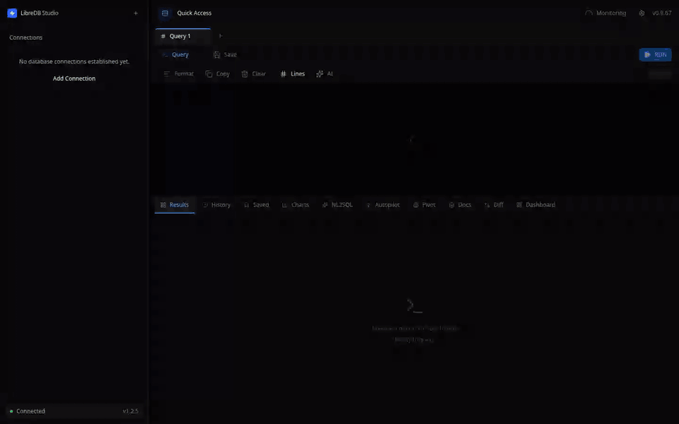
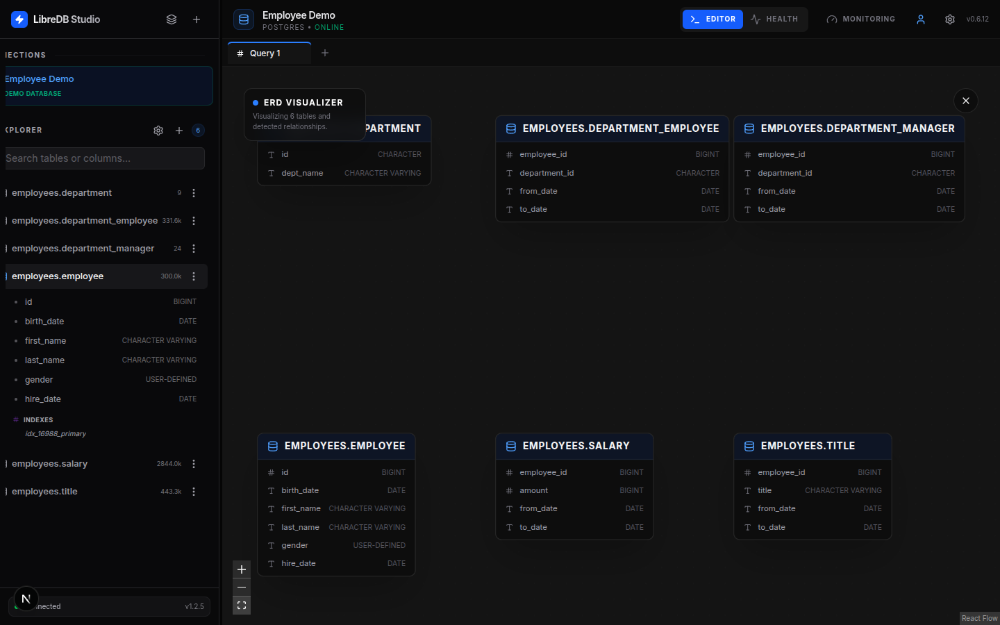
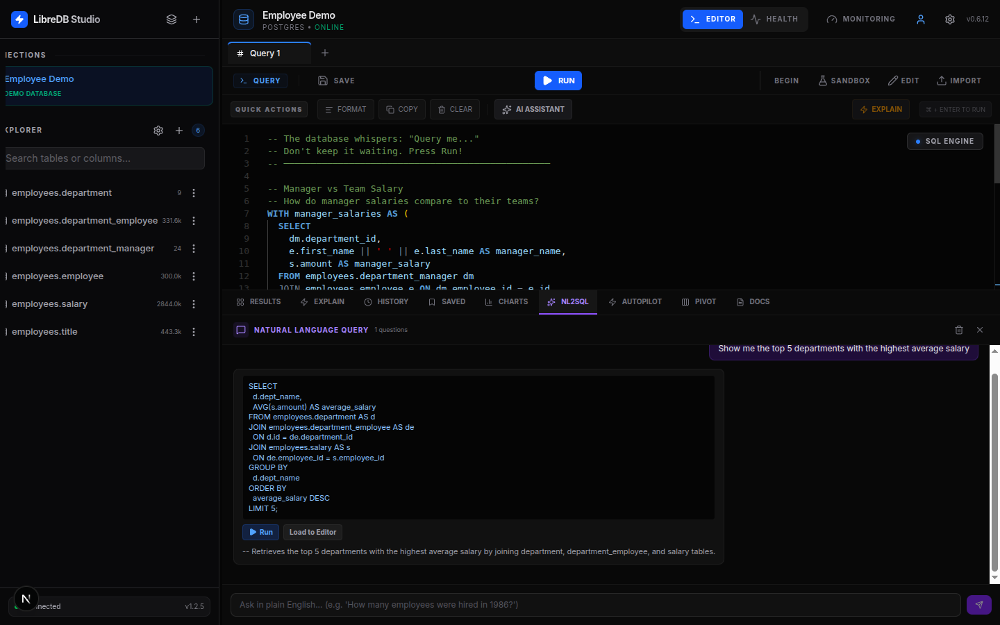

<p align="center">
  
</p>

<h1 align="center">LibreDB Studio</h1>

<p align="center">
  <strong>把数据库编辑器部署到数据旁边，而不是装到你的笔记本上。</strong>
</p>

<p align="center">
  <a href="README.md">English</a> ·
  <b>简体中文</b> ·
  <a href="README_ja.md">日本語</a>
</p>

<p align="center">
  
</p>

<p align="center">
  <a href="https://opensource.org/licenses/MIT"></a>
  <a href="https://sonarcloud.io/project/overview?id=libredb_libredb-studio"></a>
  <a href="#测试与质量"></a>
  <a href="https://artifacthub.io/packages/helm/libredb-studio/libredb-studio"></a>
</p>

## 快速开始

一条命令启动完整的 SQL IDE，不用克隆，不用构建：

```bash
# Docker（推荐）
docker run -d -p 3000:3000 ghcr.io/libredb/libredb-studio:latest

# 或者用 Node.js 24+（不装 Docker）
npx @libredb/studio
```

然后打开 **http://localhost:3000**。首次启动时管理员密码会打印到日志里，无需任何配置文件。

> 如果浏览器不是通过 localhost 或 HTTPS 访问（例如局域网里的 `http://192.168.x.x:3000`），还需要设置 `AUTH_COOKIE_SECURE=false`。否则健康检查一切正常，登录却会静默失败并不断跳回登录页。

需要 Helm、Homebrew、Snap、winget 或 deb/rpm？见下面的[安装方式](#安装方式)。

## 为什么要再做一个数据库工具

你在托管平台上开一个 Postgres，四十秒就绪。

然后你想看看里面有什么。于是你把端口暴露到公网，或者装一个桌面客户端再挖一条 SSH 隧道，或者干脆放弃、退回到命令行。数据库花了四十秒，而给它开一扇窗花掉了你一个下午。

再乘上规模。应用用 Postgres，文档用 Mongo，缓存用 Redis，事件用 ClickHouse。四个数据库，四个客户端，四套凭据。周一来了个新人，在写下第一行代码之前，他要先搞清楚哪些数据在哪里，在 wiki 和三个私聊里翻连接串，等 VPN 权限，再给每种引擎装一个不同的工具。

**数据库已经搬走了。** 它们搬进了 Kubernetes，搬进了托管云，搬进了要穿过跳板机才能到达的客户 VPC。**但读它们的工具没有跟着搬。** 它们仍然是桌面应用：笨重、按席位收费、必须先安装，并且假设你只有一个数据库、一台笔记本，以及一个永远不换设备的人。

LibreDB Studio 走另一条路：**工具去找数据，而不是把数据搬来找工具。**

认真对待这句话，它就不再是一种偏好，而是一份规格说明。

- 编辑器必须跑在浏览器里，因为数据不在你的机器上，你的同事也不在。
- 它必须能在手机上打开，因为需要执行一条查询的故障，不会等你先开笔记本。
- 它必须像基础设施那样部署（容器、Helm chart、Operator、一键模板），因为数据库旁边的东西都是这么装的。
- 它必须可嵌入，因为编辑器最有用的位置，是在那个创建了数据库的产品内部。
- 它必须毫无保留。你没法把一个按席位授权、功能分级的工具放进你拥有的每一个环境。**单点登录一旦要加钱，这个工具就不再是默认可部署的了。**

> MIT 不是慷慨，而是这套架构的硬性要求。

## 核心能力

### 十种引擎，一个界面

PostgreSQL · MySQL · Oracle · SQL Server · SQLite · MongoDB · Redis · Couchbase · ClickHouse · Apache Druid

所有 SQL 引擎共用同一套 schema 浏览器、ER 图、schema 对比和监控面板。MongoDB 和 Redis 不属于 SQL 引擎，没有 ER 图和 schema 对比；Druid 是双重例外：它的 HTTP SQL 接口没有可粘贴的 URI，只能按 host/port 配置，而且生成的迁移会直接说明限制，而不是对一个 SQL 里根本没有列变更语句的引擎硬输出 DDL；Couchbase 的 schemaless collection 同理。

| 数据库 | 驱动 | 能力 |
| :--- | :--- | :--- |
| **PostgreSQL** | `pg` | 完整 SQL IDE、EXPLAIN 执行计划、事务、查询取消（`pg_cancel_backend`） |
| **MySQL** | `mysql2` | 完整 SQL IDE、EXPLAIN、事务、查询取消（`KILL QUERY`） |
| **Oracle** | `oracledb`（Thin 模式） | 完整 SQL IDE、`FETCH FIRST N ROWS` 分页、`V$` 监控视图、`ANALYZE TABLE`、`ALTER INDEX REBUILD`、事务 |
| **SQL Server** | `mssql` (tedious) | 完整 SQL IDE、`TOP N` / `OFFSET FETCH` 分页、`sys.dm_*` DMV、`UPDATE STATISTICS`、`DBCC CHECKDB`、事务、自动识别 Azure SQL |
| **SQLite** | `bun:sqlite` / `node:sqlite`（运行时自选） | 完整 SQL IDE，文件型或内存型数据库 |
| **MongoDB** | `mongodb` | JSON 查询编辑器，集合操作（find、aggregate、insert、update、delete） |
| **Couchbase** | 无驱动，纯 HTTP（Query + 管理 REST） | 完整 SQL++ IDE、EXPLAIN、bucket/scope/collection 浏览器、`INFER` 字段推断 |
| **ClickHouse** | 无驱动，纯 HTTP（SQL 接口，8123 端口） | 完整 SQL IDE、JSON EXPLAIN 树、系统表 schema 自省、`OPTIMIZE TABLE` |
| **Apache Druid** | 无驱动，纯 HTTP（`POST /druid/v2/sql`） | 只读 SQL IDE、原生查询 EXPLAIN 树、`INFORMATION_SCHEMA` 自省、`sys.*` 监控 |
| **Redis** | `ioredis` | 命令编辑器、键浏览器、基于 INFO 的监控 |

> **传输层安全是横向能力，不是逐引擎的。** SSH 隧道在 provider 建连之前就已建立，连接会被改写到本地端点，因此与具体引擎无关：只要连接配置了 host 和 port 就适用。改用连接串填写的连接（MongoDB、Couchbase、ClickHouse 支持这种方式）没有 host/port，因此不会走隧道；SQLite 同样两者都没有。SSL/TLS 面板目前在 PostgreSQL、MySQL、SQL Server、Couchbase、ClickHouse 和 Druid 上生效。Oracle、MongoDB 和 Redis 会忽略这个设置，所以这三个引擎是否加密，取决于连接串本身怎么写，而不是对话框里选了什么。

> Redis 之所以能套进这套面向 SQL 的接口，靠的是一层约定。`getSchema()` 用非阻塞的 `SCAN`（**绝不用 `KEYS *`**）把键前缀归类成“表”，健康与指标来自 `INFO`，慢查询和会话来自 `SLOWLOG GET` / `CLIENT LIST`。

### 专业 SQL 编辑器

- **Monaco 引擎**：与 VS Code 同源。
- **schema 感知补全**：表名、列名、关键字。
- **多标签工作区**：每个标签独立的执行状态。
- **可视化 EXPLAIN**：图形化执行计划，定位性能瓶颈。
- **交互式 ER 图**：真实外键连线、基数标注、MiniMap、表搜索、PNG/SVG 导出，ELK.js 自动分层布局。
- **Schema 对比与迁移**：跨连接或跨快照对比，按颜色区分新增/删除/修改，并自动生成迁移 SQL（PostgreSQL、MySQL、SQLite、Oracle、SQL Server，以及 ClickHouse 的列变更）。
- **快照时间线**：横向时间轴，点任意两点即可对比 schema 的演化。

<p align="center">
  
</p>

### AI 助手（可选，用你自己的模型）

- **不绑定厂商**：默认 Gemini 2.5 Flash，同样支持 OpenAI、Claude，或 **本地模型**（Ollama / LM Studio）。
- **NL2SQL**：用自然语言生成复杂查询，带 schema 上下文。
- **查询安全分析**：执行前对 DELETE、DROP、TRUNCATE 这类破坏性语句做风险评估。
- **执行计划翻译**：把 EXPLAIN 翻成人话，并给出优化建议。
- **慢查询 Autopilot**：自动分析慢查询，给出可落地的索引和改写建议。

**不配置密钥，AI 就不会发起任何调用**，默认不会有任何数据离开你的网络。

<p align="center">
  
</p>

### 数据处理

- **虚拟化表格**（TanStack）：百万行级别的流畅渲染。
- **行内编辑**：双击直接改值（仅在 SQL 支持单表行更新的引擎上出现）。
- **透视表**：客户端透视，5 种聚合函数，并可生成对应 SQL。
- **8 种图表**：柱状、折线、饼图、面积、散点、直方图、堆叠柱、堆叠面积（Recharts），图表配置可保存复用。
- **导出**：CSV、JSON。

### 分析与开发工具

- **AI 数据画像**：一键生成列统计（空值率、基数、最大最小值、样本值）与叙述式总结。
- **ORM 代码生成**：从实时 schema 生成 TypeScript interface、Zod schema、Prisma model、Go struct、Python dataclass、Java POJO。
- **测试数据生成**：30+ 种语义列推断（邮箱、电话、姓名、地址等），输出 INSERT 语句或 MongoDB insertMany JSON。
- **数据库文档**：从实时 schema 自动生成可搜索的数据字典，支持 Markdown 导出。

### 认证与单点登录：全部在 MIT 版本里

- **两种模式**：本地邮箱密码，或 OIDC 单点登录，通过环境变量切换。
- **不挑厂商**：Auth0、Keycloak、Okta、Azure AD、Zitadel、Google，任何符合 OIDC 规范的提供方。
- **PKCE**：Authorization Code Flow + S256。
- **角色映射**：基于 claim 配置，支持 `realm_access.roles` 这样的嵌套路径。

### DBA 运维工具（仅管理员）

7 个标签页的监控面板（概览、性能、查询、会话、表、存储、连接池）、时序趋势图、5-60 秒可调自动刷新、阈值告警配色，以及一键 `VACUUM` / `ANALYZE` / `REINDEX` / `UPDATE STATISTICS` / `DBCC CHECKDB` / `ALTER INDEX REBUILD`。全组织的查询审计日志一并提供。

## 安装方式

| 方式 | 命令 |
| :--- | :--- |
| **Docker** | `docker run -d -p 3000:3000 ghcr.io/libredb/libredb-studio:latest` |
| **npx** | `npx @libredb/studio` |
| **Helm** | `helm install libredb oci://ghcr.io/libredb/charts/libredb-studio` |
| **Homebrew** | `brew trust libredb/tap && brew install libredb/tap/libredb-studio` |
| **Snap** | `sudo snap install libredb-studio` |
| **winget** | `winget install LibreDB.Studio` |
| **deb / rpm**（服务端，自带 systemd 服务） | [Releases 页面](https://github.com/libredb/libredb-studio/releases/latest) |
| **桌面应用**（AppImage / deb） | [Releases 页面](https://github.com/libredb/libredb-studio/releases/latest)。原生窗口，服务端作为本地 sidecar 运行，没有登录页。**不是上面那个服务端包。** |
| **桌面应用**（Flatpak，沙箱） | `flatpak --user remote-add --if-not-exists flatpark https://dl.flatpark.org/flatpark.flatpakrepo`<br>`flatpak --user install flatpark org.libredb.Studio` |

`brew trust` 只需执行一次（要求 Homebrew 6+；如果提示未知命令，先 `brew update`）。Docker、Helm 和 Snap 都是零配置的：首次启动生成的管理员密码分别打印在容器日志、Pod 日志和 `sudo snap logs libredb-studio` 里。每个渠道的完整说明（命令、配置、systemd 用法、Docker 镜像标签模型）见 [`docs/DISTRIBUTION.md`](docs/DISTRIBUTION.md)。

一键部署模板：Railway、Dokploy、CapRover、Sealos、Kubero、Cosmos、DigitalOcean Marketplace、Unraid Community Apps、Render Blueprint、Fly.io、Koyeb。完整清单见 [`docs/CHANNELS.md`](docs/CHANNELS.md)。

Kubernetes 用户还有一个 OpenShift / OLM Operator bundle。

### 嵌入到你自己的产品里

```bash
npm i @libredb/studio
```

Studio 同时以 npm 包形式发布，可以直接嵌进你的应用。如果你的产品会替用户创建数据库，这是编辑器最该待的地方。

## 关于收费的那条线

Studio 是 MIT，因为它必须能去任何地方。付费的是 libredb-platform，它卖的是“别人替你运维”：托管、多租户、计费和支持，而不是某个被挪到付费墙后面的功能。

**没有任何能力为了制造升级理由而被移到这条线的另一边。** 单点登录、RBAC、查询审计、ER 图、AI 助手、全部 NoSQL 引擎，都在 MIT 构建里。

## 测试与质量

- 单元、API、集成、hooks、组件、E2E 六层测试
- **行覆盖率 100%**，并且是 CI 的硬性门禁。覆盖率掉下来，合并就被拦住
- SonarCloud 质量门禁
- 每次发布跨 Node 24 / 26 做冒烟测试

```bash
bun run test           # 全部测试
bun run test:e2e       # Playwright（需先构建）
bun run test:coverage  # 覆盖率报告
```

## 文档

深入内容目前只有英文版本：

- [架构](docs/ARCHITECTURE.md) · [数据库提供方](docs/DATABASE_PROVIDERS.md) · [各引擎参考](docs/providers/README.md)
- [API 文档](docs/API_DOCS.md) · [OIDC 配置](docs/OIDC.md) · [存储层](docs/STORAGE.md)
- [Helm Chart](docs/HELM_CHART.md) · [分发渠道](docs/CHANNELS.md) · [新增一个数据库](docs/ADDING_A_PROVIDER.md)

## 参与贡献

欢迎 issue 和 PR，中文提交完全没问题。请先读 [CONTRIBUTING.md](CONTRIBUTING.md)。

新增数据库引擎请看 [`docs/ADDING_A_PROVIDER.md`](docs/ADDING_A_PROVIDER.md)。代码、文档、测试三者必须在同一个 PR 里同步。

## 许可证

[MIT](LICENSE)。没有 CLA，没有企业版，没有留一手。
