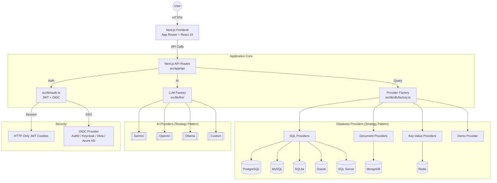
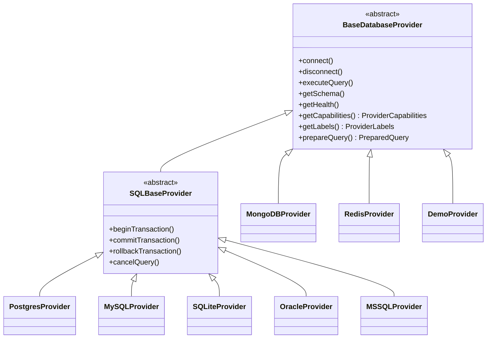
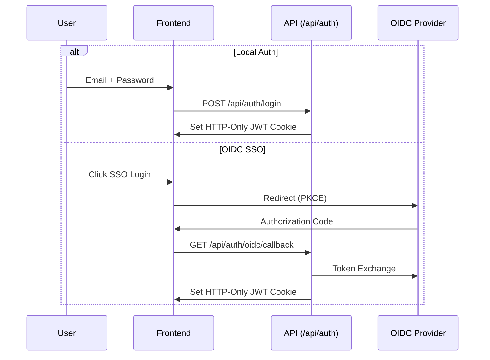

# High-Level Architecture - LibreDB Studio

This document outlines the architectural patterns, tech stack, and system design for LibreDB Studio, a web-based SQL IDE for cloud-native teams.

## System Overview

LibreDB Studio is a hybrid, cloud-native database management tool that provides an IDE-like experience in the browser. It supports **8 database backends** via a Strategy Pattern abstraction: PostgreSQL, MySQL, SQLite, Oracle, SQL Server, MongoDB, Redis, and a transient Demo mode.

## 1. Core Tech Stack

| Layer | Technology |
|-------|-----------|
| Framework | Next.js 16 (App Router) with React 19 |
| Runtime | Bun / Node.js |
| Language | TypeScript (strict mode) |
| Styling | Tailwind CSS 4 + Shadcn/UI |
| Animations | Framer Motion v12 |
| SQL Editor | Monaco Editor |
| Data Grid | TanStack React Table + react-virtual |
| AI | Multi-model (Gemini, OpenAI, Ollama, Custom) |
| Auth | JWT (`jose`) + OIDC SSO (`openid-client`) |
| Charts | Recharts |
| Containerization | Docker (multi-stage Bun build) |

## 2. High-Level Architecture Diagram



## 3. Database Provider Architecture



Each provider implements:
- **`getCapabilities()`** - queryLanguage, supportsExplain, supportsCreateTable, maintenanceOperations, etc.
- **`getLabels()`** - entityName, selectAction, searchPlaceholder, etc. (drives all UI text)
- **`prepareQuery()`** - handles query limiting per-provider (SQL LIMIT injection vs MongoDB native)

Adding a new database type requires: **1 provider class** + **1 entry in `db-ui-config.ts`**.

## 4. Key Architectural Patterns

### 4.1. Strategy Pattern (Database & LLM)

Both database and LLM layers use the Strategy Pattern with a factory:
- `src/lib/db/factory.ts` - Creates the correct database provider based on connection type
- `src/lib/llm/factory.ts` - Creates the correct LLM provider based on configuration

No `isMongoDB` / `=== 'mongodb'` checks outside provider classes. All behavior differences are driven through capabilities and labels.

### 4.2. Authentication Flow



Controlled by `NEXT_PUBLIC_AUTH_PROVIDER` (`local` | `oidc`). Both flows result in the same JWT session cookie. Proxy (`src/proxy.ts`) enforces RBAC (admin vs user roles).

### 4.3. Multi-Statement Execution

`src/lib/sql/statement-splitter.ts` splits SQL input into individual statements, handling:
- String literals (single/double quotes)
- Block and line comments
- Dollar-quoting (PostgreSQL)

Multi-statement queries execute sequentially via `POST /api/db/multi-query`.

### 4.4. Storage Abstraction Layer

- **Write-through cache architecture**: localStorage (L1 cache) + optional server storage (L2 persistent)
- **Three storage modes** controlled by `STORAGE_PROVIDER` env var:
  - `local` (default): Browser localStorage only, zero configuration
  - `sqlite`: Server-side SQLite file via `better-sqlite3`
  - `postgres`: Server-side PostgreSQL via `pg`
- **`useStorageSync` hook** in Studio.tsx: discovers mode at runtime via `/api/storage/config`, pulls on mount, pushes mutations (debounced 500ms)
- **Migration**: First login auto-migrates localStorage to server; `libredb_server_migrated` flag prevents re-migration
- **Graceful degradation**: If server unreachable, localStorage continues working

### 4.5. Client State Management

- **Storage module** (`src/lib/storage/`) for persistent data: connections, query history, saved queries, schema snapshots, chart configs, audit log, masking config, threshold config
- **React hooks** for UI state: tabs, active connection, execution status
- **Custom hooks** extracted from Studio.tsx: `useAuth`, `useConnectionManager`, `useTabManager`, `useTransactionControl`, `useQueryExecution`, `useInlineEditing`

## 5. Directory Structure

```
src/
├── app/                    # Next.js App Router
│   ├── api/
│   │   ├── auth/           # Login/logout/me + OIDC (PKCE, callback)
│   │   ├── ai/             # Chat, NL2SQL, explain, safety
│   │   ├── db/             # Query, schema, health, maintenance, transactions
│   │   ├── storage/        # Storage sync API (config, CRUD, migrate)
│   │   └── admin/          # Fleet health, audit
│   ├── admin/              # Admin dashboard (RBAC protected)
│   └── login/              # Login page
├── components/
│   ├── Studio.tsx           # Main application shell
│   ├── QueryEditor.tsx      # Monaco SQL editor wrapper
│   ├── ResultsGrid.tsx      # Virtualized data grid
│   ├── sidebar/             # ConnectionsList, ConnectionItem
│   ├── studio/              # StudioTabBar, QueryToolbar, BottomPanel
│   ├── admin/               # AdminDashboard (5 tabs)
│   ├── schema-explorer/     # SchemaExplorer
│   └── ui/                  # Shadcn/UI primitives
├── hooks/                   # Custom React hooks
└── lib/
    ├── db/                  # Database provider module
    │   ├── providers/
    │   │   ├── sql/         # postgres, mysql, sqlite, oracle, mssql
    │   │   ├── document/    # mongodb
    │   │   └── keyvalue/    # redis
    │   ├── factory.ts       # Provider factory
    │   └── types.ts         # Database types
    ├── llm/                 # LLM provider module
    ├── schema-diff/         # Diff engine + migration SQL generator
    ├── sql/                 # Statement splitter, alias extractor
    ├── ssh/                 # SSH tunnel support
    ├── auth.ts              # JWT utilities
    ├── oidc.ts              # OIDC utilities
    └── storage/             # Storage abstraction layer
        ├── index.ts         # Barrel export
        ├── storage-facade.ts # Public sync API + CustomEvent dispatch
        ├── local-storage.ts  # Pure localStorage CRUD
        ├── factory.ts       # Env-based provider factory
        └── providers/       # SQLite + PostgreSQL backends
```

## 6. Deployment

- **Docker**: Multi-stage Bun build with standalone Next.js output
- **Health Check**: `GET /api/db/health`
- **Stateless API**: API routes are stateless, suitable for horizontal scaling
- **Environment**: Configured via `.env.local` (see CLAUDE.md for full variable list)
